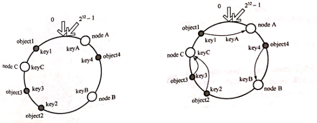

## C++常见面试问题汇总

### `1.指针和引用的区别`

- 指针是一个变量，存储的是一个地址，引用跟原来的变量实质上是同一个东西，是原变量的别名
- 可以有const指针，没有const引用
- 指针可以有多级，引用只有一级
- 指针可以为空，引用不能为NULL且在定义时必须初始化
- 指针在初始化后可以改变指向，而引用在初始化之后不可再改变
- sizeof指针得到的是本指针的大小，sizeof引用得到的是引用所指向变量的大小

- 当把指针作为参数进行传递时，也是将实参的一个拷贝传递给形参，两者指向的地址相同，但不是同一个变量，在函数中改变这个变量的指向不影响实参，而引用却可以。

参考代码：

```C++
void test(int *p)
{
　　int a=1;
　　p=&a;
　　cout<<p<<" "<<*p<<endl;
}

int main(void)
{
    int *p=NULL;
    test(p);
    if(p==NULL)
    cout<<"指针p为NULL"<<endl;
    return 0;
}
//运行结果为：
//0x22ff44 1
//指针p为NULL
```

### `2.堆和栈的区别`

|                  | 堆                                                           | 栈                                                           |
| :--------------- | ------------------------------------------------------------ | ------------------------------------------------------------ |
| **管理方式**     | 堆中资源由程序员控制（容易产生memory leak）                  | 栈资源由编译器自动管理，无需手工控制                         |
| **内存管理机制** | 系统有一个记录空闲内存地址的链表，当系统收到程序申请时，遍历该链表，寻找第一个空间大于申请空间的堆结点，删    除空闲结点链表中的该结点，并将该结点空间分配给程序（大多数系统会在这块内存空间首地址记录本次分配的大小，这样delete才能正确释放本内存  空间，另外系统会将多余的部分重新放入空闲链表中） | 只要栈的剩余空间大于所申请空间，系统为程序提供内存，否则报异常提示栈出。（这一块理解一下链表和队列的区别，不连续空间和连续空间的区别，应该就比较好理解这两种机制的区别了） |
| **空间大小**     | 堆是不连续的内存区域（因为系统是用链表来存储空闲内存地址，自然不是连续的），堆大小受限于计算机系统中有效的虚拟内存（32bit  系统理论上是4G），所以堆的空间比较灵活，比较大 | 栈是一块连续的内存区域，大小是操作系统预定好的，windows下栈大小是2M（也有是1M，在  编译时确定，VC中可设置） |
| **碎片问题**     | 对于堆，频繁的new/delete会造成大量碎片，使程序效率降低       | 对于栈，它是一个先进后出的队列，进出一一对应，不会产生碎片。（看到这里我突然明白了为什么面试官在问我堆和栈的区别之前先问了我栈和队列的区别） |
| **生长方向**     | 堆向上，向高地址方向增长。                                   | 栈向下，向低地址方向增长。                                   |
| **分配方式**     | 堆都是动态分配（没有静态分配的堆）                           | 栈有静态分配和动态分配，静态分配由编译器完成（如局部变量分配），动态分配由alloca函数  分    配，但栈的动态分配的资源由编译器进行释放，无需程序员实现。 |
| **分配效率**     | 堆由C/C++函数库提供，机制很复杂。所以堆的效率比栈低很多。    | 栈是极其系统提供的数据结构，计算机在底层对栈提供支持，分配专门  寄存  器存放栈地址，栈操作有专门指令。 |

**形象的比喻**

栈就像我们去饭馆里吃饭，只管点菜（发出申请）、付钱、和吃（使用），吃饱了就走，不必理会切菜、洗菜等准备工作和洗碗、刷锅等扫尾工作，他的好处是快捷，但是自由度小。

堆就象是自己动手做喜欢吃的菜肴，比较麻烦，但是比较符合自己的口味，而且自由度大。

> 《C++中堆（heap）和栈(stack)的区别》：https://blog.csdn.net/qq_34175893/article/details/83502412

### `3.new和delete是如何实现的？`

- new的实现过程是：首先调用名为**operator new**的标准库函数，分配足够大的原始为类型化的内存，以保存指定类型的一个对象；接下来运行该类型的一个构造函数，用指定初始化式构造对象；最后返回指向新分配并构造的对象的指针
- delete的实现过程：对指针指向的对象运行适当的析构函数；然后通过调用名为**operator delete**的标准库函数释放该对象所用内存

### `4.new / delete 与 malloc / free的异同`

**相同点**

- 都可用于内存的动态申请和释放

**不同点**

- 前者是C++运算符，后者是C/C++语言标准库函数
- new自动计算要分配的空间大小，malloc需要手工计算
- new是类型安全的，malloc不是。例如：

```C++
int *p = new float[2]; //编译错误
int *p = (int*)malloc(2 * sizeof(double));//编译无错误
```

*  new调用名为**operator new**的标准库函数分配足够空间并调用相关对象的构造函数，delete对指针所指对象运行适当的析构函数；然后通过调用名为**operator delete**的标准库函数释放该对象所用内存。后者均没有相关调用
*  后者需要库文件支持，前者不用

### `5.C和C++的区别`

- C++中new和delete是对内存分配的运算符，取代了C中的malloc和free。
- 标准C++中的字符串类取代了标准C函数库头文件中的字符数组处理函数（C中没有字符串类型）。
- C++中用来做控制态输入输出的iostream类库替代了标准C中的stdio函数库。
- C++中的try/catch/throw异常处理机制取代了标准C中的setjmp()和longjmp()函数。
- 在C++中，允许有相同的函数名，不过它们的参数类型不能完全相同，这样这些函数就可以相互区别开来。而这在C语言中是不允许的。
- C++语言中，允许变量定义语句在程序中的任何地方，只要在是使用它之前就可以；而C语言中，必须要在函数开头部分。而且C++允许重复定义变量，C语言也是做不到这一点的
- 在C++中，除了值和指针之外，新增了引用。引用型变量是其他变量的一个别名，我们可以认为他们只是名字不相同，其他都是相同的。
- C++相对与C增加了一些关键字，如：bool、using、dynamic_cast、namespace等等

> 《[C语言与C++有什么区别？](https://www.cnblogs.com/ITziyuan/p/9487760.html)》https://www.cnblogs.com/ITziyuan/p/9487760.html

### `6.C++与Java的联系与区别`

**语言特性**

-  Java语言给开发人员提供了更为简洁的语法；完全面向对象，由于JVM可以安装到任何的操作系统上，所以说它的可移植性强
- Java语言中没有指针的概念，引入了真正的数组。不同于C++中利用指针实现的“伪数组”，Java引入了真正的数组，同时将容易造成麻烦的指针从语言中去掉，这将有利于防止在C++程序中常见的因为数组操作越界等指针操作而对系统数据进行非法读写带来的不安全问题

-  C++也可以在其他系统运行，但是需要不同的编码（这一点不如Java，只编写一次代码，到处运行），例如对一个数字，在windows下是大端存储，在unix中则为小端存储。Java程序一般都是生成字节码，在JVM里面运行得到结果
- Java用接口(Interface)技术取代C++程序中的多继承性。接口与多继承有同样的功能，但是省却了多继承在实现和维护上的复杂性

**垃圾回收**

- C++用析构函数回收垃圾，写C和C++程序时一定要注意内存的申请和释放
- Java语言不使用指针，内存的分配和回收都是自动进行的，程序员无须考虑内存碎片的问题

**应用场景**

- Java在桌面程序上不如C++实用，C++可以直接编译成exe文件，指针是c++的优势，可以直接对内存的操作，但同时具有危险性 。（操作内存的确是一项非常危险的事情，一旦指针指向的位置发生错误，或者误删除了内存中某个地址单元存放的重要数据，后果是可想而知的）
- Java在Web 应用上具有C++ 无可比拟的优势，具有丰富多样的框架
- 对于底层程序的编程以及控制方面的编程，C++很灵活，因为有句柄的存在

> 《C++和java的区别和联系》：https://www.cnblogs.com/tanrong/p/8503202.html

### `7.C++中struct和class的区别`

**相同点**

- 两者都拥有成员函数、公有和私有部分
- 任何可以使用class完成的工作，同样可以使用struct完成

**不同点**

- 两者中如果不对成员不指定公私有，struct默认是公有的，class则默认是私有的
- class默认是private继承，而struct模式public继承
- class可以作为模板类型，struct不行

**引申**：C++和C的struct区别

- C语言中：struct是用户自定义数据类型（UDT）；C++中struct是抽象数据类型（ADT），支持成员函数的定义，（C++中的struct能继承，能实现多态）

- C中struct是没有权限的设置的，且struct中只能是一些变量的集合体，可以封装数据却不可以隐藏数据，而且成员**不可以是函数**
- C++中，struct增加了访问权限，且可以和类一样有成员函数，成员默认访问说明符为public（为了与C兼容）

- struct作为类的一种特例是用来自定义数据结构的。一个结构标记声明后，在C中必须在结构标记前加上struct，才能做结构类型名（除：typedef struct class{};）;C++中结构体标记（结构体名）可以直接作为结构体类型名使用，此外结构体struct在C++中被当作类的一种特例

> 《struct结构在C和C++中的区别》：https://blog.csdn.net/mm_hh/article/details/70456240

### `8.define和const的区别`

**编译阶段**

- define是在编译的预处理阶段起作用，而const是在编译、运行的时候起作用

**安全性**

- define只做替换，不做类型检查和计算，也不求解，容易产生错误
- const常量有数据类型，编译器可以对其进行类型安全检查

**内存占用**

- define只是将宏名称进行替换，在内存中会产生多分相同的备份。const在程序运行中只有一份备份，且可以执行常量折叠，能将复杂的的表达式计算出结果放入常量表

### `9.C++中const和static的作用`

**static**

- 不考虑类的情况
  - 隐藏。所有不加static的全局变量和函数具有全局可见性，可以在其他文件中使用，加了之后只能在该文件所在的编译模块中使用
  - 默认初始化为0，包括未初始化的全局静态变量与局部静态变量，都存在全局未初始化区
  - 静态变量在函数内定义，始终存在，且只进行一次初始化，具有记忆性，其作用范围与局部变量相同，函数退出后仍然存在，但不能使用
- 考虑类的情况
  - static成员变量：只与类关联，不与类的对象关联。定义时要分配空间，不能在类声明中初始化，必须在类定义体外部初始化，初始化时不需要标示为static；可以被非static成员函数任意访问。
  - static成员函数：不具有this指针，无法访问类对象的非static成员变量和非static成员函数；不能被声明为const、虚函数和volatile；可以被非static成员函数任意访问

**const**

- 不考虑类的情况
  - const常量在定义时必须初始化，之后无法更改

  - const形参可以接收const和非const类型的实参，例如

    ```C++
    // i 可以是int型或者const int 型
    void fun(const int& i){
    	//...
    }
    ```

- 考虑类的情况

  - const成员变量：不能在类定义外部初始化，只能通过构造函数初始化列表进行初始化，并且必须有构造函数；不同类对其const数据成员的值可以不同，所以不能在类中声明时初始化
  - const成员函数：const对象不可以调用非const成员函数；非const对象都可以调用；不可以改变非mutable（用该关键字声明的变量可以在const成员函数中被修改）数据的值


### `10.C++的顶层const和底层const`

**概念区分**

- **顶层**const：指的是const修饰的变量**本身**是一个常量，无法修改
- **底层**const：指的是const修饰的变量**所指向的对象**是一个常量

**举个例子**

```C++
int a = 10;
int* const b1 = &a;        //顶层const，b1本身是一个常量
const int* b2 = &a;        //底层const，b2本身可变，所指的对象是常量
const int b3 = 20; 		   //顶层const，b3是常量不可变
const int* const b4 = &a;  //前一个const为底层，后一个为顶层，b4不可变
const int& b5 = a;		   //用于声明引用变量，都是底层const
```

**区分作用**

- 执行对象拷贝时有限制，常量的底层const不能赋值给非常量的底层const
- 使用命名的强制类型转换函数const_cast时，只能改变运算对象的底层const

> 《C++ 顶层const与底层const总结》：https://www.jianshu.com/p/fbbcf11100f6
>
> 《C++的顶层const和底层const浅析》：https://blog.csdn.net/qq_37059483/article/details/78811231

### `11.final和override关键字`

**override**

当在父类中使用了虚函数时候，你可能需要在某个子类中对这个虚函数进行重写，以下方法都可以：

```C++
class A
{
    virtual void foo();
}
class B : public A
{
    void foo(); //OK
    virtual void foo(); // OK
    void foo() override; //OK
}
```

如果不使用override，当你手一抖，将**foo()**写成了**f00()**会怎么样呢？结果是编译器并不会报错，因为它并不知道你的目的是重写虚函数，而是把它当成了新的函数。如果这个虚函数很重要的话，那就会对整个程序不利。所以，override的作用就出来了，它指定了子类的这个虚函数是重写的父类的，如果你名字不小心打错了的话，编译器是不会编译通过的：

```C++
class A
{
    virtual void foo();
};
class B : public A
{
    virtual void f00(); //OK，这个函数是B新增的，不是继承的
    virtual void f0o() override; //Error, 加了override之后，这个函数一定是继承自A的，A找不到就报错
};
```

**final**

当不希望某个类被继承，或不希望某个虚函数被重写，可以在类名和虚函数后添加final关键字，添加final关键字后被继承或重写，编译器会报错。例子如下：

```C++
class Base
{
    virtual void foo();
};
 
class A : public Base
{
    void foo() final; // foo 被override并且是最后一个override，在其子类中不可以重写
};

class B final : A // 指明B是不可以被继承的
{
    void foo() override; // Error: 在A中已经被final了
};
 
class C : B // Error: B is final
{
};
```

> 《C++:override和final》：https://www.cnblogs.com/whlook/p/6501918.html

### `12.拷贝初始化和直接初始化`

- 当用于类类型对象时，初始化的拷贝形式和直接形式有所不同：直接初始化直接调用与实参匹配的构造函数，拷贝初始化总是调用拷贝构造函数。拷贝初始化首先使用指定构造函数创建一个临时对象，然后用拷贝构造函数将那个临时对象拷贝到正在创建的对象。举例如下

```C++
string str1("I am a string");//语句1 直接初始化
string str2(str1);//语句2 直接初始化，str1是已经存在的对象，直接调用构造函数对str2进行初始化
string str3 = "I am a string";//语句3 拷贝初始化，先为字符串”I am a string“创建临时对象，再把临时对象作为参数，使用拷贝构造函数构造str3
string str4 = str1;//语句4 拷贝初始化，这里相当于隐式调用拷贝构造函数，而不是调用赋值运算符函数
```

- 为了提高效率，允许编译器跳过创建临时对象这一步，直接调用构造函数构造要创建的对象，这样就完全等价于直接初始化了（语句1和语句3等价）。但是需要辨别两种情况。
  - 当拷贝构造函数为private时：语句3和语句4在编译时会报错
  - 使用explicit修饰构造函数时：如果构造函数存在隐式转换，编译时会报错

> C++的直接初始化与复制初始化的区别：https://blog.csdn.net/qq936836/article/details/83450218

### `13.初始化和赋值的区别`

- 对于简单类型来说，初始化和赋值没什么区别
- 对于类和复杂数据类型来说，这两者的区别就大了，举例如下：

```C++
class A{
public:
    int num1;
    int num2;
public:
    A(int a=0, int b=0):num1(a),num2(b){};
    A(const A& a){};
    //重载=号操作符函数
    A& operator=(const A& a){
        num1 = a.num1 + 1;
        num2 = a.num2 + 1;
        return *this;
    };
};
int main(){
    A a(1,1);
    A a1 = a; //拷贝初始化操作，调用拷贝构造函数
    A b;
    b = a;//赋值操作，对象a中，num1 = 1，num2 = 1；对象b中，num1 = 2，num2 = 2
    return 0;
}
```

### `14.extern"C"的用法`

为了能够正确的在C++代码中调用C语言的代码；在程序中加上extern "C"后，相当于告诉编译器这部分代码是C语言写的，因此要按照C语言进行编译，而不是C++；哪些情况下使用extern "C"：

（1）C++代码中调用C语言代码；

（2）在C++中的头文件中使用；

（3）在多个人协同开发时，可能有人擅长C语言，而有人擅长C++；

举个例子，C++中调用C代码：

```C++
#ifndef __MY_HANDLE_H__
#define __MY_HANDLE_H__

extern "C"{
    typedef unsigned int result_t;
    typedef void* my_handle_t;
    
    my_handle_t create_handle(const char* name);
    result_t operate_on_handle(my_handle_t handle);
    void close_handle(my_handle_t handle);
}
```

- 参考的blog中有一篇google code上的文章，专门写extern "C"的，有兴趣的读者不妨去看看

> 《extern "C"的功能和用法研究》：https://blog.csdn.net/sss_369/article/details/84060561

### `15.模板函数和模板类的特例化`

**引入原因**

编写单一的模板，它能适应多种类型的需求，使每种类型都具有相同的功能，但对于某种特定类型，如果要实现其特有的功能，单一模板就无法做到，这时就需要模板特例化

**定义**

对单一模板提供的一个特殊实例，它将一个或多个模板参数绑定到特定的类型或值上

**（1）模板函数特例化**

必须为原函数模板的每个模板参数都提供实参，且使用关键字template后跟一个空尖括号对<>，表明将原模板的所有模板参数提供实参，举例如下：

```C++
template<typename T> //模板函数
int compare(const T &v1,const T &v2)
{
    if(v1 > v2) return -1;
    if(v2 > v1) return 1;
    return 0;
}
//模板特例化,满足针对字符串特定的比较，要提供所有实参，这里只有一个T
template<> 
int compare(const char* const &v1,const char* const &v2)
{
    return strcmp(p1,p2);
}
```

**本质**

特例化的本质是实例化一个模板，而非重载它。特例化不影响参数匹配。参数匹配都以最佳匹配为原则。例如，此处如果是compare(3,5)，则调用普通的模板，若为compare(“hi”,”haha”)则调用特例化版本（因为这个cosnt char*相对于T，更匹配实参类型），注意二者函数体的语句不一样了，实现不同功能。

**注意**

模板及其特例化版本应该声明在同一个头文件中，且所有同名模板的声明应该放在前面，后面放特例化版本。

**（2）类模板特例化**

原理类似函数模板，不过在类中，我们可以对模板进行特例化，也可以对类进行部分特例化。对类进行特例化时，仍然用template<>表示是一个特例化版本，例如：

```C++
template<>
class hash<sales_data>
{
	size_t operator()(sales_data& s);
	//里面所有T都换成特例化类型版本sales_data
	//按照最佳匹配原则，若T != sales_data，就用普通类模板，否则，就使用含有特定功能的特例化版本。
};
```

**类模板的部分特例化**

不必为所有模板参数提供实参，可以**指定一部分而非所有模板参数**，一个类模板的部分特例化本身仍是一个模板，使用它时还必须为其特例化版本中未指定的模板参数提供实参(特例化时类名一定要和原来的模板相同，只是参数类型不同，按最佳匹配原则，哪个最匹配，就用相应的模板)

**特例化类中的部分成员**

可以特例化类中的部分成员函数而不是整个类，举个例子：

```C++
template<typename T>
class Foo
{
    void Bar();
    void Barst(T a)();
};

template<>
void Foo<int>::Bar()
{
    //进行int类型的特例化处理
    cout << "我是int型特例化" << endl;
}

Foo<string> fs;
Foo<int> fi;//使用特例化
fs.Bar();//使用的是普通模板，即Foo<string>::Bar()
fi.Bar();//特例化版本，执行Foo<int>::Bar()
//Foo<string>::Bar()和Foo<int>::Bar()功能不同
```

> 《类和函数模板特例化》：https://blog.csdn.net/wang664626482/article/details/52372789

### `16.C和C++的类型安全`

 **什么是类型安全？**

类型安全很大程度上可以等价于内存安全，类型安全的代码不会试图访问自己没被授权的内存区域。“类型安全”常被用来形容编程语言，其根据在于该门编程语言是否提供保障类型安全的机制；有的时候也用“类型安全”形容某个程序，判别的标准在于该程序是否隐含类型错误。类型安全的编程语言与类型安全的程序之间，没有必然联系。好的程序员可以使用类型不那么安全的语言写出类型相当安全的程序，相反的，差一点儿的程序员可能使用类型相当安全的语言写出类型不太安全的程序。绝对类型安全的编程语言暂时还没有。

**（1）C的类型安全**

C只在局部上下文中表现出类型安全，比如试图从一种结构体的指针转换成另一种结构体的指针时，编译器将会报告错误，除非使用显式类型转换。然而，C中相当多的操作是不安全的。以下是两个十分常见的例子：

- printf格式输出


上述代码中，使用%d控制整型数字的输出，没有问题，但是改成%f时，明显输出错误，再改成%s时，运行直接报segmentation fault错误

- malloc函数的返回值

malloc是C中进行内存分配的函数，它的返回类型是void\*即空类型指针，常常有这样的用法char\* pStr=(char\*)malloc(100\*sizeof(char))，这里明显做了显式的类型转换。类型匹配尚且没有问题，但是一旦出现int\* pInt=(int*)malloc(100\*sizeof(char))就很可能带来一些问题，而这样的转换C并不会提示错误。

**（2）C++的类型安全**

如果C++使用得当，它将远比C更有类型安全性。相比于C语言，C++提供了一些新的机制保障类型安全：

- 操作符new返回的指针类型严格与对象匹配，而不是void\*

- C中很多以void\*为参数的函数可以改写为C++模板函数，而模板是支持类型检查的；

- 引入const关键字代替#define constants，它是有类型、有作用域的，而#define constants只是简单的文本替换

- 一些#define宏可被改写为inline函数，结合函数的重载，可在类型安全的前提下支持多种类型，当然改写为模板也能保证类型安全

- C++提供了dynamic_cast关键字，使得转换过程更加安全，因为dynamic_cast比static_cast涉及更多具体的类型检查。

  例1：使用void\*进行类型转换


​	例2：不同类型指针之间转换

```C++
#include<iostream>
using namespace std;
 
class Parent{};
class Child1 : public Parent
{
public:
	int i;
	Child1(int e):i(e){}
};
class Child2 : public Parent
{
public:
	double d;
	Child2(double e):d(e){}
};
int main()
{
	Child1 c1(5);
	Child2 c2(4.1);
	Parent* pp;
	Child1* pc1;
 	
	pp=&c1; 
	pc1=(Child1*)pp;  // 类型向下转换 强制转换，由于类型仍然为Child1*，不造成错误
	cout<<pc1->i<<endl; //输出：5
 
	pp=&c2;
	pc1=(Child1*)pp;  //强制转换，且类型发生变化，将造成错误
	cout<<pc1->i<<endl;// 输出：1717986918
	return 0;
}

```

上面两个例子之所以引起类型不安全的问题，是因为程序员使用不得当。第一个例子用到了空类型指针void\*，第二个例子则是在两个类型指针之间进行强制转换。因此，想保证程序的类型安全性，应尽量避免使用空类型指针void\*，尽量不对两种类型指针做强制转换。

### `17.为什么析构函数一般写成虚函数`

由于类的多态性，基类指针可以指向派生类的对象，如果删除该基类的指针，就会调用该指针指向的派生类析构函数，而派生类的析构函数又自动调用基类的析构函数，这样整个派生类的对象完全被释放。如果析构函数不被声明成虚函数，则编译器实施静态绑定，在删除基类指针时，只会调用基类的析构函数而不调用派生类析构函数，这样就会造成派生类对象析构不完全，造成内存泄漏。所以将析构函数声明为虚函数是十分必要的。在实现多态时，当用基类操作派生类，在析构时防止只析构基类而不析构派生类的状况发生，要将基类的析构函数声明为虚函数。举个例子：

```C++
#include <iostream>
using namespace std;

class Parent{
public:
	Parent(){
		cout << "Parent construct function"  << endl;
	};
	~Parent(){
		cout << "Parent destructor function" <<endl;
	}
};

class Son : public Parent{
public:
	Son(){
		cout << "Son construct function"  << endl;
	};
	~Son(){
		cout << "Son destructor function" <<endl;
	}
};

int main()
{
	Parent* p = new Son();
	delete p;
	p = NULL;
	return 0;
}
//运行结果：
//Parent construct function
//Son construct function
//Parent destructor function
```

将基类的构造函数声明为虚函数：

```C++
#include <iostream>
using namespace std;

class Parent{
public:
	Parent(){
		cout << "Parent construct function"  << endl;
	};
	~Parent(){
		cout << "Parent destructor function" <<endl;
	}
};

class Son : public Parent{
public:
	Son(){
		cout << "Son construct function"  << endl;
	};
	~Son(){
		cout << "Son destructor function" <<endl;
	}
};

int main()
{
	Parent* p = new Son();
	delete p;
	p = NULL;
	return 0;
}
//运行结果：
//Parent construct function
//Son construct function
//Son destructor function
//Parent destructor function
```

### `18.C++中的重载、重写（覆盖）和隐藏的区别`

（1）重载（overload）

重载是指在同一范围定义中的同名成员函数才存在重载关系。主要特点是函数名相同，参数类型和数目有所不同，不能出现参数个数和类型均相同，仅仅依靠返回值不同来区分的函数。重载和函数成员是否是虚函数无关。举个例子：

```C++
class A{
    ...
    virtual int fun();
    void fun(int);
    void fun(double, double);
    static int fun(char);
    ...
}
```

（2）重写（覆盖）（override）

重写指的是在派生类中覆盖基类中的同名函数，要求基类函数必须是虚函数且：

- 与基类的虚函数有相同的参数个数
- 与基类的虚函数有相同的参数类型
- 与基类的虚函数有相同的返回值类型

举个例子：

```C++
//父类
class A{
public:
    virtual int fun(int a){}
}
//子类
class B : public A{
public:
    //重写,一般加override可以确保是重写父类的函数
    virtual int fun(int a) override{}
}
```

重载与重写的区别：

- 重写是父类和子类之间的垂直关系，重载是不太函数之间的水平关系
- 重写要求参数列表相同，重载则要求参数列表不同，返回值不要求
- 重写关系中，调用方法根据对象类型决定，重载根据调用时实参表与形参表的对应关系来选择方法体

（3）隐藏（hide）

隐藏指的是某些情况下，派生类中的函数屏蔽了基类中的同名函数，包括以下情况：

- 两个函数参数相同，但是基类函数不是虚函数。和重写的区别在于基类函数是否是虚函数。举个例子：

```C++
//父类
class A{
public:
    void fun(int a){
		cout << "A中的fun函数" << endl;
	}
};
//子类
class B : public A{
public:
    //隐藏父类的fun函数
    void fun(int a){
		cout << "B中的fun函数" << endl;
	}
};
int main(){
    B b;
    b.fun(2); //调用的是B中的fun函数
    b.A::fun(2); //调用A中fun函数
    return 0;
}
```

- 两个函数参数不同，无论基类函数是不是虚函数，都会被隐藏。和重载的区别在于两个函数不在同一个类中。举个例子：

```C++
//父类
class A{
public:
    virtual void fun(int a){
		cout << "A中的fun函数" << endl;
	}
};
//子类
class B : public A{
public:
    //隐藏父类的fun函数
   virtual void fun(char* a){
	   cout << "A中的fun函数" << endl;
   }
};
int main(){
    B b;
    b.fun(2); //报错，调用的是B中的fun函数，参数类型不对
    b.A::fun(2); //调用A中fun函数
    return 0;
}
```

### `19.C++的多态如何实现`

C++的多态性，一言以蔽之就是：在基类的函数前加上**virtual**关键字，在派生类中重写该函数，运行时将会根据对象的实际类型来调用相应的函数，如果对象类型是派生类，就调用派生类的函数，如果对象类型是基类，就调用基类的函数。举个例子：

```C++
#include <iostream>
using namespace std;

class Base{
public:
	virtual void fun(){
		cout << " Base::func()" <<endl;
	}
};

class Son1 : public Base{
public:
	virtual void fun() override{
		cout << " Son1::func()" <<endl;
	}
};

class Son2 : public Base{

};

int main()
{
	Base* base = new Son1;
	base->fun();
	base = new Son2;
	base->fun();
	delete base;
	base = NULL;
	return 0;
}
// 运行结果
// Son1::func()
// Base::func()
```

例子中，Base为基类，其中的函数为虚函数。子类1继承并重写了基类的函数，子类2继承基类但没有重写基类的函数，从结果分析子类体现了多态性，那么为什么会出现多态性，其底层的原理是什么？这里需要引出虚表和虚基表指针的概念。

虚表：虚函数表的缩写，类中含有virtual关键字修饰的方法时，编译器会自动生成虚表

虚表指针：在含有虚函数的类实例化对象时，对象地址的前四个字节存储的指向虚表的指针


上图中展示了虚表和虚表指针在基类对象和派生类对象中的模型，下面阐述实现多态的过程：

**（1）**编译器在发现基类中有虚函数时，会自动为每个含有虚函数的类生成一份虚表，该表是一个一维数组，虚表里保存了虚函数的入口地址

**（2）**编译器会在每个对象的前四个字节中保存一个虚表指针，即**vptr**，指向对象所属类的虚表。在程序运行时的合适时机，根据对象的类型去初始化vptr，从而让vptr指向正确的虚表，从而在调用虚函数时，能找到正确的函数

**（3）**所谓的合适时机，在派生类定义对象时，程序运行会自动调用构造函数，在构造函数中创建虚表并对虚表初始化。在构造子类对象时，会先调用父类的构造函数，此时，编译器只“看到了”父类，并为父类对象初始化虚表指针，令它指向父类的虚表；当调用子类的构造函数时，为子类对象初始化虚表指针，令它指向子类的虚表

**（4）**当派生类对基类的虚函数没有重写时，派生类的虚表指针指向的是基类的虚表；当派生类对基类的虚函数重写时，派生类的虚表指针指向的是自身的虚表；当派生类中有自己的虚函数时，在自己的虚表中将此虚函数地址添加在后面

这样指向派生类的基类指针在运行时，就可以根据派生类对虚函数重写情况动态的进行调用，从而实现多态性。

> 《C++实现多态的原理》：https://blog.csdn.net/qq_37954088/article/details/79947898

### `20.C++有哪几种的构造函数`

C++中的构造函数可以分为4类：

- 默认构造函数
- 初始化构造函数
- 复制（拷贝）构造函数
- 转换构造函数

举个例子：

```C++
#include <iostream>
using namespace std;

class Student{
public:
    Student(){//默认构造函数，没有参数
        this->age = 20;
        this->num = 1000;
    };  
    Student(int a, int n):age(a), num(n){}; //初始化构造函数，有参数和参数列表
    Student(const Student& s){//拷贝构造函数，这里与编译器生成的一致
        this->age = s.age;
        this->num = s.num;
    }; 
    Student(int r){   //转换构造函数,形参是其他类型变量，且只有一个形参
        this->age = r;
		this->num = 1002;
    };
    ~Student(){}
public:
    int age;
    int num;
};

int main(){
    Student s1;
    Student s2(18,1001);
    int a = 10;
    Student s3(a);
    Student s4(s3);
    
    printf("s1 age:%d, num:%d\n", s1.age, s1.num);
    printf("s2 age:%d, num:%d\n", s2.age, s2.num);
    printf("s3 age:%d, num:%d\n", s3.age, s3.num);
    printf("s2 age:%d, num:%d\n", s4.age, s4.num);
    return 0;
}
//运行结果
//s1 age:20, num:1000
//s2 age:18, num:1001
//s3 age:10, num:1002
//s2 age:10, num:1002
```

- 默认构造函数和初始化构造函数在定义类的对象，完成对象的初始化工作
- 复制构造函数用于复制本类的对象
- 转换构造函数用于将其他类型的变量，隐式转换为本类对象

> 《浅谈C++中的几种构造函数》：https://blog.csdn.net/zxc024000/article/details/51153743

### `21.浅拷贝和深拷贝的区别`

**浅拷贝**

被复制对象的所有变量都含有与原来的对象相同的值，而所有的其他对象的引用仍然指向原来的地址。也就是说，浅拷贝仅仅复制所考虑的对象，而不复制它所引用的对象

**深拷贝**

被复制对象的所有变量都含有与原来的对象相同的值，除去那些引用其他对象的变量，那些引用其他对象的变量将指向被复制过的新对象，而不是原有的那些被引用的对象，也就是说，深拷贝把要拷贝的对象所有引用都复制了一遍。举个例子：

```C++
#include <iostream>  
#include <string.h>
using namespace std;
 
class Student
{
private:
	int num;
	char *name;
public:
	Student(){
        name = new char(20);
		cout << "Student" << endl;
    };
	~Student(){
        cout << "~Student " << &name << endl;
        delete name;
        name = NULL;
    };
	Student(const Student &s){//拷贝构造函数
        //浅拷贝，当对象的name和传入对象的name指向相同的地址
        name = s.name;
        //深拷贝
        //name = new char(20);
        //memcpy(name, s.name, strlen(s.name));
        cout << "copy Student" << endl;
    };
};
 
int main()
{
	{// 花括号让s1和s2变成局部对象，方便测试
		Student s1;
		Student s2(s1);// 复制对象
	}
	system("pause");
	return 0;
}
//浅拷贝执行结果：
//Student
//copy Student
//~Student 0x7fffed0c3ec0
//~Student 0x7fffed0c3ed0
//*** Error in `/tmp/815453382/a.out': double free or corruption (fasttop): 0x0000000001c82c20 ***

//深拷贝执行结果：
//Student
//copy Student
//~Student 0x7fffebca9fb0
//~Student 0x7fffebca9fc0
```

从执行结果可以看出，浅拷贝在对象的拷贝创建时存在风险，即被拷贝的对象析构释放资源之后，拷贝对象析构时会再次释放一个已经释放的资源，深拷贝的结果是两个对象之间没有任何关系，各自成员地址不同。

> 《C++面试题之浅拷贝和深拷贝的区别》：https://blog.csdn.net/caoshangpa/article/details/79226270

### `22.内联函数和宏定义的区别`

内联(inline)函数和普通函数相比可以加快程序运行的速度，因为不需要中断调用，在编译的时候内联函数可以直接嵌入到目标代码中。

**内联函数适用场景**

- 使用宏定义的地方都可以使用inline函数
- 作为类成员接口函数来读写类的私有成员或者保护成员，会提高效率

**为什么不能把所有的函数写成内联函数**

内联函数以代码复杂为代价，它以省去函数调用的开销来提高执行效率。所以一方面如果内联函数体内代码执行时间相比函数调用开销较大，则没有太大的意义；另一方面每一处内联函数的调用都要复制代码，消耗更多的内存空间，因此以下情况不宜使用内联函数：

- 函数体内的代码比较长，将导致内存消耗代价
- 函数体内有循环，函数执行时间要比函数调用开销大

**主要区别**

- 内联函数在编译时展开，宏在预编译时展开
- 内联函数直接嵌入到目标代码中，宏是简单的做文本替换
- 内联函数有类型检测、语法判断等功能，而宏没有
- 内联函数是函数，宏不是
- 宏定义时要注意书写（参数要括起来）否则容易出现歧义，内联函数不会产生歧义
- 内联函数代码是被放到符号表中，使用时像宏一样展开，没有调用的开销，效率很高；

> 《inline函数和宏定义区别 整理》：https://blog.csdn.net/wangliang888888/article/details/77990650

### `23 构造函数、析构函数、虚函数可否声明为内联函数`

首先，将这些函数声明为内联函数，在语法上没有错误。因为inline同register一样，只是个建议，编译器并不一定真正的内联。举个例子：

```C++
#include <iostream>
using namespace std;
class A
{
public:
    inline A() {
		cout << "inline construct()" <<endl;
	}
    inline ~A() {
		cout << "inline destruct()" <<endl;
	}
    inline virtual void  virtualFun() {
		cout << "inline virtual function" <<endl;
	}
};
 
int main()
{
	A a;
	a.virtualFun();
    return 0;
}
//输出结果
//inline construct()
//inline virtual function
//inline destruct()
```

**构造函数和析构函数声明为内联函数是没有意义的**

《Effective C++》中所阐述的是：将构造函数和析构函数声明为inline是没有什么意义的，即编译器并不真正对声明为inline的构造和析构函数内联，因为编译器会在构造和析构函数中添加额外的操作（申请/释放内存，构造/析构对象等），致使构造函数/析构函数并不像看上去的那么精简。其次，class中的函数默认是inline型的，编译器也只是有选择性的inline，将构造函数和析构函数声明为内联函数是没有什么意义的。

 **将虚函数声明为inline，要分情况讨论**

有的人认为虚函数被声明为inline，但是编译器并没有对其内联，他们给出的理由是inline是编译期决定的，而虚函数是运行期决定的，即在不知道将要调用哪个函数的情况下，如何将函数内联呢？

上述观点看似正确，其实不然，如果虚函数在编译器就能够决定将要调用哪个函数时，就能够内联，那么什么情况下编译器可以确定要调用哪个函数呢，答案是当用对象调用虚函数（此时不具有多态性）时，就内联展开

综上，当是指向派生类的指针（多态性）调用声明为inline的虚函数时，不会内联展开；当是对象调用虚函数时，会内联展开

> 《构造函数、析构函数、虚函数可否内联，有何意义》：https://www.cnblogs.com/helloweworld/archive/2013/06/14/3136705.html

### `24.auto、decltype和decltype(auto)的用法`

**（1）auto**

C++11新标准引入了auto类型说明符，用它就能让编译器替我们去分析表达式所属的类型。和原来那些只对应某种特定的类型说明符(例如 int)不同，auto 让编译器通过初始值来进行类型推演。从而获得定义变量的类型，所以说 auto 定义的变量必须有初始值。举个例子：

```c++
//普通；类型
int a = 1, b = 3;
auto c = a + b;// c为int型

//const类型
const int i = 5;
auto j = i; // 变量i是顶层const, 会被忽略, 所以j的类型是int
auto k = &i; // 变量i是一个常量, 对常量取地址是一种底层const, 所以b的类型是const int*
const auto l = i; //如果希望推断出的类型是顶层const的, 那么就需要在auto前面加上cosnt

//引用和指针类型
int x = 2;
int& y = x;
auto z = y; //z是int型不是int& 型
auto& p1 = y; //p1是int&型
auto p2 = &x; //p2是指针类型int*
```

**（2）decltype**

有的时候我们还会遇到这种情况，我们希望从表达式中推断出要定义变量的类型，但却不想用表达式的值去初始化变量。还有可能是函数的返回类型为某表达式的值类型。在这些时候auto显得就无力了，所以C++11又引入了第二种类型说明符decltype，它的作用是选择并返回操作数的数据类型。在此过程中，编译器只是分析表达式并得到它的类型，却不进行实际的计算表达式的值。

```C++
int func() {return 0};

//普通类型
decltype(func()) sum = 5; // sum的类型是函数func()的返回值的类型int, 但是这时不会实际调用函数func()
int a = 0;
decltype(a) b = 4; // a的类型是int, 所以b的类型也是int

//不论是顶层const还是底层const, decltype都会保留   
const int c = 3;
decltype(c) d = c; // d的类型和c是一样的, 都是顶层const
int e = 4;
const int* f = &e; // f是底层const
decltype(f) g = f; // g也是底层const

//引用与指针类型
//1. 如果表达式是引用类型, 那么decltype的类型也是引用
const int i = 3, &j = i;
decltype(j) k = 5; // k的类型是 const int&

//2. 如果表达式是引用类型, 但是想要得到这个引用所指向的类型, 需要修改表达式:
int i = 3, &r = i;
decltype(r + 0) t = 5; // 此时是int类型

//3. 对指针的解引用操作返回的是引用类型
int i = 3, j = 6, *p = &i;
decltype(*p) c = j; // c是int&类型, c和j绑定在一起

//4. 如果一个表达式的类型不是引用, 但是我们需要推断出引用, 那么可以加上一对括号, 就变成了引用类型了
int i = 3;
decltype((i)) j = i; // 此时j的类型是int&类型, j和i绑定在了一起
```

**（3）decltype(auto)**

decltype(auto)是C++14新增的类型指示符，可以用来声明变量以及指示函数返回类型。在使用时，会将“=”号左边的表达式替换掉auto，再根据decltype的语法规则来确定类型。举个例子：

```C++
int e = 4;
const int* f = &e; // f是底层const
decltype(auto) j = f;//j的类型是const int* 并且指向的是e
```

> 《auto和decltype的用法总结》：https://www.cnblogs.com/XiangfeiAi/p/4451904.html
>
> 《C++11新特性中auto 和 decltype 区别和联系》：https://www.jb51.net/article/103666.htm

### `25.public，protected和private访问和继承权限`

（一）访问权限

派生类可以继承基类中除了构造/析构、赋值运算符重载函数之外的成员，但是这些成员的访问属性在派生过程中也是可以调整的，三种派生方式的访问权限如下表所示：


派生类对基类成员的访问形象有如下两种：

- 内部访问：由派生类中新增的成员函数对从基类继承来的成员的访问
- 外部访问：在派生类外部，通过派生类的对象对从基类继承来的成员的访问

（二）继承权限

**public继承**

公有继承的特点是基类的公有成员和保护成员作为派生类的成员时，都保持原有的状态，而基类的私有成员任然是私有的，不能被这个派生类的子类所访问，访问规则如下表

**protected继承**

保护继承的特点是基类的所有公有成员和保护成员都成为派生类的保护成员，并且只能被它的派生类成员函数或友元函数访问，基类的私有成员仍然是私有的，访问规则如下表


**private继承**

私有继承的特点是基类的所有公有成员和保护成员都成为派生类的私有成员，并不被它的派生类的子类所访问，基类的成员只能由自己派生类访问，无法再往下继承，访问规则如下表


### `26.如何用代码判断大小端存储`

大端存储：字数据的高字节存储在低地址中

小端存储：字数据的低字节存储在低地址中

例如：32bit的数字0x12345678

小端模式中的存储方式为：


大端模式中的存储方式为：


了解了大小端存储的方式，如何在代码中进行判断呢？下面介绍两种判断方式：

方式一：使用强制类型转换

```C++
#include <iostream>
using namespace std;
int main()
{
    int a = 0x1234;
    //由于int和char的长度不同，借助int型转换成char型，只会留下低地址的部分
    char c = (char)(a);
    if (c == 0x12)
        cout << "big endian" << endl;
    else if(c == 0x34)
        cout << "little endian" << endl;
}
```

方式二：巧用union联合体

```C++
#include <iostream>
using namespace std;
//union联合体的重叠式存储，endian联合体占用内存的空间为每个成员字节长度的最大值
union endian
{
    int a;
    char ch;
};
int main()
{
    endian value;
    value.a = 0x1234;
    //a和ch共用4字节的内存空间
    if (value.ch == 0x12)
        cout << "big endian"<<endl;
    else if (value.ch == 0x34)
        cout << "little endian"<<endl;
}
```

> 《写程序判断系统是大端序还是小端序》：https://www.cnblogs.com/zhoudayang/p/5985563.html

### `27.volatile、mutable和explicit关键字的用法`

（1）**volatile**

volatile 关键字是一种类型修饰符，用它声明的类型变量表示可以被某些编译器未知的因素更改，比如：操作系统、硬件或者其它线程等。遇到这个关键字声明的变量，编译器对访问该变量的代码就不再进行优化，从而可以提供对特殊地址的稳定访问。声明时语法：int volatile vInt; 当要求使用 volatile 声明的变量的值的时候，**系统总是重新从它所在的内存读取数据**，即使它前面的指令刚刚从该处读取过数据。

**volatile 指针**

volatile 指针和 const 修饰词类似，const 有常量指针和指针常量的说法，volatile 也有相应的概念

修饰由指针指向的对象、数据是 const 或 volatile 的：

```C++
const char* cpch;
volatile char* vpch;
```

指针自身的值——一个代表地址的整数变量，是 const 或 volatile 的：

```C++
char* const pchc;
char* volatile pchv;
```

 注意：

- 可以把一个非volatile int赋给volatile int，但是不能把非volatile对象赋给一个volatile对象。
-  除了基本类型外，对用户定义类型也可以用volatile类型进行修饰。
- C++中一个有volatile标识符的类只能访问它接口的子集，一个由类的实现者控制的子集。用户只能用const_cast来获得对类型接口的完全访问。此外，volatile向const一样会从类传递到它的成员。

**多线程下的volatile**   

有些变量是用volatile关键字声明的。当两个线程都要用到某一个变量且该变量的值会被改变时，应该用volatile声明，该关键字的作用是防止优化编译器把变量从内存装入CPU寄存器中。如果变量被装入寄存器，那么两个线程有可能一个使用内存中的变量，一个使用寄存器中的变量，这会造成程序的错误执行。volatile的意思是让编译器每次操作该变量时一定要从内存中真正取出，而不是使用已经存在寄存器中的值。

（2）**mutable**

mutable的中文意思是“可变的，易变的”，跟constant（既C++中的const）是反义词。在C++中，mutable也是为了突破const的限制而设置的。被mutable修饰的变量，将永远处于可变的状态，即使在一个const函数中。我们知道，如果类的成员函数不会改变对象的状态，那么这个成员函数一般会声明成const的。但是，有些时候，我们需要**在const的函数里面修改一些跟类状态无关的数据成员，那么这个数据成员就应该被mutable来修饰**。

（3）**explicit**

explicit关键字用来修饰类的构造函数，被修饰的构造函数的类，不能发生相应的隐式类型转换，只能以显示的方式进行类型转换，注意以下几点：

- explicit 关键字只能用于类内部的构造函数声明上

- explicit 关键字作用于单个参数的构造函数

- 被explicit修饰的构造函数的类，不能发生相应的隐式类型转换

### `28.什么情况下会调用拷贝构造函数`

- 用类的一个实例化对象去初始化另一个对象的时候
- 函数的参数是类的对象时（非引用传递）
- 函数的返回值是类的对象或者引用时

举个例子：

```C++
class A
{
public:
	A(){};
    A(const A& a)
    {
        cout << "copy constructor is called" << endl;
    };
     ~A(){};
};

void useClassA(A a){}

A getClassA()
{
    A a;
    return a;
}
int main()
{
    A a1;
    A a2 = a1;  //调用拷贝构造函数,对应情况1
    useClassA(a1);//调用拷贝构造函数，对应情况2
    A a3 = getClassA();//由于c++编译器对这种情况进行优化，不调用拷贝构造函数
    return 0;
}
```

情况1比较好理解

情况2的实现过程是，调用函数时先根据传入的实参产生临时对象，再用拷贝构造去初始化这个临时对象，在函数中与形参对应，函数调用结束后析构临时对象

情况3在执行return时，理论的执行过程是：产生临时对象，调用拷贝构造函数把返回对象拷贝给临时对象，函数执行完先析构局部变量，再析构临时对象。不过c++编译器对这种情况进行优化，不调用拷贝构造函数

> 《C++拷贝构造函数详解》：https://www.cnblogs.com/alantu2018/p/8459250.html

### `29.C++中有几种类型的new`

在C++中，new有三种典型的使用方法：plain new，nothrow new和placement new

（1）**plain new**

言下之意就是普通的new，就是我们常用的new，在C++中定义如下：

```C++
void* operator new(std::size_t) throw(std::bad_alloc);
void operator delete(void *) throw();
```

因此**plain new**在空间分配失败的情况下，抛出异常**std::bad_alloc**而不是返回NULL，因此通过判断返回值是否为NULL是徒劳的，举个例子：

```C++
#include <iostream>
#include <string>
using namespace std;
int main()
{
	try
	{
		char *p = new char[10e11];
		delete p;
	}
	catch (const std::bad_alloc &ex)
	{
		cout << ex.what() << endl;
	}
	return 0;
}
//执行结果：bad allocation
```

（2）**nothrow new**

nothrow new在空间分配失败的情况下是不抛出异常，而是返回NULL，定义如下：

```C++
void * operator new(std::size_t,const std::nothrow_t&) throw();
void operator delete(void*) throw();
```

举个例子：

```C++
#include <iostream>
#include <string>
using namespace std;

int main()
{
	char *p = new(nothrow) char[10e11];
	if (p == NULL) 
	{
		cout << "alloc failed" << endl;
	}
	delete p;
	return 0;
}
//运行结果：alloc failed
```

（3）**placement new**

这种new允许在一块已经分配成功的内存上重新构造对象或对象数组。placement new不用担心内存分配失败，因为它根本不分配内存，它做的唯一一件事情就是调用对象的构造函数。定义如下：

```C++
void* operator new(size_t,void*);
void operator delete(void*,void*);
```

使用placement new需要注意两点：

- palcement new的主要用途就是反复使用一块较大的动态分配的内存来构造不同类型的对象或者他们的数组

- placement new构造起来的对象或其数组，要显示的调用他们的析构函数来销毁（析构函数并不释放对象的内存），千万不要使用delete，这是因为placement new构造起来的对象或数组大小并不一定等于原来分配的内存大小，使用delete会造成内存泄漏或者之后释放内存时出现运行时错误。

举个例子：

```C++
#include <iostream>
#include <string>
using namespace std;
class ADT{
	int i;
	int j;
public:
	ADT(){
		i = 10;
		j = 100;
		cout << "ADT construct i=" << i << "j="<<j <<endl;
	}
	~ADT(){
		cout << "ADT destruct" << endl;
	}
};
int main()
{
	char *p = new(nothrow) char[sizeof ADT + 1];
	if (p == NULL) {
		cout << "alloc failed" << endl;
	}
	ADT *q = new(p) ADT;  //placement new:不必担心失败，只要p所指对象的的空间足够ADT创建即可
	//delete q;//错误!不能在此处调用delete q;
	q->ADT::~ADT();//显示调用析构函数
	delete[] p;
	return 0;
}
//输出结果：
//ADT construct i=10j=100
//ADT destruct
```

> 《【C++】几种类型的new介绍》：https://www.jianshu.com/p/9b57e769c3cb

### `30.C++中NULL和nullptr区别`

NULL来自C语言，一般由宏定义实现，而nullptr则是C++11的新增关键字。在C语言中，NULL被定义为(void*)0,而在C++语言中，NULL则被定义为整数0。编译器一般对其实际定义如下：

```C++
#ifdef __cplusplus
#define NULL 0
#else
#define NULL ((void *)0)
#endif
```


在C++中指针必须有明确的类型定义。但是将NULL定义为0带来的另一个问题是无法与整数的0区分。因为C++中允许有函数重载，所以可以试想如下函数定义情况：

```C++
#include <iostream>
using namespace std;

void fun(char* p) {
	cout << "char*" << endl;
}

void fun(int p) {
	cout << "int" << endl;
}

int main()
{
	fun(NULL);
	return 0;
}
//输出结果：0
```


那么在传入NULL参数时，会把NULL当做整数0来看，如果我们想调用参数是指针的函数，该怎么办呢?。nullptr在C++11被引入用于解决这一问题，nullptr可以明确区分整型和指针类型，能够根据环境自动转换成相应的指针类型，但不会被转换为任何整型，所以不会造成参数传递错误。nullptr的一种实现方式如下：

```C++
const class nullptr_t{
public:
    template<class T>  inline operator T*() const{ return 0; }
    template<class C, class T> inline operator T C::*() const { return 0; }
private:
    void operator&() const;
} nullptr = {};
```


以上通过模板类和运算符重载的方式来对不同类型的指针进行实例化从而解决了(void*)指针带来参数类型不明的问题，另外由于nullptr是明确的指针类型，所以不会与整形变量相混淆。但nullptr仍然存在一定问题，例如：

```C++
#include <iostream>
using namespace std;

void fun(char* p)
{
	cout<< "char* p" <<endl;
}
void fun(int* p)
{
	cout<< "int* p" <<endl;
}

int main()
{
    fun((int*)nullptr);//语句1
	fun(nullptr);//语句2
    fun(NULL);//语句3
    return 0;
}
//运行结果：
//语句1：int* p
//语句2和3：error: call to 'fun' is ambiguous
```

在这种情况下存在对不同指针类型的函数重载，此时如果传入nullptr指针则仍然存在无法区分应实际调用哪个函数，这种情况下必须显示的指明参数类型。

> 《NULL和nullptr区别》：https://blog.csdn.net/qq_39380590/article/details/82563571

### `31.简要说明C++的内存分区`

C++中的内存分区，分别是堆、栈、自由存储区、全局/静态存储区、常量存储区和代码区。如下图所示


　　

**栈**：在执行函数时，函数内局部变量的存储单元都可以在栈上创建，函数执行结束时这些存储单元自动被释放。栈内存分配运算内置于处理器的指令集中，效率很高，但是分配的内存容量有限

**堆**：就是那些由 `new`分配的内存块，他们的释放编译器不去管，由我们的应用程序去控制，一般一个`new`就要对应一个 `delete`。如果程序员没有释放掉，那么在程序结束后，操作系统会自动回收

**自由存储区**：就是那些由`malloc`等分配的内存块，它和堆是十分相似的，不过它是用`free`来结束自己的生命的

**全局/静态存储区**：全局变量和静态变量被分配到同一块内存中，在以前的C语言中，全局变量和静态变量又分为初始化的和未初始化的，在C++里面没有这个区分了，它们共同占用同一块内存区，在该区定义的变量若没有初始化，则会被自动初始化，例如int型变量自动初始为0

**常量存储区**：这是一块比较特殊的存储区，这里面存放的是常量，不允许修改

**代码区**：存放函数体的二进制代码

> 《C/C++内存管理详解》：https://chenqx.github.io/2014/09/25/Cpp-Memory-Management/
>

### `32.C++的异常处理的方法`

在程序执行过程中，由于程序员的疏忽或是系统资源紧张等因素都有可能导致异常，任何程序都无法保证绝对的稳定，常见的异常有：

- 数组下标越界
- 除法计算时除数为0
- 动态分配空间时空间不足
- ...

如果不及时对这些异常进行处理，程序多数情况下都会崩溃。

**（1）try、throw和catch关键字**

C++中的异常处理机制主要使用**try**、**throw**和**catch**三个关键字，其在程序中的用法如下：

```C++
#include <iostream>
using namespace std;
int main()
{
    double m = 1, n = 0;
    try {
        cout << "before dividing." << endl;
        if (n == 0)
            throw - 1;  //抛出int型异常
        else if (m == 0)
            throw - 1.0;  //拋出 double 型异常
        else
            cout << m / n << endl;
        cout << "after dividing." << endl;
    }
    catch (double d) {
        cout << "catch (double)" << d << endl;
    }
    catch (...) {
        cout << "catch (...)" << endl;
    }
    cout << "finished" << endl;
    return 0;
}
//运行结果
//before dividing.
//catch (...)
//finished
```

代码中，对两个数进行除法计算，其中除数为0。可以看到以上三个关键字，程序的执行流程是先执行try包裹的语句块，如果执行过程中没有异常发生，则不会进入任何catch包裹的语句块，如果发生异常，则使用throw进行异常抛出，再由catch进行捕获，throw可以抛出各种数据类型的信息，代码中使用的是数字，也可以自定义异常class。catch根据throw抛出的数据类型进行精确捕获（不会出现类型转换），如果匹配不到就直接报错，可以使用catch(...)的方式捕获任何异常（不推荐）。当然，如果catch了异常，当前函数如果不进行处理，或者已经处理了想通知上一层的调用者，可以在catch里面再throw异常。

**（2）函数的异常声明列表**

有时候，程序员在定义函数的时候知道函数可能发生的异常，可以在函数声明和定义时，指出所能抛出异常的列表，写法如下：

```C++
int fun() throw(int,double,A,B,C){...};
```

这种写法表名函数可能会抛出int,double型或者A、B、C三种类型的异常，如果throw中为空，表明不会抛出任何异常，如果没有throw则可能抛出任何异常

**（3）C++标准异常类**

C++ 标准库中有一些类代表异常，这些类都是从 exception 类派生而来的，如下图所示


- bad_typeid：使用typeid运算符，如果其操作数是一个多态类的指针，而该指针的值为 NULL，则会拋出此异常，例如：

```C++
#include <iostream>
#include <typeinfo>
using namespace std;

class A{
public:
  virtual ~A();
};
 
using namespace std;
int main() {
	A* a = NULL;
	try {
  		cout << typeid(*a).name() << endl; // Error condition
  	}
	catch (bad_typeid){
  		cout << "Object is NULL" << endl;
  	}
    return 0;
}
//运行结果：bject is NULL
```

- bad_cast：在用 dynamic_cast 进行从多态基类对象（或引用）到派生类的引用的强制类型转换时，如果转换是不安全的，则会拋出此异常
- bad_alloc：在用 new 运算符进行动态内存分配时，如果没有足够的内存，则会引发此异常
- 用 vector 或 string的at 成员函数根据下标访问元素时，如果下标越界，则会拋出此异常

> 《C++异常处理（try catch throw）完全攻略》：http://c.biancheng.net/view/422.html

### `33.什么是内存池，如何实现`

内存池（Memory Pool） 是一种内存分配方式。通常我们习惯直接使用new、malloc 等申请内存，这样做的缺点在于：由于所申请内存块的大小不定，当频繁使用时会造成大量的内存碎片并进而降低性能。内存池则是在真正使用内存之前，先申请分配一定数量的、大小相等(一般情况下)的内存块留作备用。当有新的内存需求时，就从内存池中分出一部分内存块， 若内存块不够再继续申请新的内存。这样做的一个显著优点是尽量避免了内存碎片，使得内存分配效率得到提升。

这里简单描述一下《STL源码剖析》中的内存池实现机制：

1. 首先客户端会调用malloc()配置一定数量的区块（固定大小的内存块，通常为8的倍数），假设40个32bytes的区块，其中20个区块（一半）给程序实际使用，1个区块交出，另外19个处于维护状态。剩余20个（一半）留给内存池，此时一共有（20*32byte）
2. 客户端之后有有内存需求，想申请（20\*64bytes）的空间，这是内存池只有（20*32bytes），就先将（10\*64bytes)个区块返回，1个区块交出，另外9个处于维护状态，此时内存池空空如也
3. 接下来如果客户端还有内存需求，就必须再调用malloc()配置空间，此时新申请的区块数量会增加一个随着配置次数越来越大的附加量，同样一半提供程序使用，另一半留给内存池
4. 如果整个堆的空间都不够了，就会在原先已经分配区块中寻找能满足当前需求的区块数量，能满足就返回，不能满足就向客户端报bad_alloc异常

> 《STL源码解析》侯捷 P68

### `34.什么是内存泄露，如何检测与避免`

**内存泄露**

一般我们常说的内存泄漏是指堆内存的泄漏。堆内存是指程序从堆中分配的，大小任意的(内存块的大小可以在程序运行期决定)内存块，使用完后必须显式释放的内存。应用程序般使用malloc,、realloc、 new等函数从堆中分配到块内存，使用完后，程序必须负责相应的调用free或delete释放该内存块，否则，这块内存就不能被再次使用，我们就说这块内存泄漏了

**避免内存泄露的几种方式**

- 计数法：使用new或者malloc时，让该数+1，delete或free时，该数-1，程序执行完打印这个计数，如果不为0则表示存在内存泄露
- 一定要将基类的析构函数声明为**虚函数**
- 对象数组的释放一定要用**delete[]**
- 有new就有delete，有malloc就有free，保证它们一定成对出现

**检测工具**

- Linux下可以使用Valgrind工具
- Windows下可以使用CRT库

### `35.对象复用的了解，零拷贝的了解`

**对象复用**

对象复用其本质是一种设计模式：Flyweight享元模式。通过将对象存储到“对象池”中实现对象的重复利用，这样可以避免多次创建重复对象的开销，节约系统资源。

**零拷贝**

零拷贝就是一种避免 CPU 将数据从一块存储拷贝到另外一块存储的技术。零拷贝技术可以减少数据拷贝和共享总线操作的次数。在C++中，vector的一个成员函数**emplace_back()**很好地体现了零拷贝技术，它跟push_back()函数一样可以将一个元素插入容器尾部，区别在于：使用push_back()函数需要调用构造函数和转移构造函数，而使用emplace_back()插入的元素原地构造，不需要触发拷贝构造和转移构造，效率更高。举个例子：

```C++
#include <vector>
#include <string>
#include <iostream>
using namespace std;

struct Person
{
    string name;
    int age;
    //初始构造函数
    Person(string p_name, int p_age): name(std::move(p_name)), age(p_age)
    {
         cout << "I have been constructed" <<endl;
    }
     //拷贝构造函数
     Person(const Person& other): name(std::move(other.name)), age(other.age)
    {
         cout << "I have been copy constructed" <<endl;
    }
     //转移构造函数
     Person(Person&& other): name(std::move(other.name)), age(other.age)
    {
         cout << "I have been moved"<<endl;
    }
};

int main()
{
    vector<Person> e;
    cout << "emplace_back:" <<endl;
    e.emplace_back("Jane", 23); //不用构造类对象

    vector<Person> p;
    cout << "push_back:"<<endl;
    p.push_back(Person("Mike",36));
    return 0;
}
//输出结果：
//emplace_back:
//I have been constructed
//push_back:
//I have been constructed
//I am being moved.
```

### `36.解释一下什么是trivial destructor`

“trivial destructor”一般是指用户没有自定义析构函数，而由系统生成的，这种析构函数在《STL源码解析》中成为“无关痛痒”的析构函数。反之，用户自定义了析构函数，则称之为“non-trivial destructor”，这种析构函数如果申请了新的空间一定要显式的释放，否则会造成内存泄露

对于trivial destructor，如果每次都进行调用，显然对效率是一种伤害，如何进行判断呢？《STL源码解析》中给出的说明是：

> 首先利用value_type()获取所指对象的型别，再利用\__type_traits<T>判断该型别的析构函数是否trivial，若是(\_\_true_type)，则什么也不做，若为(\_\_false_type)，则去调用destory()函数

也就是说，在实际的应用当中，STL库提供了相关的判断方法**__type_traits**，感兴趣的读者可以自行查阅使用方式。除了trivial destructor，还有trivial construct、trivial copy construct等，如果能够对是否trivial进行区分，可以采用内存处理函数memcpy()、malloc()等更加高效的完成相关操作，提升效率。

> 《C++中的 trivial destructor》：https://blog.csdn.net/wudishine/article/details/12307611

### `37.介绍面向对象的三大特性，并且举例说明`

三大特性：继承、封装和多态

**（1）继承**

它可以使用现有类的所有功能，并在无需重新编写原来的类的情况下对这些功能进行扩展

常见的继承有三种方式：

1. 实现继承：指使用基类的属性和方法而无需额外编码的能力
2. 接口继承：指仅使用属性和方法的名称、但是子类必须提供实现的能力
3. 可视继承：指子窗体（类）使用基窗体（类）的外观和实现代码的能力（C++里好像不怎么用）

例如，将人定义为一个抽象类，拥有姓名、性别、年龄等公共属性，吃饭、睡觉、走路等公共方法，在定义一个具体的人时，就可以继承这个抽象类，既保留了公共属性和方法，也可以在此基础上扩展跳舞、唱歌等特有方法

**（2）封装**

封装，也就是把客观事物封装成抽象的类，并且类可以把自己的数据和方法只让可信的类或者对象操作，对不可信的进行信息隐藏，例如：将公共的数据或方法使用public修饰，而不希望被访问的数据或方法采用private修饰

**（3）多态**

多态性是允许你将父对象设置成为和一个或更多的他的子对象相等的技术，赋值之后，父对象就可以根据当前赋值给它的子对象的特性以不同的方式运作。简单一句话：允许将子类类型的指针赋值给父类类型的指针

实现多态有二种方式：覆盖（override），重载（overload）。覆盖：是指子类重新定义父类的虚函数的做法。重载：是指允许存在多个同名函数，而这些函数的参数表不同（或许参数个数不同，或许参数类型不同，或许两者都不同）。例如：基类是一个抽象对象——人，那么兵哥哥、运动员也是人，而使用这个抽象对象既可以表示兵哥哥、也可以表示运动员。

> 《C++封装继承多态总结》：https://blog.csdn.net/IOT_SHUN/article/details/79674293

### `38.C++中类的数据成员和成员函数内存分布情况`

C++类是由结构体发展得来的，所以他们的成员变量（C语言的结构体只有成员变量）的内存分配机制是一样的。下面我们以类来说明问题，如果类的问题通了，结构体也也就没问题啦。 类分为成员变量和成员函数，我们先来讨论成员变量。 一个类对象的地址就是类所包含的这一片内存空间的首地址，这个首地址也就对应具体某一个成员变量的地址。（在定义类对象的同时这些成员变量也就被定义了），举个例子：

```C++
#include <iostream>
using namespace std;

class Person
{
public:
    Person()
    {
        this->age = 23;
    }
    void printAge()
    {
        cout << this->age <<endl;
    }
    ~Person(){}
public:
    int age;
};

int main()
{
    Person p;
    cout << "对象地址："<< &p <<endl;
    cout << "age地址："<< &(p.age) <<endl;
    cout << "对象大小："<< sizeof(p) <<endl;
    cout << "age大小："<< sizeof(p.age) <<endl;
    return 0;
}
//输出结果
//对象地址：0x7fffec0f15a8
//age地址：0x7fffec0f15a8
//对象大小：4
//age大小：4
```

从代码运行结果来看，对象的大小和对象中数据成员的大小是一致的，也就是说，成员函数不占用对象的内存。这是因为所有的函数都是存放在代码区的，不管是全局函数，还是成员函数。要是成员函数占用类的对象空间，那么将是多么可怕的事情：定义一次类对象就有成员函数占用一段空间。 我们再来补充一下静态成员函数的存放问题：静态成员函数与一般成员函数的唯一区别就是没有this指针，因此不能访问非静态数据成员，就像我前面提到的，所有函数都存放在代码区，静态函数也不例外。所有有人一看到 static 这个单词就主观的认为是存放在全局数据区，那是不对的

> 《C++类对象成员变量和函数内存分配的问题》：https://blog.csdn.net/z2664836046/article/details/78967313

### `39.成员初始化列表的概念，为什么用它会快一些？`

**成员初始化列表的概念**

在类的构造函数中，不在函数体内对成员变量赋值，而是在构造函数的花括号前面使用冒号和初始化列表赋值

**效率**

用初始化列表会快一些的原因是，对于类类型，它少了一次调用构造函数的过程，而在函数体中赋值则会多一次调用。而对于内置数据类型则没有差别。举个例子：

```C++
#include <iostream>
using namespace std;
class A
{
public:
    A()
    {
        cout << "默认构造函数A()" << endl;
    }
    A(int a)
    {
        value = a;
        cout << "A(int "<<value<<")" << endl;
    }
    A(const A& a)
    {
        value = a.value;
        cout << "拷贝构造函数A(A& a):  "<<value << endl;
    }
    int value;
};

class B
{
public:
    B() : a(1)
    {
        b = A(2);
    }
    A a;
    A b;
};
int main()
{
    B b;
}

//输出结果：
//A(int 1)
//默认构造函数A()
//A(int 2)
```

从代码运行结果可以看出，在构造函数体内部初始化的对象b多了一次构造函数的调用过程，而对象a则没有。由于对象成员变量的初始化动作发生在进入构造函数之前，对于内置类型没什么影响，但如果有些成员是类，那么在进入构造函数之前，会先调用一次默认构造函数，进入构造函数后所做的事其实是一次赋值操作(对象已存在)，所以是一次默认构造加一次赋值，而初始化列表只做一次赋值操作

> 《为什么用成员初始化列表会快一些？》：https://blog.csdn.net/JackZhang_123/article/details/82590368

### `40.构造函数一般不定义为虚函数的原因`

（1）创建一个对象时需要确定对象的类型，而虚函数是在运行时动态确定其类型的。在构造一个对象时，由于对象还未创建成功，编译器无法知道对象的实际类型

（2）虚函数的调用需要虚函数表指针vptr，而该指针存放在对象的内存空间中，若构造函数声明为虚函数，那么由于对象还未创建，还没有内存空间，更没有虚函数表vtable地址用来调用虚构造函数了

（3）虚函数的作用在于通过父类的指针或者引用调用它的时候能够变成调用子类的那个成员函数。而构造函数是在创建对象时自动调用的，不可能通过父类或者引用去调用，因此就规定构造函数不能是虚函数

（4）析构函数一般都要声明为虚函数，这个应该是老生常谈了，这里不再赘述

> 《为什么C++不能有虚构造函数，却可以有虚析构函数》：https://dwz.cn/lnfW9H6m

### `41.简单说一下STL中的traits技法`

traits技法利用“内嵌型别“的编程技巧与编译器的template参数推到功能，增强C++未能提供的关于型别认证方面的能力。常用的有iterator_traits和type_traits

**iterator_traits**

被称为特性萃取机，能够方面的让外界获取以下5中型别：

- value_type：迭代器所指对象的型别
- difference_type：两个迭代器之间的距离
- pointer：迭代器所指向的型别
- reference：迭代器所引用的型别
- iterator_category：三两句说不清楚，建议看书

**type_traits**

关注的是型别的**特性**，例如这个型别是否具备non-trivial defalt ctor（默认构造函数）、non-trivial copy ctor（拷贝构造函数）、non-trivial assignment operator（赋值运算符） 和non-trivial dtor（析构函数），如果答案是否定的，可以采取直接操作内存的方式提高效率，一般来说，type_traits支持以下5中类型的判断：

```c++
__type_traits<T>::has_trivial_default_constructor
__type_traits<T>::has_trivial_copy_constructor
__type_traits<T>::has_trivial_assignment_operator
__type_traits<T>::has_trivial_destructor
__type_traits<T>::is_POD_type
```

由于编译器只针对class object形式的参数进行参数推到，因此上式的返回结果不应该是个bool值，实际上使用的是一种空的结构体：

```C++
struct __true_type{};
struct __false_type{};
```

这两个结构体没有任何成员，不会带来其他的负担，又能满足需求，可谓一举两得

当然，如果我们自行定义了一个Shape类型，也可以针对这个Shape设计type_traits的特化版本

```C++
template<> struct __type_traits<Shape>{
	typedef __true_type has_trivial_default_constructor;
	typedef __false_type has_trivial_copy_constructor;
	typedef __false_type has_trivial_assignment_operator;
	typedef __false_type has_trivial_destructor;
	typedef __false_type is_POD_type;
};
```

> 《STL源码解析》侯捷 P103-P110

### `42.构造函数或者析构函数中可以调用虚函数吗`

简要结论：

-  从语法上讲，调用完全没有问题。
-  但是从效果上看，往往不能达到需要的目的。 

> 《Effective C++》的解释是： 
> 派生类对象构造期间进入基类的构造函数时，对象类型变成了基类类型，而不是派生类类型。 同样，进入基类析构函数时，对象也是基类类型。

举个例子：

```C++
#include<iostream>
using namespace std;

class Base
{
public:
    Base()
    {
       Function();
    }

    virtual void Function()
    {
        cout << "Base::Fuction" << endl;
    }
	~Base()
	{
		Function();
	}
};

class A : public Base
{
public:
    A()
    {
      Function();
    }

    virtual void Function()
    {
        cout << "A::Function" << endl;
    }
	~A()
	{
		Function();
	}
};

int main()
{
    Base* a = new Base;
	delete a;
	cout << "-------------------------" <<endl;
	Base* b = new A;//语句1
	delete b;
}
//输出结果
//Base::Fuction
//Base::Fuction
//-------------------------
//Base::Fuction
//A::Function
//Base::Fuction
```

语句1讲道理应该体现多态性，执行类A中的构造和析构函数，从实验结果来看，语句1并没有体现，执行流程是先构造基类，所以先调用基类的构造函数，构造完成再执行A自己的构造函数，析构时也是调用基类的析构函数，也就是说构造和析构中调用虚函数并不能达到目的，应该避免

> 《构造函数或者析构函数中调用虚函数会怎么样？》：https://dwz.cn/TaJTJONX

### `43.智能指针的原理、常用的智能指针及实现`

**原理**

智能指针是一个类，用来存储指向动态分配对象的指针，负责自动释放动态分配的对象，防止堆内存泄漏。动态分配的资源，交给一个类对象去管理，当类对象声明周期结束时，自动调用析构函数释放资源

**常用的智能指针**

**(1) shared_ptr** 

实现原理：采用引用计数器的方法，允许多个智能指针指向同一个对象，每当多一个指针指向该对象时，指向该对象的所有智能指针内部的引用计数加1，每当减少一个智能指针指向对象时，引用计数会减1，当计数为0的时候会自动的释放动态分配的资源。 

- 智能指针将一个计数器与类指向的对象相关联，引用计数器跟踪共有多少个类对象共享同一指针
- 每次创建类的新对象时，初始化指针并将引用计数置为1
- 当对象作为另一对象的副本而创建时，拷贝构造函数拷贝指针并增加与之相应的引用计数
- 对一个对象进行赋值时，赋值操作符减少左操作数所指对象的引用计数（如果引用计数为减至0，则删除对象），并增加右操作数所指对象的引用计数
- 调用析构函数时，构造函数减少引用计数（如果引用计数减至0，则删除基础对象）

**(2) unique_ptr** 

unique_ptr采用的是独享所有权语义，一个非空的unique_ptr总是拥有它所指向的资源。转移一个unique_ptr将会把所有权全部从源指针转移给目标指针，源指针被置空；所以unique_ptr不支持普通的拷贝和赋值操作，不能用在STL标准容器中；局部变量的返回值除外（因为编译器知道要返回的对象将要被销毁）；如果你拷贝一个unique_ptr，那么拷贝结束后，这两个unique_ptr都会指向相同的资源，造成在结束时对同一内存指针多次释放而导致程序崩溃。

**(3) weak_ptr** 

weak_ptr：弱引用。 引用计数有一个问题就是互相引用形成环（环形引用），这样两个指针指向的内存都无法释放。需要使用weak_ptr打破环形引用。weak_ptr是一个弱引用，它是为了配合shared_ptr而引入的一种智能指针，它指向一个由shared_ptr管理的对象而不影响所指对象的生命周期，也就是说，它只引用，不计数。如果一块内存被shared_ptr和weak_ptr同时引用，当所有shared_ptr析构了之后，不管还有没有weak_ptr引用该内存，内存也会被释放。所以weak_ptr不保证它指向的内存一定是有效的，在使用之前使用函数lock()检查weak_ptr是否为空指针。

**(4) auto_ptr** 

auto_ptr不支持拷贝和赋值操作，不能用在STL标准容器中。STL容器中的元素经常要支持拷贝、赋值操作，在这过程中auto_ptr会传递所有权，auto_ptr采用的是独享所有权语义，一个非空的unique_ptr总是拥有它所指向的资源。转移一个auto_ptr将会把所有权全部从源指针转移给目标指针，源指针被置空

**智能指针代码实现：**

用两个类来实现智能指针的功能，一个是引用计数类，另一个则是指针类。

```C++
#include<iostream>
using namespace std;

//  引用计数器类  用于存储指向同一对象的指针数
template<typename T>
class Counter
{
private:
	//  数据成员
	T *ptr;    //  对象指针
	int cnt;   //  引用计数器
 
	//  友元类声明
	template<typename N>
	friend class SmartPtr;
 
	//  成员函数
	//  构造函数
	Counter(T *p)   //  p为指向动态分配对象的指针
	{
		ptr = p;
		cnt = 1;
	}
	//  析构函数
	~Counter()
	{
		delete ptr;
	}
};

//  智能指针类  
template<typename T>
class SmartPtr
{
private:
	//  数据成员
	Counter<T> *ptr_cnt;  //  
 
public:
	//  普通构造函数  初始化计数类
	SmartPtr(T *p)
	{
		ptr_cnt = new Counter<T>(p);
	}
	//  拷贝构造函数
	SmartPtr(const SmartPtr &other)
	{
		ptr_cnt = other.ptr_cnt;
		ptr_cnt->cnt++;
	}
	//  赋值运算符重载函数
	SmartPtr &operator=(const SmartPtr &rhs)
	{
		ptr_cnt = rhs->ptr_cnt;
		rhs.ptr_cnt->cnt++;
		ptr_cnt->cnt--;
		if (ptr_cnt->cnt == 0)
			delete ptr_cnt;
		return *this;
	}
	//  解引用运算符重载函数
	T &operator*()
	{
		return *(ptr_cnt->cnt);
	}
 
	//  析构函数
	~SmartPtr()
	{
		ptr_cnt->cnt--;
		if (ptr_cnt->cnt == 0)
			delete ptr_cnt;
		else
			cout << "还有" << ptr_cnt->cnt << "个指针指向基础对象" << endl;
	}
};

//  测试函数
void test()
{
	int *p = new int(42);
	{
		SmartPtr<int> sptr1(p);  //  出了作用域，计数器减1
		{
			SmartPtr<int> sptr2(sptr1);  //  出了作用域，计数器减1
			{
				SmartPtr<int> sptr3(sptr1);  //  出了作用域，计数器减1
			}
		}
	}
	cout << *p << endl;  //  动态分配的对象已被释放，故输出垃圾值
}
 
//  主函数
int main()
{
	test();
	return 0;
}
//执行结果
//还有2个指针指向基础对象
//还有1个指针指向基础对象
//0
```

> 《智能指针的原理及实现》：https://blog.csdn.net/lizhentao0707/article/details/81156384

### `44.构造函数的几种关键字`

**default**

default关键字可以显式要求编译器生成合成构造函数，防止在调用时相关构造函数类型没有定义而报错

```C++
#include <iostream>
using namespace std;

class CString
{
public:
    CString() = default; //语句1
    //构造函数
    CString(const char* pstr) : _str(pstr){}
    void* operator new() = delete;//这样不允许使用new关键字
    //析构函数
    ~CString(){}
public:
     string _str;
};


int main()
{
   auto a = new CString(); //语句2
   cout << "Hello World" <<endl;
   return 0;
}
//运行结果
//Hello World
```

如果没有加语句1，语句2会报错，表示找不到参数为空的构造函数，将其设置为default可以解决这个问题

**delete**

delete关键字可以删除构造函数、赋值运算符函数等，这样在使用的时候会得到友善的提示

```C++
#include <iostream>
using namespace std;

class CString
{
public:
    void* operator new() = delete;//这样不允许使用new关键字
    //析构函数
    ~CString(){}
};


int main()
{
   auto a = new CString(); //语句1
   cout << "Hello World" <<endl;
   return 0;
}
```

在执行语句1时，会提示new方法已经被删除，如果将new设置为私有方法，则会报惨不忍睹的错误，因此使用delete关键字可以更加人性化的删除一些默认方法

**0**

将虚函数定义为纯虚函数（纯虚函数无需定义，= 0只能出现在类内部虚函数的声明语句处；当然，也可以为纯虚函数提供定义，不过函数体必须定义在类的外部）

> 《C++构造函数的default和delete》：https://blog.csdn.net/u010591680/article/details/71101737

### `45.为什么要进行内存对齐及结构体内存对齐方式？`

**为什么要进行内存对齐**

处理器默认按照一定字节长度(2,4,6,8....)读取数据，假如对齐字节数为4，整型从0开始存储，一共占用4个字节(32位系统)，此时刚好对齐，处理器只要读取一次，如果从1开始存储，则有1个字节在下一个读取位置，这样的话处理器需要读取两次，显然效率更低

Windows 默认对齐数为8字节，Linux 默认对齐数为4字节

使用内存对齐的原因还有平台的原因：不是所有的硬件平台都能访问特定的地址上的任意数据，某些平台只能访问特定的地址上的获取数据，否则会抛出异常。

**结构体内存对齐方式**

- 无嵌套结构体的情况，结构体总大小为占用空间最大的成员所占字节数的整数倍，数据对齐原则是当排到子结构体成员时，其前面摆放的空间大小必须是该成员类型大小的整数倍，如果不够则补齐
- 如果嵌套了结构体的情况，整体空间大小为子结构体与父结构体中占用空间最大的成员所占字节数的整数倍，数据对齐原则是当排到子结构体成员时，其前面摆放的空间大小必须是该子结构体成员中最大类型大小的整数倍，如果不够则补齐。

举个例子：

```C++
//测试环境：VS2017 Windows 10 默认对齐数为8
#include <bits/stdc++.h>
using namespace std;

struct s1
{
	int a;
	char b;
};

struct s2
{
	char a;
	s1 s;
};

struct s3
{
	char a;
	s2 s;
	char b;
};

int main()
{
	cout << sizeof s1 << endl;
	cout << sizeof s2 << endl;
	cout << sizeof s3 << endl;
	return 0;
}
//输出结果
//8
//12
//24
```

分析：

对于结构体s1，先排int型a，占用4个字节，再排char型b，大小为1字节，前面摆放的4个字节是1字节的整数倍，因此在第5位摆放b，此时一共摆放5字节，不满足最大类型成员a的大小的整数倍（4字节），因此需要补齐到4的整数倍，8字节，故输出为8

对于结构体s2，先排char型a，占用1个字节，已经摆放的为1字节，再排s1型s，为嵌套结构体的情况，此时在摆放s1时，前面已经摆放的空间大小必须是s1中最大类型成员的大小的整数倍，为4的整数倍，因此补齐至第5位开始放s1，到第12位（4+8）结束，此时一共摆放12字节，满足子结构体与父结构体中占用空间最大的成员（int型）所占字节数的整数倍，故输出为12

对于结构体s3，先排char型a，占用1个字节，已经摆放的为1字节，再排s2型s，为嵌套结构体的情况，此时在摆放s2时，前面已经摆放的空间大小必须是s2中最大类型成员的大小的整数倍，为4的整数倍，因此补齐至第5位开始放s1，到第12位（4+8）结束，此时一共摆放12字节，最后摆放double型数据b时（占8字节），前面摆放的空间大小必须是double类型大小的整数倍，故便宜到第16位开始摆放成员b，到第24位结束，此时满足子结构体与父结构体中占用空间最大的成员（double型）所占字节数的整数倍，故输出为24

### `46.C++的四种强制转换`

**reinterpret_cast**

==reinterpret_cast<type-id> (expression)==

type-id 必须是一个指针、引用、算术类型、函数指针或者成员指针。它可以用于类型之间进行强制转换。

**const_cast**

==const_cast<type_id> (expression)==

该运算符用来修改类型的const或volatile属性。除了const 或volatile修饰之外， type_id和expression的类型是一样的。用法如下：

- 常量指针被转化成非常量的指针，并且仍然指向原来的对象

- 常量引用被转换成非常量的引用，并且仍然指向原来的对象

- const_cast一般用于修改底指针。如const char *p形式

**static_cast**

==static_cast < type-id > (expression)==

该运算符把expression转换为type-id类型，但没有运行时类型检查来保证转换的安全性。它主要有如下几种用法：

- 用于类层次结构中基类（父类）和派生类（子类）之间指针或引用引用的转换

  - 进行上行转换（把派生类的指针或引用转换成基类表示）是安全的

  - 进行下行转换（把基类指针或引用转换成派生类表示）时，由于没有动态类型检查，所以是不安全的

- 用于基本数据类型之间的转换，如把int转换成char，把int转换成enum。这种转换的安全性也要开发人员来保证。

- 把空指针转换成目标类型的空指针

- 把任何类型的表达式转换成void类型

注意：static_cast不能转换掉expression的const、volatile、或者__unaligned属性。

**dynamic_cast**

==dynamic_cast <type-id> (expression)==

该运算符把expression转换成type-id类型的对象。type-id 必须是类的指针、类的引用或者void*

如果 type-id 是类指针类型，那么expression也必须是一个指针，如果 type-id 是一个引用，那么 expression 也必须是一个引用

dynamic_cast运算符可以在执行期决定真正的类型，也就是说expression必须是多态类型。如果下行转换是安全的（也就说，如果基类指针或者引用确实指向一个派生类对象）这个运算符会传回适当转型过的指针。如果 如果下行转换不安全，这个运算符会传回空指针（也就是说，基类指针或者引用没有指向一个派生类对象）

dynamic_cast主要用于类层次间的上行转换和下行转换，还可以用于类之间的交叉转换

在类层次间进行上行转换时，dynamic_cast和static_cast的效果是一样的

在进行下行转换时，dynamic_cast具有类型检查的功能，比static_cast更安全

举个例子：

```C++
#include <bits/stdc++.h>
using namespace std;

class Base
{
public:
	Base() :b(1) {}
	virtual void fun() {};
	int b;
};

class Son : public Base
{
public:
	Son() :d(2) {}
	int d;
};

int main()
{
	int n = 97;

	//reinterpret_cast
	int *p = &n;
	//以下两者效果相同
	char *c = reinterpret_cast<char*> (p); 
	char *c2 =  (char*)(p);
	cout << "reinterpret_cast输出："<< *c2 << endl;
	//const_cast
	const int *p2 = &n;
	int *p3 = const_cast<int*>(p2);
	*p3 = 100;
	cout << "const_cast输出：" << *p3 << endl;
	
	Base* b1 = new Son;
	Base* b2 = new Base;

	//static_cast
	Son* s1 = static_cast<Son*>(b1); //同类型转换
	Son* s2 = static_cast<Son*>(b2); //下行转换，不安全
	cout << "static_cast输出："<< endl;
	cout << s1->d << endl;
	cout << s2->d << endl; //下行转换，原先父对象没有d成员，输出垃圾值

	//dynamic_cast
	Son* s3 = dynamic_cast<Son*>(b1); //同类型转换
	Son* s4 = dynamic_cast<Son*>(b2); //下行转换，安全
	cout << "dynamic_cast输出：" << endl;
	cout << s3->d << endl;
	if(s4 == nullptr)
		cout << "s4指针为nullptr" << endl;
	else
		cout << s4->d << endl;
	
	
	return 0;
}
//输出结果
//reinterpret_cast输出：a
//const_cast输出：100
//static_cast输出：
//2
//-33686019
//dynamic_cast输出：
//2
//s4指针为nullptr
```

从输出结果可以看出，在进行下行转换时，dynamic_cast安全的，如果下行转换不安全的话其会返回空指针，这样在进行操作的时候可以预先判断。而使用static_cast下行转换存在不安全的情况也可以转换成功，但是直接使用转换后的对象进行操作容易造成错误。

> 来源：百度百科

### `47.C++函数调用的压栈过程`

从代码入手，解释这个过程：

```C++
#include <iostream>
using namespace std;

int f(int n) 
{
	cout << n << endl;
	return n;
}

void func(int param1, int param2)
{
	int var1 = param1;
	int var2 = param2;
	printf("var1=%d,var2=%d", f(var1), f(var2));
}

int main(int argc, char* argv[])
{
	func(1, 2);
	return 0;
}
//输出结果
//2
//1
//var1=1,var2=2
```

当函数从入口函数main函数开始执行时，编译器会将我们操作系统的运行状态，main函数的返回地址、main的参数、mian函数中的变量、进行依次压栈；当main函数开始调用func()函数时，编译器此时会将main函数的运行状态进行压栈，再将func()函数的返回地址、func()函数的参数从右到左、func()定义变量依次压栈；当func()调用f()的时候，编译器此时会将func()函数的运行状态进行压栈，再将的返回地址、f()函数的参数从右到左、f()定义变量依次压栈

从代码的输出结果可以看出，函数f(var1)、f(var2)依次入栈，而后先执行f(var2)，再执行f(var1)，最后打印整个字符串，将栈中的变量依次弹出，最后主函数返回。

> 《C/C++函数调用过程分析》：https://www.cnblogs.com/biyeymyhjob/archive/2012/07/20/2601204.html
>
> 《C/C++函数调用的压栈模型》：https://blog.csdn.net/m0_37717595/article/details/80368411

### `48.C++中将临时变量作为返回值时的处理过程`

首先需要明白一件事情，临时变量，在函数调用过程中是被压到程序进程的栈中的，当函数退出时，临时变量出栈，即临时变量已经被销毁，临时变量占用的内存空间没有被清空，但是可以被分配给其他变量，所以有可能在函数退出时，该内存已经被修改了，对于临时变量来说已经是没有意义的值了

C语言里规定：16bit程序中，返回值保存在ax寄存器中，32bit程序中，返回值保持在eax寄存器中，如果是64bit返回值，edx寄存器保存高32bit，eax寄存器保存低32bit

由此可见，函数调用结束后，返回值被临时存储到寄存器中，并没有放到堆或栈中，也就是说与内存没有关系了。当退出函数的时候，临时变量可能被销毁，但是返回值却被放到寄存器中与临时变量的生命周期没有关系

如果我们需要返回值，一般使用赋值语句就可以了

> 《【C++】临时变量不能作为函数的返回值？》：https://www.wandouip.com/t5i204349/

（栈上的内存分配、拷贝过程）

### `49.STL中vector的实现`

vector是一种序列式容器，其数据安排以及操作方式与array非常类似，两者的唯一差别就是对于空间运用的灵活性，众所周知，array占用的是静态空间，一旦配置了就不可以改变大小，如果遇到空间不足的情况还要自行创建更大的空间，并手动将数据拷贝到新的空间中，再把原来的空间释放。vector则使用灵活的动态空间配置，维护一块**连续的线性空间**，在空间不足时，可以自动扩展空间容纳新元素，做到按需供给。其在扩充空间的过程中仍然需要经历：重新配置空间，移动数据，释放原空间等操作。这里需要说明一下动态扩容的规则：以原大小的两倍配置另外一块较大的空间（或者旧长度+新增元素的个数），源码：

```C++
const size_type len  = old_size + max(old_size, n);
```

测试代码：

```C++
#include <iostream>
#include <vector>
using namespace std;

int main()
{
	vector<int> res(2,0);
	cout << res.capacity() <<endl; //2
	res.push_back(1);
	cout << res.capacity() <<endl;//4
	res.push_back(2);
	res.push_back(3);
    cout << res.capacity() <<endl;//8
	return 0;
}
```

运行上述代码，一开始配置了一块长度为2的空间，接下来插入一个数据，长度变为原来的两倍，为4，此时已占用的长度为3，再继续两个数据，此时长度变为8，可以清晰的看到空间的变化过程

需要注意的是，频繁对vector调用push_back()对性能是有影响的，这是因为每插入一个元素，如果空间够用的话还能直接插入，若空间不够用，则需要重新配置空间，移动数据，释放原空间等操作，对程序性能会造成一定的影响

> 《STL源码剖析》 侯杰 P115-128

### `50.this指针`

**this指针的用处**

一个对象的this指针并不是对象本身的一部分，不会影响sizeof(对象)的结果。this作用域是在类内部，当在类的**非静态成员函数**中访问类的**非静态成员**的时候（全局函数，静态函数中不能使用this指针），编译器会自动将对象本身的地址作为一个隐含参数传递给函数。也就是说，即使你没有写上this指针，编译器在编译的时候也是加上this的，它作为非静态成员函数的隐含形参，对各成员的访问均通过this进行

**this指针的使用**

一种情况就是，在类的非静态成员函数中返回类对象本身的时候，直接使用 return *this；另外一种情况是当参数与成员变量名相同时用于区分，如this->n = n （不能写成n = n）

**类的this指针有以下特点**

(1）**this**只能在成员函数中使用，全局函数、静态函数都不能使用this。实际上，成员函数默认第一个参数为

**T * const this**

如：

```C++
class A{
public:
	int func(int p){}
};
```

其中，**func**的原型在编译器看来应该是：

  **int func(A \* const this,int p);**

（2）由此可见，**this**在成员函数的开始前构造，在成员函数的结束后清除。这个生命周期同任何一个函数的参数是一样的，没有任何区别。当调用一个类的成员函数时，编译器将类的指针作为函数的this参数传递进去。如：

```C++
A a;
a.func(10);
//此处，编译器将会编译成：
A::func(&a,10);
```

看起来和静态函数没差别，对吗？不过，区别还是有的。编译器通常会对this指针做一些优化，因此，this指针的传递效率比较高，例如VC通常是通过ecx（计数寄存器）传递this参数的。

（3）几个this指针的易混问题

A. this指针是什么时候创建的？

this在成员函数的开始执行前构造，在成员的执行结束后清除。

但是如果class或者struct里面没有方法的话，它们是没有构造函数的，只能当做C的struct使用。采用TYPE xx的方式定义的话，在栈里分配内存，这时候this指针的值就是这块内存的地址。采用new的方式创建对象的话，在堆里分配内存，new操作符通过eax（累加寄存器）返回分配的地址，然后设置给指针变量。之后去调用构造函数（如果有构造函数的话），这时将这个内存块的地址传给ecx，之后构造函数里面怎么处理请看上面的回答

B. this指针存放在何处？堆、栈、全局变量，还是其他？

this指针会因编译器不同而有不同的放置位置。可能是栈，也可能是寄存器，甚至全局变量。在汇编级别里面，一个值只会以3种形式出现：立即数、寄存器值和内存变量值。不是存放在寄存器就是存放在内存中，它们并不是和高级语言变量对应的。

C. this指针是如何传递类中的函数的？绑定？还是在函数参数的首参数就是this指针？那么，this指针 又是如何找到“类实例后函数的”？

大多数编译器通过ecx寄存器传递this指针。事实上，这也是一个潜规则。一般来说，不同编译器都会遵从一致的传参规则，否则不同编译器产生的obj就无法匹配了。

在call之前，编译器会把对应的对象地址放到eax中。this是通过函数参数的首参来传递的。this指针在调用之前生成，至于“类实例后函数”，没有这个说法。类在实例化时，只分配类中的变量空间，并没有为函数分配空间。自从类的函数定义完成后，它就在那儿，不会跑的

D. this指针是如何访问类中的变量的？

如果不是类，而是结构体的话，那么，如何通过结构指针来访问结构中的变量呢？如果你明白这一点的话，就很容易理解这个问题了。

在C++中，类和结构是只有一个区别的：类的成员默认是private，而结构是public。this是类的指针，如果换成结构体，那this就是结构的指针了。

E.我们只有获得一个对象后，才能通过对象使用this指针。如果我们知道一个对象this指针的位置，可以直接使用吗？

this指针只有在成员函数中才有定义。因此，你获得一个对象后，也不能通过对象使用this指针。所以，我们无法知道一个对象的this指针的位置（只有在成员函数里才有this指针的位置）。当然，在成员函数里，你是可以知道this指针的位置的（可以通过&this获得），也可以直接使用它。

F.每个类编译后，是否创建一个类中函数表保存函数指针，以便用来调用函数？

普通的类函数（不论是成员函数，还是静态函数）都不会创建一个函数表来保存函数指针。只有虚函数才会被放到函数表中。但是，即使是虚函数，如果编译器能明确知道调用的是哪个函数，编译器就不会通过函数表中的指针来间接调用，而是会直接调用该函数。正是由于this指针的存在，用来指向不同的对象，从而确保不同对象之间调用相同的函数可以互不干扰

> 《C++中this指针的用法详解》http://blog.chinaunix.net/uid-21411227-id-1826942.html

### `51.STL中list的实现`

相比于vector的连续线型空间，list显得复杂许多，但是它的好处在于插入或删除都只作用于一个元素空间，因此list对空间的运用是十分精准的，对任何位置元素的插入和删除都是常数时间。list不能保证节点在存储空间中连续存储，也拥有迭代器，迭代器的“++”、“--”操作对于的是指针的操作，list提供的迭代器类型是双向迭代器：Bidirectional iterators。

list节点的结构见如下源码：

```C++
template <class T>
struct __list_node{
    typedef void* void_pointer;
    void_pointer prev;
    void_pointer next;
    T data;
}
```

从源码可看出list显然是一个双向链表。list与vector的另一个区别是，在插入和接合操作之后，都不会造成原迭代器失效，而vector可能因为空间重新配置导致迭代器失效

此外list也是一个环形链表，因此只要一个指针便能完整表现整个链表。list中node节点指针始终指向尾端的一个空白节点，因此是一种“前闭后开”的区间结构

list的空间管理默认采用alloc作为空间配置器，为了方便的以节点大小为配置单位，还定义一个list_node_allocator函数可一次性配置多个节点空间

由于list的双向特性，其支持在头部（front)和尾部（back)两个方向进行push和pop操作，当然还支持erase，splice，sort，merge，reverse，sort等操作，这里不再详细阐述。

> 《STL源码剖析》 侯杰 P128-142

### `52.构造函数、拷贝构造函数和赋值操作符的区别`

**构造函数**

对象不存在，没用别的对象初始化，在创建一个新的对象时调用构造函数

**拷贝构造函数**

对象不存在，但是使用别的已经存在的对象初始化

**赋值运算符**

对象存在，用别的对象给它赋值，这属于重载“=”号运算符的范畴，“=”号两侧的对象都是已存在的

举个例子：

```C++
#include <iostream>
using namespace std;

class A
{
public:
	A()
	{
		cout << "我是构造函数" << endl;
	}
	A(const A& a)
	{
		cout << "我是拷贝构造函数" << endl;
	}
	A& operator = (A& a)
	{
		cout << "我是赋值操作符" << endl;
		return *this;
	}
	~A() {};
};

int main()
{
	A a1; //调用构造函数
	A a2 = a1; //调用拷贝构造函数
	a2 = a1; //调用赋值操作符
	return 0;
}
//输出结果
//我是构造函数
//我是拷贝构造函数
//我是赋值操作符
```


### `53.STL中的deque的实现`

vector是单向开口（尾部）的连续线性空间，deque则是一种双向开口的连续线性空间，虽然vector也可以在头尾进行元素操作，但是其头部操作的效率十分低下（主要是涉及到整体的移动）


deque和vector的最大差异一个是deque运行在常数时间内对头端进行元素操作，二是deque没有容量的概念，它是动态地以分段连续空间组合而成，可以随时增加一段新的空间并链接起来

deque虽然也提供随机访问的迭代器，但是其迭代器并不是普通的指针，其复杂程度比vector高很多，因此除非必要，否则一般使用vector而非deque。如果需要对deque排序，可以先将deque中的元素复制到vector中，利用sort对vector排序，再将结果复制回deque

deque由一段一段的定量连续空间组成，一旦需要增加新的空间，只要配置一段定量连续空间拼接在头部或尾部即可，因此deque的最大任务是如何维护这个整体的连续性

deque的数据结构如下：

```C++
class deque
{
    ...
protected:
    typedef pointer* map_pointer;//指向map指针的指针
    map_pointer map;//指向map
    size_type map_size;//map的大小
public:
    ...
    iterator begin();
    itertator end();
    ...
}
```


deque内部有一个指针指向map，map是一小块连续空间，其中的每个元素称为一个节点，node，每个node都是一个指针，指向另一段较大的连续空间，称为缓存区，这里就是deque中实际存放数据的区域，默认大小512bytes。整体结构如上图所示。

deque的迭代器数据结构如下：

```C++
struct __deque_iterator
{
    ...
    T* cur;//迭代器所指缓冲区当前的元素
    T* first;//迭代器所指缓冲区第一个元素
    T* last;//迭代器所指缓冲区最后一个元素
    map_pointer node;//指向map中的node
    ...
}
```

从deque的迭代器数据结构可以看出，为了保持与容器联结，迭代器主要包含上述4个元素


deque迭代器的“++”、“--”操作是远比vector迭代器繁琐，其主要工作在于缓冲区边界，如何从当前缓冲区跳到另一个缓冲区，当然deque内部在插入元素时，如果map中node数量全部使用完，且node指向的缓冲区也没有多余的空间，这时会配置新的map（2倍于当前+2的数量）来容纳更多的node，也就是可以指向更多的缓冲区。在deque删除元素时，也提供了元素的析构和空闲缓冲区空间的释放等机制。

> 《STL源码剖析》 侯杰 P143-164

### `54.智能指针的循环引用`

循环引用是指使用多个智能指针share_ptr时，出现了指针之间相互指向，从而形成环的情况，有点类似于死锁的情况，这种情况下，智能指针往往不能正常调用对象的析构函数，从而造成内存泄漏。举个例子：

```C++
#include <iostream>
using namespace std;

template <typename T>
class Node
{
public:
	Node(const T& value)
		:_pPre(NULL)
		, _pNext(NULL)
		, _value(value)
	{
		cout << "Node()" << endl;
	}
	~Node()
	{
		cout << "~Node()" << endl;
		cout << "this:" << this << endl;
	}

	shared_ptr<Node<T>> _pPre;
	shared_ptr<Node<T>> _pNext;
	T _value;
};

void Funtest()
{
	shared_ptr<Node<int>> sp1(new Node<int>(1));
	shared_ptr<Node<int>> sp2(new Node<int>(2));

	cout << "sp1.use_count:" << sp1.use_count() << endl;
	cout << "sp2.use_count:" << sp2.use_count() << endl;

	sp1->_pNext = sp2; //sp1的引用+1
	sp2->_pPre = sp1; //sp2的引用+1

	cout << "sp1.use_count:" << sp1.use_count() << endl;
	cout << "sp2.use_count:" << sp2.use_count() << endl;
}
int main()
{
	Funtest();
	system("pause");
	return 0;
}
//输出结果
//Node()
//Node()
//sp1.use_count:1
//sp2.use_count:1
//sp1.use_count:2
//sp2.use_count:2
```

从上面shared_ptr的实现中我们知道了只有当引用计数减减之后等于0，析构时才会释放对象，而上述情况造成了一个僵局，那就是析构对象时先析构sp2,可是由于sp2的空间sp1还在使用中，所以sp2.use_count减减之后为1，不释放，sp1也是相同的道理，由于sp1的空间sp2还在使用中，所以sp1.use_count减减之后为1，也不释放。sp1等着sp2先释放，sp2等着sp1先释放,二者互不相让，导致最终都没能释放，内存泄漏。

在实际编程过程中，应该尽量避免出现智能指针之前相互指向的情况，如果不可避免，可以使用使用弱指针——weak_ptr，它不增加引用计数，只要出了作用域就会自动析构。

> 《C++ 智能指针（及循环引用问题）》：https://blog.csdn.net/m0_37968340/article/details/76737395

### `55.STL中stack和queue的实现`

**stack**

stack（栈）是一种先进后出（First In Last Out）的数据结构，只有一个入口和出口，那就是栈顶，除了获取栈顶元素外，没有其他方法可以获取到内部的其他元素，其结构图如下：


stack这种单向开口的数据结构很容易由双向开口的deque和list形成，只需要根据stack的性质对应移除某些接口即可实现，stack的源码如下：

```C++
template <class T, class Sequence = deque<T> >
class stack
{
	...
protected:
    Sequence c;
public:
    bool empty(){return c.empty();}
    size_type size() const{return c.size();}
    reference top() const {return c.back();}
    const_reference top() const{return c.back();}
    void push(const value_type& x){c.push_back(x);}
    void pop(){c.pop_back();}
};
```

从stack的数据结构可以看出，其所有操作都是围绕Sequence完成，而Sequence默认是deque数据结构。stack这种“修改某种接口，形成另一种风貌”的行为，成为adapter(配接器)。常将其归类为container adapter而非container

stack除了默认使用deque作为其底层容器之外，也可以使用双向开口的list，只需要在初始化stack时，将list作为第二个参数即可。由于stack只能操作顶端的元素，因此其内部元素无法被访问，也不提供迭代器。

**queue**

queue（队列）是一种先进先出（First In First Out）的数据结构，只有一个入口和一个出口，分别位于最底端和最顶端，出口元素外，没有其他方法可以获取到内部的其他元素，其结构图如下：


类似的，queue这种“先进先出”的数据结构很容易由双向开口的deque和list形成，只需要根据queue的性质对应移除某些接口即可实现，queue的源码如下：

```C++
template <class T, class Sequence = deque<T> >
class queue
{
	...
protected:
    Sequence c;
public:
    bool empty(){return c.empty();}
    size_type size() const{return c.size();}
    reference front() const {return c.front();}
    const_reference front() const{return c.front();}
    void push(const value_type& x){c.push_back(x);}
    void pop(){c.pop_front();}
};
```

从queue的数据结构可以看出，其所有操作都也都是是围绕Sequence完成，Sequence默认也是deque数据结构。queue也是一类container adapter。

同样，queue也可以使用list作为底层容器，不具有遍历功能，没有迭代器。

> 《STL源码剖析》 侯杰 

### `56.什么是虚拟继承`

由于C++支持多继承，除了public、protected和private三种继承方式外，还支持虚拟（virtual）继承，举个例子：

```C++
#include <iostream>
using namespace std;

class A{}
class B : virtual public A{};
class C : virtual public A{};
class D : public B, public C{};

int main()
{
    cout << "sizeof(A)：" << sizeof A <<endl; // 1，空对象，只有一个占位
    cout << "sizeof(B)：" << sizeof B <<endl; // 4，一个bptr指针，省去占位,不需要对齐
    cout << "sizeof(C)：" << sizeof C <<endl; // 4，一个bptr指针，省去占位,不需要对齐
    cout << "sizeof(D)：" << sizeof D <<endl; // 8，两个bptr，省去占位,不需要对齐
}
```

上述代码所体现的关系是，B和C虚拟继承A，D又公有继承B和C，这种方式是一种菱形继承，可以用如下图来表示


虚拟继承的情况下，无论基类被继承多少次，只会存在一个实体。虚拟继承基类的子类中，子类会增加某种形式的指针，或者指向虚基类子对象，或者指向一个相关的表格；表格中存放的部不是虚基类子对象的地址，就是其偏移量，此类指针被称为bptr，如上图所示。如果既存在vptr又存在bptr，某些编译器会将其优化，合并为一个指针

### `57.STL中的heap的实现`

heap（堆）并不是STL的容器组件，是priority queue（优先队列）的底层实现机制，因为binary max heap（大根堆）总是最大值位于堆的根部，优先级最高。

binary heap本质是一种complete binary tree（完全二叉树），整棵binary tree除了最底层的叶节点之外，都是填满的，但是叶节点从左到右不会出现空隙，如下图所示就是一颗完全二叉树


完全二叉树内没有任何节点漏洞，是非常紧凑的，这样的一个好处是可以使用array来存储所有的节点，因为当其中某个节点位于$i$处，其左节点必定位于$2i$处，右节点位于$2i+1$处，父节点位于$i/2$（向下取整）处。这种以array表示tree的方式称为隐式表述法。

因此我们可以使用一个array和一组heap算法来实现max heap（每个节点的值大于等于其子节点的值）和min heap（每个节点的值小于等于其子节点的值）。由于array不能动态的改变空间大小，用vector代替array是一个不错的选择。

那heap算法有哪些？常见有的插入、弹出、排序和构造算法，下面一一进行描述。

**push_heap插入算法**

由于完全二叉树的性质，新插入的元素一定是位于树的最底层作为叶子节点，并填补由左至右的第一个空格。事实上，在刚执行插入操作时，新元素位于底层vector的end()处，之后是一个称为percolate up（上溯）的过程，举个例子如下图：


新元素50在插入堆中后，先放在vector的end()存着，之后执行上溯过程，调整其根结点的位置，以便满足max heap的性质，如果了解大根堆的话，这个原理跟大根堆的调整过程是一样的。

**pop_heap算法**

heap的pop操作实际弹出的是根节点吗，但在heap内部执行pop_heap时，只是将其移动到vector的最后位置，然后再为这个被挤走的元素找到一个合适的安放位置，使整颗树满足完全二叉树的条件。这个被挤掉的元素首先会与根结点的两个子节点比较，并与较大的子节点更换位置，如此一直往下，直到这个被挤掉的元素大于左右两个子节点，或者下放到叶节点为止，这个过程称为percolate down（下溯）。举个例子：


根节点68被pop之后，移到了vector的最底部，将24挤出，24被迫从根节点开始与其子节点进行比较，直到找到合适的位置安身，需要注意的是pop之后元素并没有被移走，如果要将其移走，可以使用pop_back()。

**sort算法**

一言以蔽之，因为pop_heap可以将当前heap中的最大值置于底层容器vector的末尾，heap范围减1，那么不断的执行pop_heap直到树为空，即可得到一个递增序列。

**make_heap算法**

将一段数据转化为heap，一个一个数据插入，调用上面说的两种percolate算法即可。

代码实测：

```C++
#include <iostream>
#include <algorithm>
#include <vector>
using namespace std;

int main()
{
	vector<int> v = { 0,1,2,3,4,5,6 };
	make_heap(v.begin(), v.end()); //以vector为底层容器
	for (auto i : v)
	{
		cout << i << " "; // 6 4 5 3 1 0 2
	}
	cout << endl;
	v.push_back(7);
	push_heap(v.begin(), v.end());
	for (auto i : v)
	{
		cout << i << " "; // 7 6 5 4 1 0 2 3
	}
	cout << endl;
	pop_heap(v.begin(), v.end());
	cout << v.back() << endl; // 7 
	v.pop_back();
	for (auto i : v)
	{
		cout << i << " "; // 6 4 5 3 1 0 2
	}
	cout << endl;
	sort_heap(v.begin(), v.end());
	for (auto i : v)
	{
		cout << i << " "; // 0 1 2 3 4 5 6
	}
	return 0;
}
```

> 《STL源码剖析》 侯杰 

### `58.如何获得结构成员相对于结构开头的字节偏移量`

使用<stddef.h>头文件中的，offsetof宏。

举个例子：

```C++
#include <iostream>
#include <stddef.h>
using namespace std;

struct  S
{
	int x;
	char y;
	int z;
	double a;
};
int main()
{
	cout << offsetof(S, x) << endl; // 0
	cout << offsetof(S, y) << endl; // 4
	cout << offsetof(S, z) << endl; // 8
	cout << offsetof(S, a) << endl; // 12
	return 0;
}
```

S结构体中各个数据成员的内存空间划分如下所示，需要注意内存对齐


### `59.STL中的priority_queue的实现`

priority_queue，优先队列，是一个拥有权值观念的queue，它跟queue一样是顶部入口，底部出口，在插入元素时，元素并非按照插入次序排列，它会自动根据权值（通常是元素的实值）排列，权值最高，排在最前面，如下图所示。


默认情况下，priority_queue使用一个max-heap完成，底层容器使用的是vector。priority_queue的这种实现机制导致其不被归为容器，而是一种容器配接器。关键的源码如下：

```C++
template <class T, class Squence = vector<T>, 
class Compare = less<typename Sequence::value_tyoe> >
class priority_queue{
	...
protected:
    Sequence c; // 底层容器
    Compare comp; // 元素大小比较标准
public:
    bool empty() const {return c.empty();}
    size_type size() const {return c.size();}
    const_reference top() const {return c.front()}
    void push(const value_type& x)
    {
        c.push_heap(x);
        push_heap(c.begin(), c.end(),comp);
    }
    void pop()
    {
        pop_heap(c.begin(), c.end(),comp);
        c.pop_back();
    }
};
```

priority_queue的所有元素，进出都有一定的规则，只有queue顶端的元素（权值最高者），才有机会呗外界取用，它没有遍历功能，也不提供迭代器

举个例子：

```C++
#include <queue>
#include <iostream>
using namespace std;

int main()
{
	int ia[9] = {0,4,1,2,3,6,5,8,7 };
	priority_queue<int> pq(ia, ia + 9);
	cout << pq.size() <<endl;  // 9
	for(int i = 0; i < pq.size(); i++)
	{
		cout << pq.top() << " "; // 8 8 8 8 8 8 8 8 8
	}
	cout << endl;
	while (!pq.empty())
	{
		cout << pq.top() << ' ';// 8 7 6 5 4 3 2 1 0
		pq.pop();
	}
	return 0;
}
```

> 《STL源码剖析》 侯杰 

### `60.静态类型和动态类型，静态绑定和动态绑定的介绍`

- 静态类型：对象在声明时采用的类型，在编译期既已确定；
- 动态类型：通常是指一个指针或引用目前所指对象的类型，是在运行期决定的；
- 静态绑定：绑定的是静态类型，所对应的函数或属性依赖于对象的静态类型，发生在编译期；
- 动态绑定：绑定的是动态类型，所对应的函数或属性依赖于对象的动态类型，发生在运行期；

从上面的定义也可以看出，非虚函数一般都是静态绑定，而虚函数都是动态绑定（如此才可实现多态性）。
举个例子：

```C++
#include <iostream>
using namespace std;

class A
{
public:
	/*virtual*/ void func() { std::cout << "A::func()\n"; }
};
class B : public A
{
public:
	void func() { std::cout << "B::func()\n"; }
};
class C : public A
{
public:
	void func() { std::cout << "C::func()\n"; }
};
int main()
{
	C* pc = new C(); //pc的静态类型是它声明的类型C*，动态类型也是C*；
	B* pb = new B(); //pb的静态类型和动态类型也都是B*；
	A* pa = pc;      //pa的静态类型是它声明的类型A*，动态类型是pa所指向的对象pc的类型C*；
	pa = pb;         //pa的动态类型可以更改，现在它的动态类型是B*，但其静态类型仍是声明时候的A*；
	C *pnull = NULL; //pnull的静态类型是它声明的类型C*,没有动态类型，因为它指向了NULL；
    
    pa->func();      //A::func() pa的静态类型永远都是A*，不管其指向的是哪个子类，都是直接调用A::func()；
	pc->func();      //C::func() pc的动、静态类型都是C*，因此调用C::func()；
	pnull->func();   //C::func() 不用奇怪为什么空指针也可以调用函数，因为这在编译期就确定了，和指针空不空没关系；
	return 0;
}
```

如果将A类中的virtual注释去掉，则运行结果是：

```C++
pa->func();      //B::func() 因为有了virtual虚函数特性，pa的动态类型指向B*，因此先在B中查找，找到后直接调用；
pc->func();      //C::func() pc的动、静态类型都是C*，因此也是先在C中查找；
pnull->func();   //空指针异常，因为是func是virtual函数，因此对func的调用只能等到运行期才能确定，然后才发现pnull是空指针；
```

在上面的例子中，

- 如果基类A中的func不是virtual函数，那么不论pa、pb、pc指向哪个子类对象，对func的调用都是在定义pa、pb、pc时的静态类型决定，早已在编译期确定了。

- 同样的空指针也能够直接调用no-virtual函数而不报错（这也说明一定要做空指针检查啊！），因此静态绑定不能实现多态；

- 如果func是虚函数，那所有的调用都要等到运行时根据其指向对象的类型才能确定，比起静态绑定自然是要有性能损失的，但是却能实现多态特性；

 **本文代码里都是针对指针的情况来分析的，但是对于引用的情况同样适用。**

至此总结一下静态绑定和动态绑定的区别：

- 静态绑定发生在编译期，动态绑定发生在运行期；

- 对象的动态类型可以更改，但是静态类型无法更改；

- 要想实现动态，必须使用动态绑定；

- 在继承体系中只有虚函数使用的是动态绑定，其他的全部是静态绑定；

 **建议：**

绝对不要重新定义继承而来的非虚(non-virtual)函数（《Effective C++ 第三版》条款36），因为这样导致函数调用由对象声明时的静态类型确定了，而和对象本身脱离了关系，没有多态，也这将给程序留下不可预知的隐患和莫名其妙的BUG；另外，在动态绑定也即在virtual函数中，要注意默认参数的使用。当缺省参数和virtual函数一起使用的时候一定要谨慎，不然出了问题怕是很难排查。
看下面的代码：

```C++
#include <iostream>
using namespace std;

class E
{
public:
	virtual void func(int i = 0)
	{
		std::cout << "E::func()\t" << i << "\n";
	}
};
class F : public E
{
public:
	virtual void func(int i = 1)
	{
		std::cout << "F::func()\t" << i << "\n";
	}
};

void test2()
{
	F* pf = new F();
	E* pe = pf;
	pf->func(); //F::func() 1  正常，就该如此；
	pe->func(); //F::func() 0  哇哦，这是什么情况，调用了子类的函数，却使用了基类中参数的默认值！
}
int main()
{
	test2();
	return 0;
}
```

> 《C++中的静态绑定和动态绑定》：https://www.cnblogs.com/lizhenghn/p/3657717.html

### `61.STL中slist的实现`

list是双向链表，而slist（single linked list）是单向链表，它们的主要区别在于：前者的迭代器是双向的Bidirectional iterator，后者的迭代器属于单向的Forward iterator。虽然slist的很多功能不如list灵活，但是其所耗用的空间更小，操作更快。

根据STL的习惯，插入操作会将新元素插入到指定位置之前，而非之后，然而slist是不能回头的，只能往后走，因此在slist的其他位置插入或者移除元素是十分不明智的，但是在slist开头却是可取的，slist特别提供了insert_after()和erase_after供灵活应用。考虑到效率问题，slist只提供push_front()操作，元素插入到slist后，存储的次序和输入的次序是相反的

slist的单向迭代器如下图所示：


slist默认采用alloc空间配置器配置节点的空间，其数据结构主要代码如下

```C++
template <class T, class Allco = alloc>
class slist
{
	...
private:
    ...
    static list_node* create_node(const value_type& x){}//配置空间、构造元素
    static void destroy_node(list_node* node){}//析构函数、释放空间
private:
    list_node_base head; //头部
public:
    iterator begin(){}
    iterator end(){}
    size_type size(){}
    bool empty(){}
    void swap(slist& L){}//交换两个slist，只需要换head即可
    reference front(){} //取头部元素
    void push_front(const value& x){}//头部插入元素
    void pop_front(){}//从头部取走元素
    ...
}
```

举个例子：

```C++
#include <forward_list>
#include <algorithm>
#include <iostream>
using namespace std;

int main()
{
	forward_list<int> fl;
	fl.push_front(1);
	fl.push_front(3);
	fl.push_front(2);
	fl.push_front(6);
	fl.push_front(5);

	forward_list<int>::iterator ite1 = fl.begin();
	forward_list<int>::iterator ite2 = fl.end();
	for(;ite1 != ite2; ++ite1)
	{
		cout << *ite1 <<" "; // 5 6 2 3 1
	}
	cout << endl;

	ite1 = find(fl.begin(), fl.end(), 2); //寻找2的位置

	if (ite1 != ite2)
		fl.insert_after(ite1, 99);
	for (auto it : fl)
	{
		cout << it << " ";  //5 6 2 99 3 1
	}
	cout << endl;

	ite1 = find(fl.begin(), fl.end(), 6); //寻找6的位置
	if (ite1 != ite2)
		fl.erase_after(ite1);
	for (auto it : fl)
	{
		cout << it << " ";  //5 6 99 3 1
	}
	cout << endl;	
	return 0;
}
```

需要注意的是C++标准委员会没有采用slist的名称，forward_list在C++ 11中出现，它与slist的区别是没有size()方法。

> 《STL源码剖析》 侯杰 

### `62.C++ 11有哪些新特性？`

- nullptr替代 NULL
- 引入了 auto 和 decltype 这两个关键字实现了类型推导
- 基于范围的 for 循环for(auto& i : res){}
- 类和结构体的中初始化列表
- Lambda 表达式（匿名函数）
- std::forward_list（单向链表）
- 右值引用和move语义

* ...

### `63.STL中set的实现？`

STL中的容器可分为序列式容器（sequence）和关联式容器（associative），set属于关联式容器。

set的特性是，所有元素都会根据元素的值自动被排序（默认升序），set元素的键值就是实值，实值就是键值，set不允许有两个相同的键值

set不允许迭代器修改元素的值，其迭代器是一种constance iterators

标准的STL set以RB-tree（红黑树）作为底层机制，几乎所有的set操作行为都是转调用RB-tree的操作行为，这里补充一下红黑树的特性：

- 每个节点不是红色就是黑色
- 根结点为黑色
- 如果节点为红色，其子节点必为黑
- 任一节点至（NULL）树尾端的任何路径，所含的黑节点数量必相同

关于红黑树的具体操作过程，比较复杂读者可以翻阅《算法导论》详细了解。

举个例子：

```C++
#include <set>
#include <iostream>
using namespace std;


int main()
{
	int i;
	int ia[5] = { 1,2,3,4,5 };
	set<int> s(ia, ia + 5);
	cout << s.size() << endl; // 5
	cout << s.count(3) << endl; // 1
	cout << s.count(10) << endl; // 0

	s.insert(3); //再插入一个3
	cout << s.size() << endl; // 5
	cout << s.count(3) << endl; // 1

	s.erase(1);
	cout << s.size() << endl; // 4

	set<int>::iterator b = s.begin();
	set<int>::iterator e = s.end();
	for (; b != e; ++b)
		cout << *b << " "; // 2 3 4 5
	cout << endl;

	b = find(s.begin(), s.end(), 5);
	if (b != s.end())
		cout << "5 found" << endl; // 5 found

	b = s.find(2);
	if (b != s.end())
		cout << "2 found" << endl; // 2 found

	b = s.find(1);
	if (b == s.end())
		cout << "1 not found" << endl; // 1 not found
	return 0;
}

```

关联式容器尽量使用其自身提供的find()函数查找指定的元素，效率更高，因为STL提供的sort()函数是一种顺序搜索算法。

> 《STL源码剖析》 侯杰 

### `64.引用是否能实现动态绑定，为什么可以实现？`

可以。

引用在创建的时候必须初始化，在访问虚函数时，编译器会根据其所绑定的对象类型决定要调用哪个函数。注意只能调用虚函数。

举个例子：

```C++
#include <iostream>
using namespace std;

class Base 
{
public:
	virtual void  fun()
	{
		cout << "base :: fun()" << endl;
	}
};

class Son : public Base
{
public:
	virtual void  fun()
	{
		cout << "son :: fun()" << endl;
	}
	void func()
	{
		cout << "son :: not virtual function" <<endl;
	}
};

int main()
{
	Son s;
	Base& b = s; // 基类类型引用绑定已经存在的Son对象，引用必须初始化
	s.fun(); //son::fun()
	b.fun(); //son :: fun()
	return 0;
}
```

需要说明的是虚函数才具有动态绑定，上面代码中，Son类中还有一个非虚函数func()，这在b对象中是无法调用的，如果使用基类指针来指向子类也是一样的。

### `65.STL中map的实现`

map的特性是所有元素会根据键值进行自动排序。map中所有的元素都是pair，拥有键值(key)和实值(value)两个部分，并且不允许元素有相同的key

一旦map的key确定了，那么是无法修改的，但是可以修改这个key对应的value，因此map的迭代器既不是constant iterator，也不是mutable iterator

标准STL map的底层机制是RB-tree（红黑树），另一种以hash table为底层机制实现的称为hash_map。map的架构如下图所示


map的在构造时缺省采用递增排序key，也使用alloc配置器配置空间大小，需要注意的是在插入元素时，调用的是红黑树中的insert_unique()方法，而非insert_euqal()（multimap使用）

举个例子：

```C++
#include <map>
#include <iostream>
#include <string>
using namespace std;

int main()
{
	map<string, int> maps;
    //插入若干元素
	maps["jack"] = 1;
	maps["jane"] = 2;
	maps["july"] = 3;
	//以pair形式插入
	pair<string, int> p("david", 4);
	maps.insert(p);
	//迭代输出元素
	map<string, int>::iterator iter = maps.begin();
	for (; iter != maps.end(); ++iter)
	{
		cout << iter->first << " ";
		cout << iter->second << "--"; //david 4--jack 1--jane 2--july 3--
	}
	cout << endl;
	//使用subscipt操作取实值
	int num = maps["july"];
	cout << num << endl; // 3
	//查找某key
	iter = maps.find("jane");
	if(iter != maps.end())
		cout << iter->second << endl; // 2
    //修改实值
	iter->second = 100;
	int num2 = maps["jane"]; // 100
	cout << num2 << endl;
	
	return 0;
}
```

需要注意的是subscript（下标）操作既可以作为左值运用（修改内容）也可以作为右值运用（获取实值）。例如：

```C++
maps["abc"] = 1; //左值运用
int num = masp["abd"]; //右值运用
```

无论如何，subscript操作符都会先根据键值找出实值，源码如下：

```C++
...
T& operator[](const key_type& k)
{
	return (*((insert(value_type(k, T()))).first)).second;
}
...
```

代码运行过程是：首先根据键值和实值做出一个元素，这个元素的实值未知，因此产生一个与实值型别相同的临时对象替代：

```C++
value_type(k, T());
```

再将这个对象插入到map中，并返回一个pair：

```C++
pair<iterator,bool> insert(value_type(k, T()));
```

pair第一个元素是迭代器，指向当前插入的新元素，如果插入成功返回true，此时对应左值运用，根据键值插入实值。插入失败（重复插入）返回false，此时返回的是已经存在的元素，则可以取到它的实值

```C++
(insert(value_type(k, T()))).first; //迭代器
*((insert(value_type(k, T()))).first); //解引用
(*((insert(value_type(k, T()))).first)).second; //取出实值
```

由于这个实值是以引用方式传递，因此作为左值或者右值都可以

> 《STL源码剖析》 侯杰 

### `66.全局变量和局部变量有什么区别？`

生命周期不同：全局变量随主程序创建和创建，随主程序销毁而销毁；局部变量在局部函数内部，甚至局部循环体等内部存在，退出就不存在；

使用方式不同：通过声明后全局变量在程序的各个部分都可以用到；局部变量分配在栈区，只能在局部使用。 

操作系统和编译器通过内存分配的位置可以区分两者，全局变量分配在全局数据段并且在程序开始运行的时候被加载。局部变量则分配在堆栈里面 。

> 《C++经典面试题》：https://www.cnblogs.com/yjd_hycf_space/p/7495640.html

### `67.STL中unordered_map和map的区别和应用场景`

map支持键值的自动排序，底层机制是红黑树，红黑树的查询和维护时间复杂度均为$O(logn)$，但是空间占用比较，因为每个节点要保持父节点、孩子节点及颜色的信息

unordered_map是C++ 11新添加的容器，底层机制是哈希表，通过hash函数计算元素位置，其查询时间复杂度为$O(1)$，维护时间与bucket桶所维护的list长度有关，但是建立hash表耗时较大

从两者的底层机制和特点可以看出：map适用于有序数据的应用场景，unordered_map适用于高效查询的应用场景

### `68.hashtable中解决冲突有哪些方法？`

**线性探测**

使用hash函数计算出的位置如果已经有元素占用了，则向后依次寻找，找到表尾则回到表头，直到找到一个空位

**二次探测**

使用hash函数计算出的位置如果已经有元素占用了，按照$1^2$、$2^2$、$3^2$...的步长依次寻找，如果步长是随机数序列，则称之为伪随机探测

**开链**

每个表格维护一个list，如果hash函数计算出的格子相同，则按顺序存在这个list中

**再散列**

发生冲突时使用另一种hash函数再计算一个地址，直到不冲突

**公共溢出区**

一旦hash函数计算的结果相同，就放入公共溢出区

### `69.指针加减计算要注意什么？`

指针加减本质是对其所指地址的移动，移动的步长跟指针的类型是有关系的，因此在涉及到指针加减运算需要十分小心，加多或者减多都会导致指针指向一块未知的内存地址，如果再进行操作就会很危险。

举个例子：

```C++
#include <iostream>
using namespace std;

int main()
{
	int *a, *b, c;
	a = (int*)0x500;
	b = (int*)0x520;
	c = b - a;
	printf("%d\n", c); // 8
	a += 0x020;
	c = b - a;
	printf("%d\n", c); // -24
	return 0;
}
```

首先变量a和b都是以16进制的形式初始化，将它们转成10进制分别是1280（5\*16\^2=1280）和1312（5\*16\^2+2*16=1312)， 那么它们的差值为32，也就是说a和b所指向的地址之间间隔32个位，但是考虑到是int类型占4位，所以c的值为32/4=8

a自增16进制0x20之后，其实际地址变为1280 + 2\*16\*4 = 1408，（因为一个int占4位，所以要乘4），这样它们的差值就变成了1312 - 1280 = -96，所以c的值就变成了-96/4 = -24

遇到指针的计算，需要明确的是指针每移动一位，它实际跨越的内存间隔是指针类型的长度，建议都转成10进制计算，计算结果除以类型长度取得结果

### `70.什么是一致性哈希？`

**一致性哈希**

一致性哈希是一种哈希算法，就是在移除或者增加一个结点时，能够尽可能小的改变已存在key的映射关系

一致性哈希将整个哈希值空间组织成一个虚拟的圆环，假设哈希函数的值空间为0~2^32-1，整个哈希空间环如下左图所示


一致性hash的基本思想就是使用相同的hash算法将数据和结点都映射到图中的环形哈希空间中，上右图显示了4个数据object1-object4在环上的分布图

**结点和数据映射**

假如有一批服务器，可以根据IP或者主机名作为关键字进行哈希，根据结果映射到哈希环中，3台服务器分别是nodeA-nodeC

现在有一批的数据object1-object4需要存在服务器上，则可以使用相同的哈希算法对数据进行哈希，其结果必然也在环上，可以沿着顺时针方向寻找，找到一个结点（服务器）则将数据存在这个结点上，这样数据和结点就产生了一对一的关联，如下图所示：



**移除结点**

如果一台服务器出现问题，如上图中的nodeB，则受影响的是其逆时针方向至下一个结点之间的数据，只需将这些数据映射到它顺时针方向的第一个结点上即可，下左图


**添加结点**

如果新增一台服务器nodeD，受影响的是其逆时针方向至下一个结点之间的数据，将这些数据映射到nodeD上即可，见上右图

**虚拟结点**

假设仅有2台服务器：nodeA和nodeC，nodeA映射了1条数据，nodeC映射了3条，这样数据分布是不平衡的。引入虚拟结点，假设结点复制个数为2，则nodeA变成：nodeA1和nodeA2，nodeC变成：nodeC1和nodeC2，映射情况变成如下：


这样数据分布就均衡多了，平衡性有了很大的提高

> 《程序员求职宝典》王道论坛

### `71.STL中hashtable的实现？`

STL中的hashtable使用的是开链法解决hash冲突问题，如下图所示。


hashtable中的bucket所维护的list既不是list也不是slist，而是其自己定义的由hashtable_node数据结构组成的linked-list，而bucket聚合体本身使用vector进行存储。hashtable的迭代器只提供前进操作，不提供后退操作

在hashtable设计bucket的数量上，其内置了28个质数[53, 97, 193,...,429496729]，在创建hashtable时，会根据存入的元素个数选择大于等于元素个数的质数作为hashtable的容量（vector的长度），其中每个bucket所维护的linked-list长度也等于hashtable的容量。如果插入hashtable的元素个数超过了bucket的容量，就要进行重建table操作，即找出下一个质数，创建新的buckets vector，重新计算元素在新hashtable的位置。

> 《STL源码解析》侯杰

### `72.什么是纯虚函数`

纯虚函数首先是虚函数，其次它没有函数体，取而代之的是用“=0”。

既然是虚函数，它的函数指针会被存在虚函数表中，由于纯虚函数并没有具体的函数体，因此它在虚函数表中的值就为0，而具有函数体的虚函数则是函数的具体地址。

一个类中如果有纯虚函数的话，称其为抽象类。抽象类不能用于实例化对象，否则会报错。抽象类一般用于定义一些公有的方法。子类继承抽象类也必须实现其中的纯虚函数才能实例化对象。

举个例子：

```C++
#include <iostream>
using namespace std;

class Base
{
public:
	virtual void fun1()
	{
		cout << "普通虚函数" << endl;
	}
	virtual void fun2() = 0;
	virtual ~Base() {}
};

class Son : public Base
{
public:
	virtual void fun2() 
	{
		cout << "子类实现的纯虚函数" << endl;
	}
};

int main()
{
	Base* b = new Son;
	b->fun1(); //普通虚函数
	b->fun2(); //子类实现的纯虚函数
	return 0;
}
```

### `73.说一下STL每种容器对应的迭代器`

| 容器                                   | 迭代器         |
| -------------------------------------- | -------------- |
| vector、deque                          | 随机访问迭代器 |
| stack、queue、priority_queue           | 无             |
| list、(multi)set/map                   | 双向迭代器     |
| unordered_(multi)set/map、forward_list | 前向迭代器     |

### `74.C++从代码到可执行程序经历了什么？`

**（1）预编译**
主要处理源代码文件中的以“#”开头的预编译指令。处理规则见下：

1. 删除所有的#define，展开所有的宏定义。

2. 处理所有的条件预编译指令，如“#if”、“#endif”、“#ifdef”、“#elif”和“#else”。
3. 处理“#include”预编译指令，将文件内容替换到它的位置，这个过程是递归进行的，文件中包含其他
   文件。
4. 删除所有的注释，“//”和“/**/”。
5. 保留所有的#pragma 编译器指令，编译器需要用到他们，如：#pragma once 是为了防止有文件被重
   复引用。
6. 添加行号和文件标识，便于编译时编译器产生调试用的行号信息，和编译时产生编译错误或警告是
   能够显示行号。

**（2）编译**
把预编译之后生成的xxx.i或xxx.ii文件，进行一系列词法分析、语法分析、语义分析及优化后，生成相应
的汇编代码文件。

1. 词法分析：利用类似于“有限状态机”的算法，将源代码程序输入到扫描机中，将其中的字符序列分
   割成一系列的记号。
2. 语法分析：语法分析器对由扫描器产生的记号，进行语法分析，产生语法树。由语法分析器输出的
   语法树是一种以表达式为节点的树。
3. 语义分析：语法分析器只是完成了对表达式语法层面的分析，语义分析器则对表达式是否有意义进
   行判断，其分析的语义是静态语义——在编译期能分期的语义，相对应的动态语义是在运行期才能确定
   的语义。
4. 优化：源代码级别的一个优化过程。
5. 目标代码生成：由代码生成器将中间代码转换成目标机器代码，生成一系列的代码序列——汇编语言
   表示。
6. 目标代码优化：目标代码优化器对上述的目标机器代码进行优化：寻找合适的寻址方式、使用位移
   来替代乘法运算、删除多余的指令等。

**（3）汇编**
将汇编代码转变成机器可以执行的指令(机器码文件)。 汇编器的汇编过程相对于编译器来说更简单，没
有复杂的语法，也没有语义，更不需要做指令优化，只是根据汇编指令和机器指令的对照表一一翻译过
来，汇编过程有汇编器as完成。经汇编之后，产生目标文件(与可执行文件格式几乎一样)xxx.o(Windows
下)、xxx.obj(Linux下)。

**（4）链接**

将不同的源文件产生的目标文件进行链接，从而形成一个可以执行的程序。链接分为静态链接和动态链
接：
**静态链接**
函数和数据被编译进一个二进制文件。在使用静态库的情况下，在编译链接可执行文件时，链接器从库
中复制这些函数和数据并把它们和应用程序的其它模块组合起来创建最终的可执行文件。

空间浪费：因为每个可执行程序中对所有需要的目标文件都要有一份副本，所以如果多个程序对同一个
目标文件都有依赖，会出现同一个目标文件都在内存存在多个副本；

更新困难：每当库函数的代码修改了，这个时候就需要重新进行编译链接形成可执行程序。

运行速度快：但是静态链接的优点就是，在可执行程序中已经具备了所有执行程序所需要的任何东西，
在执行的时候运行速度快。

**动态链接**
动态链接的基本思想是把程序按照模块拆分成各个相对独立部分，在程序运行时才将它们链接在一起形
成一个完整的程序，而不是像静态链接一样把所有程序模块都链接成一个单独的可执行文件。

共享库：就是即使需要每个程序都依赖同一个库，但是该库不会像静态链接那样在内存中存在多分，副
本，而是这多个程序在执行时共享同一份副本；

更新方便：更新时只需要替换原来的目标文件，而无需将所有的程序再重新链接一遍。当程序下一次运
行时，新版本的目标文件会被自动加载到内存并且链接起来，程序就完成了升级的目标。

性能损耗：因为把链接推迟到了程序运行时，所以每次执行程序都需要进行链接，所以性能会有一定损
失。

> 《操作系统（三）》：https://www.nowcoder.com/tutorial/93/675fd4af3ab34b2db0ae650855aa52d5

### `75.说一下C++左值引用和右值引用`

**左值和右值**

左值：表示的是可以获取地址的表达式，它能出现在赋值语句的左边，对该表达式进行赋值。但是修饰符const的出现使得可以声明如下的标识符，它可以取得地址，但是没办法对其进行赋值

```C++
const int& a = 10;
```

右值：表示无法获取地址的对象，有常量值、函数返回值、lambda表达式等。无法获取地址，但不表示其不可改变，当定义了右值的右值引用时就可以更改右值。

**左值引用和右值引用**

左值引用：传统的C++中引用被称为左值引用

右值引用：C++11中增加了右值引用，右值引用关联到右值时，右值被存储到特定位置，右值引用指向该特定位置，也就是说，右值虽然无法获取地址，但是右值引用是可以获取地址的，该地址表示临时对象的存储位置

这里主要说一下右值引用的特点：

- 特点1：通过右值引用的声明，右值又“重获新生”，其生命周期与右值引用类型变量的生命周期一样长，只要该变量还活着，该右值临时量将会一直存活下去
- 特点2：右值引用独立于左值和右值。意思是右值引用类型的变量可能是左值也可能是右值
- 特点3：T&& t在发生自动类型推断的时候，它是左值还是右值取决于它的初始化。

举个例子：

```C++
#include <bits/stdc++.h>
using namespace std;

template<typename T>
void fun(T&& t)
{
	cout << t << endl;
}

int getInt()
{
	return 5;
}

int main() {
	
	int a = 10;
	int& b = a;  //b是左值引用
	int& c = 10;  //错误，c是左值不能使用右值初始化
	int&& d = 10;  //正确，右值引用用右值初始化
	int&& e = a;  //错误，e是右值引用不能使用左值初始化
	const int& f = a; //正确，左值常引用相当于是万能型，可以用左值或者右值初始化
	const int& g = 10;//正确，左值常引用相当于是万能型，可以用左值或者右值初始化
	const int&& h = 10; //正确，右值常引用
	const int& aa = h;//正确
	int& i = getInt();  //错误，i是左值引用不能使用临时变量（右值）初始化
	int&& j = getInt();  //正确，函数返回值是右值
	fun(10); //此时fun函数的参数t是右值
	fun(a); //此时fun函数的参数t是左值
	return 0;
}
```

> 《c++右值引用以及使用》：https://www.cnblogs.com/likaiming/p/9045642.html
>
> 《从4行代码看右值引用》：https://www.cnblogs.com/likaiming/p/9029908.html

### `76.基类的虚函数表存放在内存的什么区，虚表指针vptr的初始化时间`

首先整理一下虚函数表的特征：

- 虚函数表是全局共享的元素，即全局仅有一个，在编译时就构造完成

- 虚函数表类似一个数组，类对象中存储vptr指针，指向虚函数表，即虚函数表不是函数，不是程序代码，不肯能存储在代码段

- 虚函数表存储虚函数的地址,即虚函数表的元素是指向类成员函数的指针,而类中虚函数的个数在编译时期可以确定，即虚函数表的大小可以确定,即大小是在编译时期确定的，不必动态分配内存空间存储虚函数表，所以不再堆中

根据以上特征，虚函数表类似于类中静态成员变量.静态成员变量也是全局共享，大小确定，因此最有可能存在全局数据区，测试结果显示：

虚函数表vtable在Linux/Unix中存放在可执行文件的只读数据段中(rodata)，这与微软的编译器将虚函数表存放在常量段存在一些差别

由于虚表指针vptr跟虚函数密不可分，对于有虚函数或者继承于拥有虚函数的基类，对该类进行实例化时，在构造函数执行时会对虚表指针进行初始化，并且存在对象内存布局的最前面。

> 《虚函数表存放在哪里》：https://blog.csdn.net/u013270326/article/details/82830656

### `77. 介绍一下几种典型的锁`

**读写锁**

- 多个读者可以同时进行读
- 写者必须互斥（只允许一个写者写，也不能读者写者同时进行）
- 写者优先于读者（一旦有写者，则后续读者必须等待，唤醒时优先考虑写者）

**互斥锁**

一次只能一个线程拥有互斥锁，其他线程只有等待

互斥锁是在抢锁失败的情况下主动放弃CPU进入睡眠状态直到锁的状态改变时再唤醒，而操作系统负责线程调度，为了实现锁的状态发生改变时唤醒阻塞的线程或者进程，需要把锁交给操作系统管理，所以互斥锁在加锁操作时涉及上下文的切换。互斥锁实际的效率还是可以让人接受的，加锁的时间大概100ns左右，而实际上互斥锁的一种可能的实现是先自旋一段时间，当自旋的时间超过阀值之后再将线程投入睡眠中，因此在并发运算中使用互斥锁（每次占用锁的时间很短）的效果可能不亚于使用自旋锁

**条件变量**

互斥锁一个明显的缺点是他只有两种状态：锁定和非锁定。而条件变量通过允许线程阻塞和等待另一个线程发送信号的方法弥补了互斥锁的不足，他常和互斥锁一起使用，以免出现竞态条件。当条件不满足时，线程往往解开相应的互斥锁并阻塞线程然后等待条件发生变化。一旦其他的某个线程改变了条件变量，他将通知相应的条件变量唤醒一个或多个正被此条件变量阻塞的线程。总的来说互斥锁是线程间互斥的机制，条件变量则是同步机制。

**自旋锁**

如果进线程无法取得锁，进线程不会立刻放弃CPU时间片，而是一直循环尝试获取锁，直到获取为止。如果别的线程长时期占有锁那么自旋就是在浪费CPU做无用功，但是自旋锁一般应用于加锁时间很短的场景，这个时候效率比较高。

> 《互斥锁、读写锁、自旋锁、条件变量的特点总结》：https://blog.csdn.net/RUN32875094/article/details/80169978

