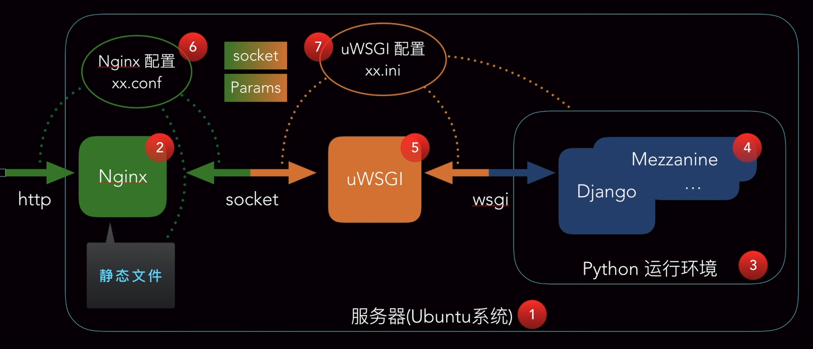

# Docker

## 1. 概念简介

### 1.1 什么是容器？

容器技术，是一种虚拟化的方案，在操作系统级别试下虚拟化，只能运行相同或相似内核的操作系统，由于依赖于Linux内核特性：Namespace和Cgrouos，导致容器只能运行Linux而不能运行Windows操作系统。（Docker for Windows 实际上启用了Windows自带的虚拟机Hyper-V，还是运行在Linux的内核上）


容器只需要应用程序和先关的库即可，而虚拟机需要应用程序、相关的库和整个操作系统，后者对资源大小的需求远大于前者，同时还要模拟硬件的行为，对内存和CPU的损耗更大。在相同的配置下，前者能够提供更多的服务能力。

### 1.2 什么是Docker

Docker是一种能将应用程序自动部署到容器中的技术。其目标是：

- 提供简单轻量的建模方式
- 职责的逻辑分离
- 快速高效的开发生命周期
- 鼓励使用面向服务的架构

## 2. 基本组成


这张图揭示了docker各个组成部分，下面将分别对其中的内容进行讲解。

### 2.1 Docker Client客户端和Docker Daemon守护进程

Docker为C/S架构，Client向服务端(守护进程)发出请求，守护进程处理完成后返回给客户端。如下图所示。


### 2.3 Docker Image镜像

镜像是Docker的基石，容器基于镜像启动和运行，保存了容器运行的各种条件，镜像是一个层叠的**只读**文件系统，最底端为引导文件系统bootfs，实际上当容器启动后，将被移到内存中，引导文件系统被卸载，rootfs文件系统在其之上，只能是只读的。docker采用联合加载技术（一次加载多个文件系统），将各层文件系统叠加在一起，这样最终的文件系统会包含底层的文件系统和目录，docker将这样的文件系统称为镜像。下一层是上一层的父级镜像，最下层的镜像称为基础镜像。


### 2.4 Docker Container容器

容器通过镜像来启动，容器中可运行多个进程，如果说镜像是docker的构建和打包阶段，则容器是docker的启动和执行阶段。当一个容器启动时，docker会在该镜像的最顶层加载一个读写文件系统（可写层），docker中的程序就是在这一层执行的。第一次启动一个容器时，初始的读写层是空的。如果想修改一个文件，文件首先会从读写层一下的只读层复制到可写层，其在只读层的源文件仍然存在，只是被可写层的文件副本所隐藏（写时复制 copy on write）。


### 2.5 Docker Registry仓库

用于保存用户创建的镜像，分为共有和私有两种镜像，Docker Hub上存有大量的镜像，可供用户进行下载。

## 3. 容器相关技术

### 3.1 Namespace命名空间

可以Namespace认为是一种封装的概念，在编程语言中实现的是代码的隔离，而操作系统中的Namespace实现的是系统资源的隔离包括进程、网络和文件系统等等。在同一个Namespace中的进程可以感知彼此的变化，而对其它Namespace下的进程一无所知，容器中的进程仿佛自己独自存在，达到隔离的目的。

docker中提供五种Namespace：

- PID（Process ID）进程隔离
- NET（Network）管理网络接口
- IPC（InterProcess Communication）管理跨进程通信的访问
- MNT（Mount）管理挂载点
- UST（Unix Timesharing System）隔离内核和版本标识

如何对这些隔离的资源进行管理？

### 3.2 Control Groups控制组

用来限制、记录和隔离进程组所使用的物理资源的机制。可以认为cgroups就是为了实现容器技术而生。

主要的功能有：

- 资源限制，设置内存使用的上限
- 优先级设定，设定进程的优先级
- 资源计量，计算进程组使用多少系统资源
- 资源控制，可以将进程组挂起和恢复

### 3.3 Docker容器能力

- 文件系统隔离：每个容器都有自己的rooot文件系统
- 进程隔离：每个容器都运行在自己的进程环境中
- 网络隔离：容器见的虚拟网络接口和IP都是分卡的
- 资源隔离和分组：使用cgroups将CPU和内存之类的资源独立分配给每个Docker容器

## 4. 容器基本操作

### 4.1 安装和启动容器

安装参考博客如下：

> 《Ubuntu安装与卸载docker》https://blog.csdn.net/longzhoufeng/article/details/82421322

```shell
#1. 启动基本容器
$ docker run IMAGE [COMMAND] [ARG]
#IMAGE:表示的是容器的名称
#COMMAND: 命令
#ARG:参数

#2. 启动交互式的容器
$ docker run -i -t IMAGE /bin/bash
# -i:interactive=true | false 默认是false
# -t:--tty=true | false 默认是false

#3. 查看容器
$ docker ps [-a][-l] 
# -a：查看所有容器，包括已经停止的，默认显示当前运行的
# -l：最新创建的容器
$ docker inspect [cname|cid]
# cname|cid: 可以是容器的名字或者id，该命令输出容器的详细信息

#4. 自定义容器名称
$ docker run -i -t --name=yourname IMAGE /bin/bash
# --name: 可以自己定义容器的名称

#5. 重新启动已经停止的容器
$ docker start [-i] cname
# -i: 以交互的方式启动容器
# cname: 容器名称

#6. 删除已经停止的容器
$ docker rm  cname|cid
# cname|cid: 可以是容器的名字或者id
```

### 4.2 守护式容器

守护式容器的是一种：

- 长期运行
- 没有交互式会话
- 适合运行应用程序和服务

```shell
#1. 以守护形式运行容器
$ docker run -i -t IMAGE /bin/bash
  ctrl+P ctrl+Q #组合键退出容器，使之在后台运行
  
#2. 附加到运行中的容器
$ docker attach cname|cid
# cname|cid: 可以是容器的名字或者id

#3. 启动守护式容器
$ docker run -d IMAGE [COMMAND] [ARG...]
# -d:以后台方式启动容器

#4. 启动守护式容器
$ docker run -d IMAGE [COMMAND] [ARG...]
# -d:以后台方式启动容器,在其command运行结束后就会停止
#例子：docker run -d ubuntu /bin/sh -c "while true; do echo hello world; sleep 1; done"
#后台方式运行容器，容器中每秒输入一个hello world

#5. 查看运行容器日志
$ docker logs [-f] [-t] [--tail] cname|cid
# -f: --follows=true|false 默认是false 一直跟踪并返回结果
# -t: --timestamos=true|false 默认是false
# --tail="all" 返回结尾处多少条日志
# cname|cid: 可以是容器的名字或者id

#6. 查看运行容器内进程
$ docker top cname|cid
# cname|cid: 可以是容器的名字或者id

#7. 在运行的容器中启动新进程
$ docker exec [-d] [-i] [-t] cname|cid [COMMAND] [ARG]
# cname|cid: 可以是容器的名字或者id

#8. 停止守护式容器
$ docker stop cname|cid 
$ docker kill cname|cid 
# cname|cid: 可以是容器的名字或者id
# stop是发送结束信号等待容器停止，而kill是直接停止，都会返回cname
```

### 4.2 容器中部署静态网站

**step1：**设置容器的端口映射

```shell
$ docker run [-P|-p]
# -P:--publish-all=true|false 默认false 对容器暴露的所有端口进行映射
# -p:--publish=[] 指定映射容器的端口,有四种格式
#1. 指定容器的端口，宿主机端口随机映射
$ docker run -p 80 -i ubuntu /bin/bash
#2. 指定宿主机端口和容器端口
$ docker run -p 80880:80 -i ubuntu /bin/bash
#3. 指定ip和容器端口
$ docker run -p 0.0.0.0:80 -i ubuntu /bin/bash
#4. 指定ip、宿主机端口和容器端口
$ docker run -p 0.0.0.0:8080:80 -i ubuntu /bin/bash
```

**step2：**Nginx部署流程


```shell
# 1. 启动并创建交互容器
$ docker run -p 80 --name web -i -t ubuntu /bin/bash

# 2. 安装nginx
root@53ce313d8/# apt-get install -y nginx

# 3. 安装vim
root@53ce313d8/# apt-get install -y vim

# 4. 新建一个目录并进入，创建一个静态html文件
root@53ce313d8/# mkdir -p /var/www/html
root@53ce313d8/# cd /var/www/html
root@53ce313d8/# vim index.html
#按下字母i，进入编辑模式，写入内容：
<html>
	<head>docker中的静态页面</head>
	<body>
		<h1>我是docker中的静态界面</h1>
		<h2>Hello, Nginx</h2>
	</body>
</html>
#按下退出键ESC，输入wq保存并退出vim编辑器

# 5. 通过whereis命令找打nginx安装位置,修改配置文件
rooot@53ce313d8/# whereis nginx
rooot@53ce313d8/# vim /etc/nginx/sites-default
#将server中的root改为静态文件所在文件夹
server{
	listen 80 default_server;
	listen [::]:80 default_server ipv6only=on;
	root /var/www/html; #修改位置
	......
}
# 6. 启动nginx，退出并保持容器后台运行
rooot@53ce313d8/# nginx
rooot@53ce313d8/# ps -ef   #查看nginx是否启动
rooot@53ce313d8/# 按下ctrl+P ctrl+Q 组合键

# 7. 查看web容器的端口
$ docker port web
$ docker top web  #查看web中运行的进程

# 8. 访问静态页面 
$ curl http://127.0.0.1:端口

# 9. 查看在docker容器中的ip,也可根据此ip访问静态页面，只不过端口是80
$ docker inspect web
#看到的内容找到IPAddress即为容器中的ip地址
"IPAddress": "172.17.0.34",

# 10. 停止容器并重新启动，nginx需要重启
$ docker stop web
$ docker start -i web
$ docker exec web nginx
#注意此时web容器中的IP地址可能会发生变化，可以重新查询
```

## 5. 镜像的仓库

Docker的镜像存储在/var/lib/docker文件夹下，可以使用$ docker info 命令查看

### 5.1 列出镜像

```shell
$ docker images [OPTIONS] [REPOSITORY]
# OPTIONS:
	-a, --all=false 默认不显示中间层的镜像
	-f, --filter=[] 过滤条件
	--no-trunc=fasle 不使用截断形式显示数据，默认截断
	-q,--quite=fasle 只显示镜像的唯一ID
```

**REPOSITORY** 仓库，其包含的是独立的镜像，而**REGISTRY**仓库中包含大量的**REPOSITORY** 仓库，这两者是不一样的

### 5.2 镜像标签（TAG）

例如：ubuntu:14.04、ubuntu:latest，如果使用时不加以指明，默认使用最新的镜像。镜像中不同的镜像标签，可能对应相同的镜像ID，也就是说可以为同样的镜像根据需求的不同打上不同的标签

### 5.3 查看镜像

```shell
$ docker inspect [OPTIONS] CONTAINER|IMAGE [CONTAINER|IMAGE]
# 既支持容器的查看，也支持镜像的查看
```

### 5.4 删除镜像

```shell
$ docker rmi [OPTIONS] |IMAGE
# -f, --force=false 强制删除镜像
# -no-prune=false 不删除没打标签的父镜像
例如:
$ docker rmi ubuntu:14.04
# 这样只删除了ubuntu仓库中14.04这个标签，并没有删除镜像

$ docker rmi 镜像id
# 这样可以直接删除对应的全部镜像

$ docker rmi $(docker image -q ubuntu)
# 这样可以删除容器中ubuntu对应的全部镜像

$ docker cp 本地文件名 容器id:容器路径
# 这样可以将本地文件拷贝到dokcer容器中
```

## 6. 获取和推送镜像

### 6.1 查找镜像

方式一：使用Docker Hub 地址：https://hub.docker.com/

方式二：使用命令行查找

```shell
$ docker search [OPYIONS] TERM
# 参数：
	--automated=fasle 只显示自动化构建的镜像
	--no-trunc=false 不截断显示
	-s，--stars=0 不显示低于stars数量星级的镜像
```

### 6.2 拉取镜像

```shell
$ docker pull [OPYIONS] NAME [:TAG]
# 参数：
	-a,--all-tag=false 是否将仓库中的所有标记的镜像下载到本地
例如：
$ docker pull ubuntu:14.04
```

官方的镜像拉取比较缓慢，可以修改镜像源。在ubuntu与centOS中，我们可以通过去编辑**/etc/docker/daemon.json**将我们的国内源添加进去,或者去DAOCloud上获取加速链接，更改后daemon.json的内容可能像这样：

```json
{
  "registry-mirrors": ["https://registry.docker-cn.com"]
}
```


之后重启Docker服务

然后重启Docker服务

```shell
$ service docker restart
```

### 6.3 推送镜像

我们可以将本地的镜像推送到Docker镜像仓库中

```shell
$ docker push NAME [:TAG]
```

## 7. 构建镜像

### 7.1 commit方式

```shell
$ docker commit [OPTIONS] CONTAINER [REPOSITORY[:TAG]]
# 参数说明：
	-a,--author="" 作者信息
	-m,--message="" 提交的信息
	-p,--pause=true 提交时，不停止其他容器

例如：
$ docker run -it -p 80 --name cpmmit_test ubuntu /bin/bash
root@2s5di6:/# apt-get update
# 安装nginx
root@2s5di6:/# apt-get install -y nginx
# 提交镜像
$ docker commit commit_test -a 'Author' -m 'nginx' cpmmit_test mynginx/ct1
# 运行刚才提交的镜像,关闭守护进程执行的方式可以让我们方便调试nginx
$ docker run -d --name nginx_web1 -p 80 mynginx/ct1 nginx -g "damon off;"
$ dcker ps
$ curl http://127.0.0.1:端口
```

### 7.2 Dockerfile方式

创建第一个Dockerfile，如下所示。演示的是从ubuntu14.04版本中运行update和安装nginx，并指定暴露的端口为80

```dockerfile
#First Dockerfile
From ubuntu:14.04
MAINTAINER own "xxx@163.com"
RUN apt-get update
RUN apt-get install -y nginx
EXPOSE 80
```

docker build命令介绍

```shell
$ docker build [OPTIONS] PATH|URL|-
# 参数说明：
	--force-rm=false
	--no-cache=false
	--pull=false
	-q,--quite=fasle 静默的构建，不产生输出信息
	--rm=true
	-t,--tag="" 指定构建镜像的名字
```

构建First Dockerfile

```shell
$ mkdir -p dockerfile/df_test1
$ cd dockerfile/df_test1
$ vim Dockerfile
    #First Dockerfile
    From ubuntu:14.04
    MAINTAINER own "xxx@163.com"
    RUN apt-get update
    RUN apt-get install -y nginx
    EXPOSE 80

# 构建镜像并生成在当前目录
$ docker build -t “mynginx/df_test1” .
# 验证镜像
$ docker run -d --name nginx_web1 -p 80 mynginx/df_test1 nginx -g "damon off;"
$ dcker ps
$ curl http://127.0.0.1:端口
```

Dockerfile提供了更为灵活的构建镜像方式，也是目前构建镜像的主要方式。

## 8. Docker的C/S模式

### 8.1 交互方式

如图所示，在Docker Client中会运行各种命令，这些命令会传递到在宿主机上运行的Docker守护进程，负责实现Docker各种功能


下面这幅图中，运行在宿主机上的守护进程（服务端）会在后台一直运行，负责实现客户端提交的命令，用户是通过客户端与守护进程进行交互。


除了通过客户端与守护进程交互，我们还可以通过Remote API(目前叫：Docker Engine SDKs and API)与守护进程交互，其是RESTful 风格的API


目前，Docker官方的Docker Engine SDKs and API参考地址为：

> https://docs.docker.com/develop/sdk/

### 8.2 连接方式

客户端与守护进程的连接方式分为以下三种：

- unix///var/run/docker.sock(默认)
- tcp://host:port
- fd://socketfd

用户通过命令行接口或自定义的应用与客户端进行连接，客户端（可以是自定义的程序，也可以是shell）则通过socket或者其他方式连接服务端，意味着运行Docker的客户端和服务端可以在不同的机器上。


案例演示：

```sh
$ nc -U /var/run/docker.sock
GET /info HTTP/1.1

# 使用netcat命令指定使用UDP协议，连接Docker的服务端
# nc命令参数：
1）-l：用于指定nc将处于侦听模式。指定该参数，则意味着nc被当作server，侦听并接受连接，而非向其它地址发起连接。
2) -p <port>
暂未用到（老版本的nc可能需要在端口号前加-p参数，下面测试环境是centos6.6，nc版本是nc-1.84，未用到-p参数）
3) -s 
指定发送数据的源IP地址，适用于多网卡机 
4) -u
 指定nc使用UDP协议，默认为TCP
5) -v
输出交互或出错信息，新手调试时尤为有用
6）-w
超时秒数，后面跟数字 
7）-z
表示zero，表示扫描时不发送任何数据
```

## 9. 守护进程配置与操作

### 9.1 守护进程的操作

查看Docker守护进程的运行状态：

```shell
# 方式一：
$ ps -ef | grep docker
# 方式二：
$ sudo status docker
```

使用service命令管理Docker：

```shell
# 启动守护进程
$ sudo service docker start
# 停止
$ sudo service docker stop
# 重启，先stop再start
$ sudo service docker restart
```

### 9.2 守护进程的配置

关于Docker的启动选项和启动配置文件的配置问题，可以参考下面这篇博客中的描述，这里不再赘述。

> https://blog.csdn.net/acmman/article/details/85947895

## 10. 远程访问

我们将演示Docker的客户端和服务端配置在不同的机器上，实现远程访问。

**step1：**准备环境如下：

- 2台安装Docker的服务器
- 修改Docker守护经常启动选项，使用labels区分服务器（第一台设置为server1，第二台设置为server2）
- 保证Client API 和 Server API版本一致

**step2：**修改服务器端配置(server1，假设ip为：10.215.55.5)

```shell
# 修改Docker守护守护启动选项
	-H  tcp://host:port
		unix:///path/to/socker,
		fd://* or fd://socketfd
		
#守护进程默认配置：
	-H	unix:///var/run/docker.sock
	
# 修改启动配置文件，加入守护进程的连接方式
	-H	tcp://0.0.0.0:2375
	
# 注意，-H参数可以写多个，既支持远程也支持本地则如下
	-H	tcp://0.0.0.0:2375 -H	unix:///var/run/docker.sock

# 保存退出重启Docker
$ sudo service docker restart
```

**step3：**修改客户器端配置(server2)

step2配置完成后，在另一台机器上可以通过相关的命令远程访问server1

```shell
# 显示server1的docker信息,方式1
$ curl http://10.215.55.5:2375/info

# 方式2
$ docker -H tcp://10.215.55.5:2375 info

# 临时设置环境变量简化访问,之后使用docker命令无需-H参数，默认操作server1守护进程
$ export DOCKER_HOST="tcp://10.215.55.5:2375"
$ docker info
# 恢复
$ export DOCKER_HOST=""
```

## 11. Dockerfile

### 11.1 基础指令

注释以"**#**"打头，指令是全部大写的，指令后面跟参数

```dockerfile
# 1. From必须是已经存在的镜像，后续操作都基于此镜像
From <image> | <image>>:<tag>

# 2. 维护者信息，一般是名字+邮箱
MAINTAINER navicate "xxx@163.com"

# 3. 镜像中运行的命令，支持两种模式
# shell模式
RUN <command> (/bin/sh -c command形式执行)
RUN echo hello 
# exec模式
RUN ["executable", "param1", "param2"]
RUN ["/bin/bash", "-c", "echo hello"]
# 每一条RUN就会当前镜像的上层新建一层运行指令

# 4. 使用的端口，可以是一个或者多个
EXPOSE <port>[<port>...]
# docker run -p 80 -d myimage/df_test1 nginx -g "daemon off";
# 这里处于安全的考虑docker并不会自动打开，仍然需要手动的设定映射端口
```

### 11.2 其他指令

```dockerfile
# 1. CMD用来提供容器运行时命令与RUN类似，在shell中的命令会覆盖这条命令
# shell模式
CMD <command> param1 param2
CMD echo hello 
# exec模式
CMD ["executable", "param1", "param2"]
CMD ["/bin/bash", "-c", "echo hello"]
# 作为ENTRYPOINT指令默认参数
CMD ["param1", "param2"]
# 例：以前台模式运行nginx
CMD ["/usr/sbin/nginx","g","daemon off"]

# 2. ENTRYPOINT用来提供容器运行时命令与CMD类似，不同在于默认不会被shell中的命令覆盖
# 如果需要覆盖可使用docker run --entrypoint覆盖
# shell模式
ENTRYPOINT <command> param1 param2
ENTRYPOINT echo hello 
# exec模式
ENTRYPOINT ["executable", "param1", "param2"]
ENTRYPOINT ["/bin/bash", "-c", "echo hello"]
# 例：以前台模式运行nginx
ENTRYPOINT ["/usr/sbin/nginx","g","daemon off"]

# 3. ADD和COPY将文件复制到使用Dockerfile构建的镜像中
ADD <src>...<dest>
ADD ["<src>"..."<dest>"] #(适用于文件路径中有空格的情况)

COPY <src>...<dest>
COPY ["<src>"..."<dest>"] #(适用于文件路径中有空格的情况)
# <src>	 是构建镜像中的相对路径
# <dest> 是构建镜像中的绝对路径
# 区别：ADD包含类似tar的解压缩功能，单纯复制文件，推荐使用COPY
#例：index.html与dockerfile在同一路径下，用于替换nginx默认页
COPY index.html /usr/share/nginx/html/

# 4. VOLUME
ADD ["/data"]

# 5. WORKDIR镜像创建容器时，在容器内部设置工作目录，ENTRYPOINT和CMD默认这个工作目录下执行
WORKDIR /path/to/workdir # 使用相对路径，后续还有WORKDIR则会传递
# 例：
WORKDIR /a
WORKDIR b
WORKDIR c
RUN pwd
# 结果为：/a/b/c

# 6. ENV用于设置环境变量
ENV <key><value>
ENV <key>=<value> ...

# 7. USER指定镜像会以什么样的用户去运行(不指定则为root用户)
USER daemon
# 例：
USER nginx
USER user
USER user:group
USER user:gid
USER user:uid
...

# 8. ONBUILD镜像触发器，当一个镜像被其他镜像作为基础镜像时执行,子镜像在构建时插入指令
ONBUILD [INSTRUCTION]
# 例：
ONBUILD COPY index.html /usr/share/nginx/html/
# 这个指令在当前构建的过程中，不会执行，当前的镜像作为其他镜像的基础镜像时则会触发执行
```

### 11.3 Dockerfile构建过程

**执行过程**

- 从基础镜像运行一个容器	
- 执行一条指令，对容器做出修改
- 执行类似docker commit的操作，提交一个新的镜像层
- 在基于刚才提交的经常运行一个新容器
- 执行Dockerfile中的下一条指令，直至所有指令执行完毕

下面分析如下代码的执行过程

```dockerfile
FROM ubuntu:14.04
MAINTAINER navicate "xxx@163.com"
ENV REFRESH_DATE 2015-04-01
RUN apt-get update
RUN apt-get install -y nginx
EXPOSE 80
```


从图中可以看到**Running in** 后面的编号即为提交后新镜像层的guid，也就是中间层的镜像id，在执行完时，还会删除中间层创建的容器，但不会删除中间层镜像镜像，因此可以根据镜像id运行中间层镜像。

**构建缓存**

在上述镜像构建完成后，如果再次构建相同的镜像，可以看到构建过程使用了缓存，那如何不使用缓存呢？


方式一：

```shell
$ docker build --no-cache # 使用no-cache，全部不使用缓存
```

方式二：

```dockerfile
ENV REFRESH_DATE 2015-04-02 #修改这个环境变量的日期，其以下指令都不使用缓存
```

**构建过程**

```shell
$ docker history [image] # 查看已经存在的镜像的构建过程
```

## 12. 网络基础

**网络分配**

查看宿主机的网络配置信息，如下图所示。


其中的**docker0**即为Linux的虚拟网桥（数据链路层，使用Mac地址对网络进行划分，并且在不同的网络中传递数据），其特点如下：

- 可以设置IP地址
- 相当于拥有一个隐藏的虚拟网卡，名字为docker0

在容器创建时，这个**docker0**虚拟网桥会对其中的容器创建一个以vech打头的网络接口，这个网络接口对应了容器中的网络地址。


```shell
$ sudo apt-get update
$ sudo apt-get install bridge-utils
$ sudo apt-get install net-tools # 上面一条指令不行则使用这一条，安装网桥相关工具
$ sudo brctl show # 显示网桥
```

当容器创建完成后，再次显示网桥的信息，可以发现docker0虚拟网桥中实现了一个容器接口。


**自定义docker0**

当我们希望docker中的网络地址为我们想要设定的网段时，可以进行自定义，如下所示。

```shell
$ sudo inconfig docker0 192.168.200.1 netmask 255.255.255.0
```

**自定义网桥**

步骤一：添加虚拟网桥

```shell
$ sudo brctl addbr br0
$ sudo ifconfig br0 192.168.100.1 netmask 255.255,255.0
```

步骤二：更改docker守护进程的启动配置

在/etc/defult/docker中添加DOCKER_OPS值，-b = br0

*Docker版本的不同，其更改方式也不尽相同，如有疑问请查阅第九章相关内容和链接。

## 13. 容器互联

### 13.1 环境准备

创建一个dockerfile，用于构建测试实验镜像，代码如下所示：

```dockerfile
FROM ubuntu:14.04
RUN apt-get install -y ping
RUN apt-get update
RUN apt-get install -y curl
EXPOSE 80
CMD /bin/bash
```

### 13.2 所有容器互联

启动Docker时，守护进程的启动选项，默认参数 ：**--icc=true**，表示运行容器之间进行相互访问。

使用以下命名可以将当前容器与指定的容器建立关联，之后可以通过别名来访问容器内的服务，在docker重启之后仍然有效。其原理是设置了环境变量，将别名映射到容器，并修改了/etc/hosts中的映射关系。


```shell
$ docker run --link=[CONTAINER_NAME]:[ALIAS] [IMAGE][COMMOND]
# CONTAINER_NAME: 容器名
# ALIAS: 别名
```

### 13.3 拒绝所有容器间互联

启动Docker时，守护进程的启动选项设置为 ：**--icc=false**，阻断容器之间的连接。通过修改Docker的配置文件完成。

### 13.4 允许特定容器间的连接

Docker守护进程的启动选项：

​	--icc=false   --iptables=true

​	--link

表示容器阻断所有容器的访问，仅仅允许使用link配置的容器访问

```shell
$ sudo iptables -L -n # 查看网络连接情况
```

### 13.5 外部网络连接

首先介绍两个命令：

- --ip-forward

该命令决定了系统是否会转发流量，docker守护进程的默认参数中默认其为true，使用如下命令可以查看转发是否开启

```shell
$ sysctl net.ipv4.conf.all.forwarding  # 1表示开始，0表示关闭
```

- --iptables

Iptabels是与linux内核集成的包过滤防火墙系统，几乎所有的linux发行版都会包含iptables的功能。


iptables的框架如上图所示，图中每一个方框中的小写名称都表示一个table，图中一共包含三条chain，分别是：

- IN->PREROUTING->INPUT->LOCALHOST
- LOCALHOST->OUTPUT->POSTROUTING->OUT
- IN->PREROUTING->FORWARD->POSTROUTING->OUT

每一条链表示数据处理的不同环节。

本次要用到的主要filter表，其包含的链有：

- INPUT
- FORWARD
- OUTPUT

```shell
# 查看filter表中链的信息
$ sudo iptables -t filter -L -n
$ sudo iptables -L -n
$ docker run -it -p 80 --name cct5 image/name
$ docker port cct5

# 阻止ip访问
$ sudo iptables -I DOCKER -s srcIP -d destIP -p TCP --dport 80 -j DROP
# srcIP是要阻止的ip，destIP是容器的ip，dport的容器对应的端口号
```

## 14. 容器的数据卷

### 14.1数据卷（Data Volume）

数据卷是经过特殊设计的目录，可以绕过联合文件系统（UFS），为一个或多个容器提供访问

数据卷设计的目的，在于数据的永久化，它会独立于容器的生命周期，因此，Docker不会在容器删除时删除其挂载的数据卷，也不会存在类似的垃圾收集机制，对容器引用的数据卷进行处理


从上图可以看出：

- docker数据卷独立于docker存在，它存在于宿主机中，因此它与docker容器的生命周期是分离的
- docker数据卷可以是目录，也可以是文件
- docker容器可以通过数据卷技术与宿主机进行数据共享
- 同一个数据卷文件可以支持多个文件的访问，从而实现容器间的数据共享和交换

**数据卷的特点**

- 数据卷在容器启动时期初始化，如果容器使用的镜像在挂载点包含了数据，这些数据会拷贝到新初始化的数据卷中
- 数据卷可以在容器之间共享和重用
- 可以对数据卷里的内容直接进行修改
- 数据卷的变化不会影响镜像的更新
- 数据卷会一直存在，即使挂载数据卷的容器已经被删除

### 14.2 数据卷的使用

- 为容器添加数据卷

```shell
# 为容器添加数据卷
$ sudo docker run -v ~/container_data:/data -it ubuntu /bin/bash
# ~/container_data为本机文件夹，如果不存在则自动创建
# /data为容器中的文件夹

# 在容器的data中创建文件
$ touch /data/c1
$ echo "I'm a data in container" > /data/c1
# 退出容器后可以在宿主机的对应目录中查看到该文件

# 查看数据卷
$ docker ps -l
$ docker inspect 容器id
```

- 为数据卷添加访问权限

```shell
# 为数据卷添加访问权限
$ sudo docker run -v ~/container_data:/data:ro -it ubuntu /bin/bash
# ro:只读的文件权限

# 在容器的data中创建文件
$ touch /data/c2
# 此时会提示该目录为只读，不允许新建文件
```

- 使用dockerfile构建包含数据卷的镜像

```dockerfile
FROM ubuntu:14.04
VOLUME ["/datavolume1","/datavolume2"]
CMD /bin/bash
```

```shell
# 构建、运行、查看
$ docker build -t testimg/dvt .
$ docker run -it testimg/dvt --name dvt1
$ docker inspect dvt1
```

需要注意的是，使用这种方式创建的数据卷在对宿主机中是自动创建的，每次运行容器时创建的数据卷都不一样，而且不同容器之间的数据卷无法相互访问

### 14.3 数据卷容器

**概念**

命名的容器挂载数据卷，其他容器通过挂载这个容器实现数据共享，挂载数据卷的容器，就叫做数据卷容器


从上图可以看出，数据卷容器挂载了一个本地目录，其他容器通过连接这个数据卷容器来实现数据的共享

**挂载数据卷容器**

```shell
# 挂载指令
$ docker run --volumes-from [CONTAINER NAME]

# 启动一个容器作为数据卷容器， 并在容器中的数据卷创建文件
$ docker run -it --name dvt2 testimg/dvt
$ touch /datavolume1/dvt2_1
$ exit

# 运行容器并挂载数据卷容器
$ docker run -it --name dvt3 --volumes-from dvt2 ubuntu /bin/bash
$ ls /datavolume1
$ touch /datavolume1/dvt3_1

# 运行容器并挂载数据卷容器
$ docker run -it --name dvt4 --volumes-from dvt2 ubuntu /bin/bash
$ ls /datavolume1

# 删除数据卷容器，查看挂载了数据卷容器的容器中数据信息
$ docker rm dvt2
$ docker restart dvt3
$ docker attach dvt3
$ ls /datavolume  #可以看到数据还在
$ touch /datavolume1/dvt3_2 #也仍然创建文件
$ docker rm -v dvt3 #删除容器并且删除其挂载的数据卷容器，如果这个容器还被其他容器挂载，则不会删除
```

因此，通过上述的实验可以证明，使用数据卷容器进行挂载，实际上是将数据集配置信息传递到新的容器中。

### 14.4 数据卷的备份和还原

**数据备份方法**

```shell
$ docker run --volumes-from [CONTAINER NAME] -v $(pwd):/backup ubuntu tar cvf /backup/backup.tar [CONTAINER DATA VOLUME] 
# 将当前容器挂载数据容器，在容器创建一个名为backup的目录，并将数据容器中的数据卷压缩到当前容器的backup文件夹下
```


执行备份命令的容器先挂载数据容器，这样数据会被拷贝一份到执行备份命令的容器中，同时该容器挂载了本地文件系统中的备份数据目录，因此将数据容器中的数据打包到该容器中的备份数据目录即可实现容器目录到本地目录的转移

**数据还原方法**

数据还原方法与备份方法类似，只不过执行的是解压缩操作。

```shell
$ docker run --volumes-from [CONTAINER NAME] -v $(pwd):/backup ubuntu tar xvf /backup/backup.tar [CONTAINER DATA VOLUME] 
# 将当前容器挂载数据容器，在容器创建一个名为backup的目录，并将数据容器中的数据卷压缩到当前容器的backup文件夹下
```

## 15. 跨主机连接

### 15.1 网桥

在宿主机中，docker之间的容器通过默认的docker0网桥进行通信，如果将网桥桥接到宿主机的往卡上，并且将网桥和宿主机的ip地址设置为同一ip网段，相当于将docker集中的容器和宿主机的网络连接在一起，这种做法能否实现跨主机的docker之间的联系呢？


**准备环境**

- 虚拟机
- 两个ubuntu 14.04
- 网桥管理工具：apt-get install bridge-utils|net=tools
- IP地址：Host1:10.211.55.3   Host2:10.211.55.5

**网络设置**

修改/ect/network/interfaces文件

```shell
 auto br0  # 网桥名称
 iface br0 inet static # ip分配方式
 address 10.211.55.3 # 网络ip
 netmask 255.255.255.0 # 子网掩码
 gateway 10.211.55.1 # 网关
 bridge_ports eth0 # 本地的物理网卡连接到新建网桥
```

**Docker设置**


**实验过程**

```shell
# 1. 查看本机网络信息
$ ifconfig

# 2. 编辑网络配置，重启不失效
$ sudo vim /ect/network/interfaces

# 3. 修改docker守护进程配置
# DOCKER_OPTS="-b=br0 --fiex-cidr=10.211.55.128/26"

# 4. 重启系统使网络配置生效
$ sudo reboot

# 5. 启动docker容器，并查看网络信息
$ ps -ef |grep docker
$ docker run -it ubuntu /bin/bash
$ ifconfig

# 另一台ubuntu虚拟机也是上述的配置步骤，配置完成之后，可以ping通两台主机
```

**优点**

- 配置简单，不依赖于第三方软件

**缺点**

- 与主机在同网段，需要小心划分IP地址

- 需要有网段控制权，在生产环境中不易实现
- 不容易管理
- 兼容性不佳

### 15.2 Open vSwitch


上图中，蓝色方框部分是我们熟悉的网桥，其上方黄色的部分是使用Open vSwitch创建的网桥，obr网桥通过GRE隧道协议接口实现跨主机网络连接


**准备环境**

- 虚拟机
- 两个ubuntu 14.04
- 双网卡，Host-Only （虚拟机之间的连接）& NAT（虚拟机与外部网络的连接）
- 安装Open vSwitch：apt-get install openvswitch-switch
- 网桥管理工具：apt-get install bridge-utils|net=tools
- IP地址：Host1:192.168.59.103   Host2:192.168.59.104

**操作过程**

- 建立ovs网桥
- 添加gre连接
- 配置docker容器虚拟网桥
- 为虚拟网桥添加ovs接口
- 添加不同docker容器网段路由

```shell
# 1. 查看ovs状态
$ sudo ovs-vsctl show

# 2. 添加ovs网桥，配置gre端口和远程ip
$ sudo ovs-vsctl add-br obr0
$ sudo ovs-vsctl add-port obr0 gre0 
$ sudo ovs-vsctl set interface gre0 type=gre options:remote_ip=192.168.59.104
$ sudo ovs-vsctl show

# 3. 新增br0网桥,增加ovs网桥的连接
$ sudo brctl addr br0
$ sudo ifconfig br0 192.168.1.1 netmask 255.255.255.0
$ sudo brctl addif br0 obr0
$ sudo brctl show

# 4. 修改docker配置文件
# DOCKER_OPTS="-b=br0"

# 5. 启动docker1容器
$ docker run -it ubuntu /bin/bash
$ ifconfig
$ ping 192.168.59.104

# 6. 配置另一台机器，步骤同上，配置br0为192.168.2.1

# 7. 启动docker2容器
$ docker run -it ubuntu /bin/bash
$ ifconfig
$ ping docker1的ip # ping 不通

# 8. 修改路由表，发往192.168.1.0网段的数据通过192.168.59.10转发
$ route
$ sudo ip route add 192.168.1.0/24 via 192.168.59.103 dev eth0

# 9. 启动docker2容器
$ docker run -it ubuntu /bin/bash
$ ifconfig
$ ping docker1的ip # 可以ping通

```

### 15.3 weave

**weave是什么?**

​	语义：编织	

​	建立一个虚拟的网络，用于将运行在不同主机的Docker容器连接起来

​	http://weave.works

​	https://github.com/weaveworks/weave#readme


通过weave，我们可以忽略容器的所在位置，而直接通过配置的网络进行连接。

**准备环境**

- 虚拟机
- 两个ubuntu 14.04
- 双网卡，Host-Only （虚拟机之间的连接）& NAT（虚拟机与外部网络的连接）
- IP地址：Host1:192.168.59.103   Host2:192.168.59.104

**操作过程**

- 安装weave
- 启动weave   $ weave launch
- 连接不同主机
- 通过weave启动容器

```shell
# 1. 下载weave
$ sudo wget -O /usr/bin/weave https://raw.githubusercontent.com/zettio/weave/master/weave

# 2. 更改weave的文件夹模式，使之可以执行
$ sudo chmod a+x /usr/bin/weave

# 3. 启动weave
$ weave launch

# 4. 在另一台机器中启动weave，同时传入机器1的ip地址，使之连接在一起
$ weave launch 192.168.59.103
$ c2=$(weave run 192.168.1.2/24 -it ubuntu /bin/bash)
# 这条命令中，使用weave启动容器，192.168.1.2/24为将要在容器中使用的ip地址，由weave维护
# c2接收命令返回值，这里是容器的id，方便后续进入容器
$ docker attach $c2

# 5. 回到机器1中，运行容器
$ weave run 192.168.1.10/24 -it --name wc1 ubuntu /bin/bash
$ docker attach wc1
$ ifconfig
$ ping 192.168.1.2 # 可以ping通
```

## 16 Docker环境下配置Django+uwsgi+nginx

**准备环境**

- Docker
- Ubuntu18.04镜像
- 容器中安装vim、nginx、python

**部署流程**



整个部署流程可以参照上图，图中的序号代表了部署的顺序。下面将根据上图进行部署。

**开始部署**


## 参考资料

> 视频教程：《Docker入坑教程》https://www.bilibili.com/video/av17854410/