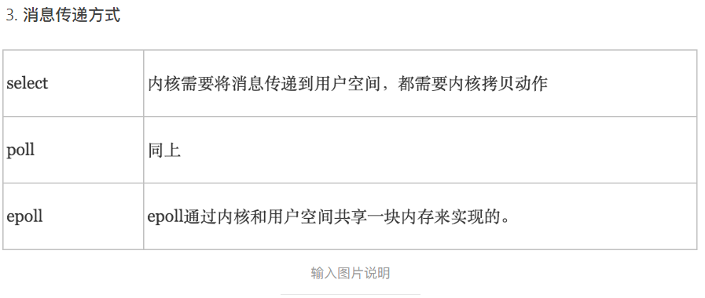

## Linux面试问题汇总

### 1. Linux同步异步阻塞非阻塞的区别（超级重要）

**同步**

一个任务依赖于另一个任务，只有被依赖的任务执行完毕，当前任务才能继续执行，一种可靠的任务序列，要么都成功，要么都失败

**异步**

当前任务不需要等待所依赖的任务完成即可执行，至于被依赖的任务是否执行完成以及是否成功，当前任务无法确定，是不可靠的

**阻塞**

在等待被依赖的任务执行过程中，当前任务不能干别的事情，只能挂起等待

**非阻塞**

在等待被依赖的任务执行过程中，当前任务可以干其他的事情，并不会等待被依赖的任务执行

> 《聊聊同步、异步、阻塞与非阻塞》：https://www.jianshu.com/p/aed6067eeac9

### 2. LinuxI/O模型介绍

简单总结一下：
同步：主动菜是否准备好（光等或轮询）
异步：服务员在菜准备好的时候通知你
阻塞：没准备好之前什么事都不干
非阻塞：没准备好之前干其他事

楼主举的例子所说的同步跟阻塞一般是针对数据准备阶段的。
所以最后的总结图对应的是：
阻塞I/O：同步阻塞
非阻塞I/O：同步（轮询）非阻塞
I/O多路复用：同步阻塞（不过可以同时监听多个socket状态，效率高了）
信号驱动I/O：异步非阻塞
异步I/O：真正意义上的异步非阻塞（上面的都只是数据准备阶段，这个是数据准备和数据处理阶段）  


> 《聊聊Linux 五种IO模型》：https://www.jianshu.com/p/486b0965c296

### 3. LinuxIO复用的三种方法（select,poll,epoll）深入理解，区别和内部原理实现？




**epoll的ET模式和LT模式**

LT模式：当epoll_wait检测到描述符事件发生并将此事件通知应用程序，`应用程序可以不立即处理该事件`。下次调用epoll_wait时，会再次响应应用程序并通知此事件。

ET模式：当epoll_wait检测到描述符事件发生并将此事件通知应用程序，`应用程序必须立即处理该事件`。如果不处理，下次调用epoll_wait时，不会再次响应应用程序并通知此事件。

`ET模式在很大程度上减少了epoll事件被重复触发的次数，因此效率要比LT模式高`。epoll工作在ET模式的时候，`必须使用非阻塞套接口`，以避免由于一个文件句柄的阻塞读/阻塞写操作把处理多个文件描述符的任务饿死。

**epoll的底层机制**

首先epoll_create创建一个epoll文件描述符，底层同时创建一个**红黑树**，和一个**就绪链表**；红黑树存储所监控的文件描述符的节点数据，就绪链表存储就绪的文件描述符的节点数据；epoll_ctl将会添加新的描述符，首先判断是红黑树上是否有此文件描述符节点，如果有，则立即返回。如果没有， 则在树干上插入新的节点，并且告知**内核注册回调函数**。当接收到某个文件描述符过来数据时，那么内核将该节点插入到就绪链表里面。epoll_wait将会接收到消息，并且将数据拷贝到用户空间，清空链表。epoll_wait清空就绪链表之后会检查该文件描述符是哪一种模式，**如果为LT模式，且必须该节点确实有事件未处理，那么就会把该节点重新放入到刚刚删除掉的且刚准备好的就绪链表，epoll_wait马上返回。ET模式不会检查，只会调用一次**

> 《聊聊IO多路复用之select、poll、epoll详解》：https://www.jianshu.com/p/dfd940e7fca2
>

### 4. 文件系统的理解（EXT4，XFS，BTRFS）

**文件系统**主要用于控制所有程序在不使用数据时如何存储数据、如何访问数据以及有什么其它信息（元数据）和数据本身相关，等等

常见的文件系统如下：

Linux文件系统：ext2,ext3,ext4,xfs,btrfs,reiserfs,jfs,swap
swap：交换分区，是一种比较特殊的文件系统，将硬盘当内存用
windows：fat32，ntfs
unix：FFS,UFS,JFS2
网络文件系统：NFS,CIFS
集群文件系统：GFS2，OCFS2
分布式文件系统：ceph，moosefs，mogilefs,等等吧

根据是否支持日志（journal）功能：
日志型文件系统：ext3，ext4，xfs，……
非日志型文件系统：ext2，vfat

**EXT4**

ext4 还有一些明显的限制。最大文件大小是 16 tebibytes（大概是 17.6 terabytes），这比普通用户当前能买到的硬盘还要大的多。使用 ext4 能创建的最大卷/分区是 1 exbibyte（大概是 1,152,921.5 terabytes）。通过使用多种技巧， ext4 比 ext3 有很大的速度提升。类似一些最先进的文件系统，它是一个日志文件系统，意味着它会对文件在磁盘中的位置以及任何其它对磁盘的更改做记录。纵观它的所有功能，它还不支持透明压缩、重复数据删除或者透明加密。技术上支持了快照，但该功能还处于实验性阶段。

**XFS** 

文件系统是扩展文件系统的一个扩展。XFS 是 64 位高性能日志文件系统。对 XFS 的支持大概在 2002 年合并到了 Linux 内核，到了 2009 年，红帽企业版 Linux 5.4 也支持了 XFS 文件系统。对于 64 位文件系统，XFS 支持最大文件系统大小为 8 exabytes。XFS 文件系统有一些缺陷，例如它不能压缩，删除大量文件时性能低下。目前RHEL 7.0 文件系统默认使用 XFS。

**BTRFS**

btrfs 有很多不同的叫法，例如 Better FS、Butter FS 或者 B-Tree FS。它是一个几乎完全从头开发的文件系统。btrfs 出现的原因是它的开发者起初希望扩展文件系统的功能使得它包**括快照、池化、校验**以及其它一些功能。虽然和 ext4 无关，它也希望能保留 ext4 中能使消费者和企业受益的功能，并整合额外的能使每个人，尤其是企业受益的功能。对于使用大型软件以及大规模数据库的企业，让多种不同的硬盘看起来一致的文件系统能使他们受益并且使数据整合变得更加简单。删除重复数据能降低数据实际使用的空间，当需要镜像一个单一而巨大的文件系统时使用 btrfs 也能使数据镜像变得简单。

官方说，其下一代文件系统仍然被归类为“不稳定”，但是如果用户下载最新版本的 Ubuntu，就可以选择安装到 btrfs 分区上。什么时候 btrfs 会被归类到 “稳定” 仍然是个谜， 直到真的认为它“稳定”之前，用户也不应该期望 Ubuntu 会默认采用 btrfs。有报道说 Fedora 18 会用 btrfs 作为它的默认文件系统，因为到了发布它的时候，应该有了 btrfs 文件系统校验器。由于还没有实现所有的功能，另外和 ext4 相比性能上也比较缓慢，btrfs 还有很多的工作要做。

### 5. 文件处理awk,sed,grep,strace,tcpdump命令必知必会

#### awk

awk拥有强大的文本格式化能力，能将文本格式化成想要的格式进行输出

基本指令格式：

```shell
$ awk [options] 'Pattern{Action}' file1, file2,...

# df指令的第5列输出在屏幕上
$ df | awk '{print $5}' 
```

#### sed

  Sed是一种非交互式的流编辑器，可动态编辑文件；流编辑器则会在编辑器处理数据之前基于预先提供的一组 规则来编辑数据流 。
       Sed本身是一个管道命令，可以分析 standard input 的，主要是用来分析关键字的使用、统计等，此外还可 以将数据进行替换、删除、选中、选取特定行等功能
1.sed -[]常用的参数及其作用：
-n ：安静模式。在sed的一般用法中，所有来自文件中的数据都会被列出到屏幕上，如果加上-n，则只有经过sed特殊处理的那行（或操作）才会被列出来。
-e ：直接下命令行模式上进行sed的动作编辑。
-f ：直接将sed的动作写在一个文件内，-f filename 则可以执行file内的sed动作。
-r ：sed的动作支持的是扩展型正则表达式的语法（默认是基础正则表达式的语法）。
-i ：可直接对源文件内容进行修改。危险操作
-h或–help：显示帮助；
-V或–version：显示版本信息

2.function有下面这些参数
i ：插入，在目标行的上面新增一行。
a ：插入，在目标行的下面新增一行。
d ：删除所选行。
p ：打印，也就是将某个选择的数据打印出来，通常参数-p与参数-n搭配使用。
s ：替换，可以直接进行替换的工作。
c ：替换，c的后面可以接替字符串，这些字符串可以替换n1，n2之间的行。
w ：写并追加模板块到file末尾。
W ： 写并追加模板块的第一行到file末尾。
! ：表示后面的命令对所有没有被选定的行发生作用。
= ：打印当前行号; # 把注释扩展到下一个换行符以前。

以上参数皆不改变原文件内容

#### grep

**grep [-acinv] [--color=auto] '搜寻字符串' filename**

选项与参数：

-a ：将 binary 文件以 text 文件的方式搜寻数据

-c ：计算找到 '搜寻字符串' 的次数

-i ：忽略大小写的不同，所以大小写视为相同

-n ：顺便输出行号

-v ：反向选择，亦即显示出没有 '搜寻字符串' 内容的那一行！

--color=auto ：可以将找到的关键词部分加上颜色的显示喔！在关键字的显示方面，grep 可以使用 --color=auto 来将关键字部分使用颜色显示。 这可是个很不错的功能啊！但是如果每次使用 grep 都得要自行加上 --color=auto 又显的很麻烦～ 此时那个好用的 alias 就得来处理一下啦！你可以在 ~/.bashrc 内加上这行：『alias grep='grep --color=auto'』再以『 source ~/.bashrc 』来立即生效即可喔！ 这样每次运行 grep 他都会自动帮你加上颜色显示啦

#### strace

strace是一个可用于诊断、调试和教学的Linux用户空间跟踪器。我们用它来监控用户空间进程和内核的交互，比如系统调用、信号传递、进程状态变更等，使用参数如下：

> -tt 在每行输出的前面，显示毫秒级别的时间
> -T 显示每次系统调用所花费的时间
> -v 对于某些相关调用，把完整的环境变量，文件stat结构等打出来。
> -f 跟踪目标进程，以及目标进程创建的所有子进程
> -e 控制要跟踪的事件和跟踪行为,比如指定要跟踪的系统调用名称
> -o 把strace的输出单独写到指定的文件
> -s 当系统调用的某个参数是字符串时，最多输出指定长度的内容，默认是32个字节
> -p 指定要跟踪的进程pid, 要同时跟踪多个pid, 重复多次-p选项即可。

#### tcpdump

根据使用者的定义对网络上的数据包进行截获的包分析工具。 tcpdump可以将网络中传送的数据包的“头”完全截获下来提供分析。它支持针对网络层、协议、主机、网络或端口的过滤，并提供and、or、not等逻辑语句来帮助你去掉无用的信息。

> 　-a 　　　将网络地址和广播地址转变成名字；
> 　　　-d 　　　将匹配信息包的代码以人们能够理解的汇编格式给出；
> 　　　-dd 　　 将匹配信息包的代码以c语言程序段的格式给出；
> 　　　-ddd 　　将匹配信息包的代码以十进制的形式给出；
> 　　　-e 　　　在输出行打印出数据链路层的头部信息；
> 　　　-f 　　　将外部的Internet地址以数字的形式打印出来；
> 　　　-l 　　　使标准输出变为缓冲行形式；
> 　　　-n 　　　不把网络地址转换成名字；
> 　　　-t 　　　在输出的每一行不打印时间戳；
> 　　　-v 　　　输出一个稍微详细的信息，例如在ip包中可以包括ttl和服务类型的信息；
> 　　　-vv 　　 输出详细的报文信息；
> 　　　-c 　　　在收到指定的包的数目后，tcpdump就会停止；
> 　　　-F 　　　从指定的文件中读取表达式,忽略其它的表达式；
> 　　　-i 　　　指定监听的网络接口；
> 　　　-r 　　　从指定的文件中读取包(这些包一般通过-w选项产生)；
> 　　　-w 　　　直接将包写入文件中，并不分析和打印出来；
> 　　　-T 　　　将监听到的包直接解释为指定的类型的报文，常见的类型有rpc （远程过程调用）和snmp（简单网络管理协议；）

#### gdb


### 6. 说说proc/目录下包含哪些信息？

* /proc/cpuinfo - CPU 的信息(型号, 家族, 缓存大小等)
* /proc/meminfo - 物理内存、交换空间等的信息
* /proc/mounts - 已加载的文件系统的列表
* /proc/devices - 可用设备的列表
* /proc/filesystems - 被支持的文件系统
* /proc/modules - 已加载的模块
* /proc/version - 内核版本
* /proc/cmdline - 系统启动时输入的内核命令行参数

> https://www.jianshu.com/p/dfd940e7fca2
>

### 7. 查询进程占用CPU的命令


第一行：

19:40:28    当前时间

up 11days,  2:49    系统运行时间，格式为：天，时:分

2 user    当前登录用户数

load average: 0.32, 0.34, 0.36    系统负载，即任务队列的平均长度。三个数值分别为 1分钟、5分钟、15分钟前到现在的平均值

第二、三行：

当有多个CPU时，这些内容可能会超过两行。内容如下：

total 进程总数

running 正在运行的进程数

sleeping 睡眠的进程数

stopped 停止的进程数

zombie 僵尸进程数

Cpu(s): 

0.3% us 用户空间占用CPU百分比

1.0% sy 内核空间占用CPU百分比

0.0% ni 用户进程空间内改变过优先级的进程占用CPU百分比

98.7% id 空闲CPU百分比

0.0% wa 等待输入输出的CPU时间百分比

0.0%hi：硬件CPU中断占用百分比

0.0%si：软中断占用百分比

0.0%st：虚拟机占用百分比

最后两行为内存信息。内容如下：

Mem:

191272k total    物理内存总量

173656k used    使用的物理内存总量

17616k free    空闲内存总量

22052k buffers    用作内核缓存的内存量

Swap: 
192772k total    交换区总量

0k used    使用的交换区总量

192772k free    空闲交换区总量

123988k cached  缓冲的交换区总量，内存中的内容被换出到交换区，而后又被换入到内存，但使用过的交换区尚未被覆盖，该数值即为这些内容已存在于内存中的交换区的大小，相应的内存再次被换出时可不必再对交换区写入。

> 《linux-linux top 命令各参数详解》：https://www.cnblogs.com/sunshuhai/p/6250514.html

### 8. docker实现安全和隔离的方法

**namespace**

- pid 隔离容器中进程的pid，允许容器中的进程有跟宿主机中相同的pod
- net 允许容器单独配置容器中的网络 
- ipc 用作管理对IPC (IPC: InterProcess Communication)资源的访问。
- mnt 管理各自的挂载点
- uts 用作区分内核和版本标识符

**cgroups**

- 实现组进程并且管理它们的资源总消耗。
- 分享可用的硬件资源到容器。
- 限制容器的内存和CPU使用。
- 可以通过更改相应的cgroup来调整容器的大小。
- 通过检查Linux中的/sys/fs/cgroup对照组来获取容器中的资源使用信息。
- 提供了一种可靠的结束容器内所有进程的方法。

### 9. 硬连接和软连接的区别

硬链接等于cp -p加同步更新

软链接像快捷方式，方便我们打开源文件，这一点在windows中深有体会

硬链接和源文件都指向同一个inode，因此修改这两者中的任何一者都会导致另一方被修改

如果将源文件删掉了，硬链接还可以继续使用而软连接会失效

> 《软链接和硬链接到底有啥作用和区别》：https://blog.csdn.net/gao_zhennan/article/details/79127232

### 10. 文件权限怎么看（rwx）

**查看文件的普通权限**

- ls -l [file | dir]，查看一个文件或者目录内部所有文件的权限

- ls -ld dir，查看一个目录本身的权限

**drwxr-xr-x是什么意思**

第一位表示文件类型：d是目录文件,l是链接文件,-是普通文件,p是管道;

第2-4位表示这个文件的属主拥有的权限,r是读,w是写,x是执行;

第5-7位表示和这个文件属主所在同一个组的用户所具有的权限;

第8-10位表示其他用户所具有的权限。

一般目录默认都是具有x权限的，而文件一般则没有x权限

**普通权限的设置**

使用chmod命令来设定普通权限，r-->4,w-->2,x-->1，上面是三种权限对应的数字，我们可以通过数字的形式来设定一个文件的权限，比如：chmod 755 file，这样就把对应的权限设置为user-->rwx,group-->r_x,other-->r_x。使用-R选项来递归修改一个目录的权限。

**修改user或者group**

chown username file，改变一个文件的所有者

chgrp groupname file，改变一个文件的所属组

> 《Linux文件权限一：普通权限（rwx）》：https://blog.csdn.net/u013721086/article/details/79503608

### linux的其他常见命令（kill，find，cp等等）

### shell脚本用法

### 文件的三种时间（mtime, atime，ctime），分别在什么时候会改变

### Linux监控网络带宽的命令，查看特定进程的占用网络资源情况命令

