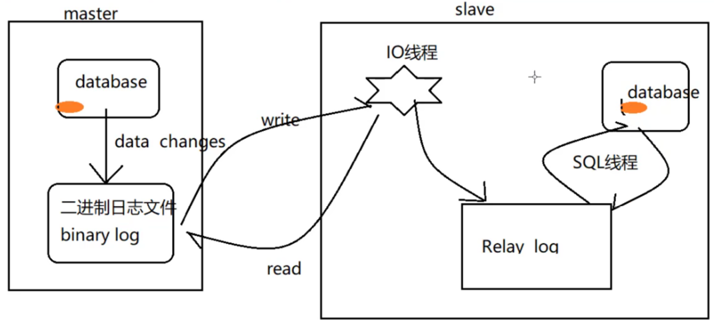

# MySQL高级

## 1. 安装MySQL

**`环境准备`**

- 操作系统：Ubuntu18.04
- MySQL 5.5

**`安装指令`**

- sudo apt-get install mysql-server 
- sudo apt-get install mysql-client
- 如果安装时与之前版本冲突，则需要卸载：sudo apt-get remove --purge mysql-\\* 
- 安装时看日志文件提示修改密码

**`操作指令`**

- 启动mysql：

  ```shell
  #方式一：
  $ sudo /etc/init.d/mysql start 
  #方式二：
  $ sudo service mysql start
  ```

- 停止mysql：

  ```shell
  #方式一：
  $ sudo /etc/init.d/mysql stop 
  #方式二：
  $ sudo service mysql stop
  ```

- 重启mysql：

  ```shell
  #方式一：
  $ sudo /etc/init.d/mysql restart
  #方式二：
  $ sudo service mysql restart
  ```

- 设置密码

  给root用户设置密码为root

  ```shell
  $ /usr/bin/mysqladmin -u root password root
  ```

- 启动报错

  启动时报错：/var/lib/mysql/mysql.sock不存在

  解决方法：

  ```shell
  # 1. 手动启动服务： 
  $ /etc/init.d/mysql start
  # 2. 开机自启
  $ chkconfig mysql on
  # 检查开启
  $ ntsysv
  ```

**`核心目录`**

- /var/lib/mysql

  MySQL的安装目录

- /usr/share/mysql

  配置文件

- /usr/bin

  命令目录（mysqladmin、mysqldump等）

- /etc/init.d/mysql

  启停脚本

**`配置文件`**

- my-huge.cnf   高端服务器  1-2G内存及以上
- my-large.cnf   中等规模
- my-medium.cnf   一般
- my-small.cnf   较小

以上配置文件默认不能识别，默认识别的配置文件/etc/my.cnf可以将上述配置文件拷贝到这个文件：

```shell
$ cp /usr/share/mysql/my-huge.cnf /etc/my.cnf
```

注意：MySQL5.5默认的配置文件/etc/my.cnf，MySQL5.6及以上默认配置文件为/etc/mysql/mysql.conf.d/mysqld.cnf

**`字符编码`**

```mysql
# 查看字符编码
show variables like '%char%'
```

编辑/etc/my.cnf文件，设置统一编码：

- [mysql]

  default-character-set=utf8

- [client]

  default-character-set=utf8

- [mysqld]

  character_set_server=utf8

  character_set_client=utf8

  collation_server=utf8_general_ci

## 2. 逻辑分层

**`总体分层`**

MySQL的总体分层如下图所示，用户在客户处键入查询语句，提交至连接层，连接层将语句转至服务层进行执行并优化，其中优化有时候不一定能达到想要的效果，需要谨慎使用。


**`存储引擎`[^1]**

MyISAM：默认表类型，它是基于传统的ISAM类型，ISAM是Indexed Sequential Access Method (有索引的顺序访问方法) 的缩写，它是存储记录和文件的标准方法。**不是事务安全的，而且不支持外键**，如果执行大量的select，insert MyISAM比较适合

InnoDB：支持事务安全的引擎，**支持外键、行锁、事务**是他的最大特点。如果有大量的update和insert，建议使用InnoDB，特别是针对多个并发和QPS较高的情况

```mysql
# 查询数据库引擎
show engines;

# 查询默认的存储引擎
show variables like '%storage_engine%';

# 查询事务隔离级别
show global variables like 'tx_isolation';

# 指定使用的引擎
create table tb(
	id int(4) auto_increment,
    name varchar(5),
    dept varchar(5),
    primary key(id)
)ENGINE=MyISAM AUTO_INCREMENT=1;
```

## 3. SQL优化内容

**`原因`**

- 性能低，执行时间太长

- 索引失效
- SQL语句欠佳（连接查询）
- 等待时间太长

- 服务器参数设置不合理（线程数、缓冲）

**`SQL编写与解析过程`[^2]**

编写过程：

select distinct ... from ...join ...on ...where ...group by ...having ...order by

解析过程：

from ...on ...join ...where ...group by ...having ...select distinct ...order by

**`索引的优缺点`**

**缺点**：

- 索引本身很大，需要存放在硬盘中
- 少量数据、频繁更新的字段、很少使用的字段不适合建索引
- 索引会降低增删改的效率，原因在于需要维护树结构

**优点**

- 提高查询效率
- 降低CPU使用率，例如做排序，由于树结构的有序性，排序直接输出即可

## 4. 索引分类

**表结构**


**分类**

- 单值索引：设置单个列，一个表可以有多个单值索引

```mysql
# 方式一
create index dept_index on tb(dept);
# 方式二
alter table tb add index dept_index(dept);

# 删除索引
drop index 索引名称 on 表名;

# 查看索引
show index from 表名;
```

- 唯一索引：要求字段中不能重复数据，一般以id作为索引

```mysql
# 方式一
create unique index name_unique_index on tb(name);
# 方式二
alter table tb add unique index name_unique_index(name);
```

- 复合索引：多个列构成的索引，相当于多级目录

```mysql
# 方式一
create index dept_name_index on tb(dept,name);
# 方式二
alter table tb add index dept_name_index(dept,name);
```

注：如果一个字段是primary key，则该字段模式就是主键索引（与唯一索引的区别是主键索引不能是null)

## 5. SQL性能分析

SQL性能分析主要分析的是SQL的执行计划，其中的关键字为：**explain**，它可以模拟SQL优化器执行SQL语句。此外，SQL自带的查询优化器会干扰我们的优化结果。例如：

```mysql
explain select * from tb;
```

explain查询结果信息：

| 名称          | 含义             |
| ------------- | ---------------- |
| id            | 查询标识         |
| select_type   | 查询的类型       |
| type          | 访问类型         |
| possible_keys | 可能选择的索引   |
| key           | 实际选择的索引   |
| key_len       | 使用索引的长度   |
| ref           | 与索引比较的字段 |
| rows          | 预计查询的行数   |
| Extra         | 额外信息         |

**id**

对于id相同的记录，其对应的表中数据量越小，越先被查询

对于id不同的记录，id值越大越优先查询，本质在于嵌套子查询时，先查内层，再查询外层

id即有相同也有不同，id越大越优先，id根据表的数据量越小越优先

**select_type**

- PRIMARY：包含子查询SQL中的主查询（最外层）
- SUBQUERY：包含子查询SQL中的子查询（非最外层）
- simple：简单查询，不包含子查询/union
- derived：衍生查询（使用到了临时表），后面跟的id是所在的记录id
  - 在from子查询中只有一张表
  - 在from子查询中，如果有table1 union table2，则table1就是derived表
- union：上述中的table2就是union表
- union result：表示哪两张表之间存在union查询，用id来指示

**type**

type访问类型比较多，这里只讲述常见的类型system、const、eq_ref、ref、range、all，当然要对type进行优化的前提是有索引

system（忽略）：只有一条数据的系统表或衍生表只有一条数据的主查询

const（忽略）：仅仅能查到一条数据的SQL，用于Primary key 或 unique 索引（与索引类型有关）

eq_ref（较难达到）：唯一索引，对于每个索引键的查询，返回匹配唯一行数据（有且只有1个，不能多，不能为0），也就是说查询的字段必须具有唯一性，例如查询名字时，存在同名的两个人，就不行

ref（一般都可以达到）：非唯一性索引，对于每个索引键的查询，返回匹配的所有行

range：检索指定范围的行，where后面是一个范围查询（between、>、>=、<、<=、**in**有时候会失效）

index：查询索引中全部的数据，要查询的字段有建立索引

all：查询表中全部的数据，查询没有建立索引的字段，全表扫描

**key_len**

索引的长度，用于判断复合索引是否被完全使用，如果索引字段为Null，则会使用1个字节用于标识。注意这个长度与数据库的编码有关，常见的utf8编码1个字符占3个字节，如果使用可变长度的类型，还需要2个字节来标识

**ref**

 此处的ref与type中的ref不同。该属性指明当前表所参照的字段，如果字段为常量，则为const

**rows**

被索引优化查询的数据个数（实际通过索引查询到的数据个数）

**Extra**

- using filesort：性能消耗大，常出现在order by语句中
  - 单索引的情况下，需要“额外”的一次排序（查询），这里的额外理解为非查询字段的排序
  - 复合索引的情况下，出现了跨列的情况（where和order by中的字段不连续），例如：(a1,a2,a3)为复合索引，查询时where条件是a1，查询结果按照a3排序就会出现这种情况，查哪个字段，就根据那个字段排序就不会出现
- using temporary：性能消耗大，用到临时表，一般出现在group by语句中，也就是说查询的字段跟分组的字段不一致，这个分组的字段需要在临时表中操作完再反馈到查询结果表。查哪个字段，就根据那个字段分组就不会出现
- using index：性能提升，索引覆盖。原因：不读取源文件，只从索引文件中获取数据（不需要回表查询），只要查询的字段都有索引，就是这种情况。需要注意的是，如果使用了索引覆盖，出现以下两种情况会对possible_keys和key造成影响
  - 如果没有where条件，则索引只出现在key中
  - 如果有where条件，则索引在两者中都会出现
- using where：需要回表查询，也就是说，需要查询的字段中有字段不在索引表中，则需要回到原表进行查询
- impossible where：常见于where子句恒为false的情况
- using join buffer：使用了连接缓存

## 6. 优化案例

### 6.1 单表优化

准备一张书本表：

```mysql
create table book
(
    bid int(4) primary key, -- 书本id
    name varchar(20) not null,-- 书名
    authorid int(4) not null, -- 作者id
    publicid int(4) not null, -- 出版编号
    typeid int(4) not null -- 书本类型
);

# 插入数据
insert into book values(1,'java', 1, 1, 2);
insert into book values(2,'mysql', 2, 1, 2);
insert into book values(3,'c++', 3, 2, 1);
insert into book values(4,'html', 4, 2, 3);
```

**查询作者id为1且类书本型为2或3的书本id**

```mysql
# 一般写法
explain select bid from book where typeid in(2,3) and authorid = 1 order by typeid desc;
```

执行结果：


可以很明显的看到，访问类型为all，全表扫描，没有索引，效率很低。

**优化：加索引**

观察查询内容，可以给bid、typeid和authorid建一个复合索引：

```mysql
# 加索引
alter table book add index idx_bta(bid, typeid, authorid);

# 再次查询
explain select bid from book where typeid in(2,3) and authorid = 1 order by typeid desc;
```

执行结果：


访问类型为index，查询效率有所提升。

**进一步优化：调整索引顺序**

```mysql
# 删除原来索引
drop index idx_bta on book;

# 根据解析顺序: from ...where ...select，将where后面的字段放在复合索引前面
alter table book add index idx_tab(typeid, authorid, bid);

# 再次查询
explain select bid from book where typeid in(2,3) and authorid = 1 order by typeid desc;
```

执行结果：


using filesort已经没有了，进一步提高了覆盖索引的范围

**再一步优化：调整SQL语句**

```mysql
# 一般写法
explain select bid from book where typeid in(2,3) and authorid = 1 order by typeid desc;

# 一般写法中，where条件中使用了in关键字，可能会导致索引失效，因此将其放到后面
explain select bid from book where authorid = 1 and typeid in(2,3) order by typeid desc; 

# 删除原来索引
drop index idx_tab on book;

# 调整索引顺序
alter table book add index idx_atB(authorid,typeid, bid);

# 再次查询
explain select bid from book where authorid = 1 and typeid in(2,3) order by typeid desc; 
```

执行结果：


访问类型从index提高到了ref，可以说是比较理想了

**总结**

- 最佳左前缀，保持复合索引的定义顺序和使用顺序的一致性
- 索引需要逐步优化
- in关键字条件放在最后
- 本例中如果出现using where是因为in关键字条件使索引失效，导致需要回原表查询数据，从key_len的长度可以证实索引是否失效

### 6.2 多表优化

准备两张表，teacher和course表

```mysql
create table teacher
(
    tid int(4) primary key, # 教师id
    cid int(4) not null # 课程id
);

# 插入数据
insert into teacher values(1, 2);
insert into teacher values(2, 1);
insert into teacher values(3, 3);

create table course
(
    cid int(4) primary key, # 课程id
    cname varchar(20) not null # 课程
);

# 插入数据
insert into course values(1,'mysql');
insert into course values(2,'c++');
insert into course values(3,'html');
```

**查询课程为java的老师信息**

```mysql
explain select  * from teacher t left outer join course c on t.cid = c.cid where c.cname='java' ;
```

执行结果：


可以看出没有加任何索引的情况下，只有主键索引在发挥作用。

**如何加索引？**

- 索引建立在经常使用的字段上，本例中使用teacher的cid字段去匹配course表中的cid，因此前者使用频繁，可以加索引

```mysql
alter table teacher add index index_teacher_cid(cid);
alter table course add index index_course_cid(cname);
```

执行结果：


增加索引后，不在有全表扫描的情况，效率有所提升

- 小表驱动大表。对于连接查询，数据量小的表放在等值条件的左边，类似于for循环中将循环次数小的放在外层

### 6.3 避免索引失效

- 复合索引不要跨列或无序使用（最佳左前缀）
- 复合索引尽量使用全索引匹配
- 尽量不要在索引上进行任何操作（计算、函数、类型转换）

```mysql
# 假设在teacher表中，tid存在复合索引（tid，cid)
alter table teacher add index idx_t_c(tid, cid);
explain select * from teacher where tid = 1 and cid*2 = 4;# 语句1
explain select * from teacher where tid*2 = 4 and cid = 1;# 语句2
explain select * from teacher where tid = 1 and cid = 2;# 语句3
```

执行结果：


语句1的SQL只用了tid这个索引

语句2用了两个索引（貌似索引没有失效，可能与SQL优化器有关，测试环境MySQL版本是 5.5.53）

语句3只用了tid这个索引

- 复合索引不能使用不等于（!=   <>）或 is null (is not null)，否则自身或其右侧索引全部失效【不一定】

```mysql
# 在teacher表中，tid存在复合索引（tid，cid)
explain select * from teacher where tid != 1 and cid = 2;
explain select * from teacher where tid != 2 and cid != 1;
```

执行结果：


从执行结果可以看出，即使用到了不等操作，还是使用了索引，因此这个规则不一定成立

- 一般而言，范围查询（> < in)之后的索引会失效【不一定】

执行结果：


从实验结果来看，索引均没有失效，这个原则不一定成立

- 尽量使用索引覆盖（using index），查询的字段在索引中
- like模糊查询，尽量以“常量”开头，使用%开头会造成索引失效，如果一定要使用%开头，尽量使用索引覆盖（using index）挽救一部分

执行结果：


- 尽量不要使用类型转换（显式、隐式），否则索引失效。例如字段类型为字符串，查询时使用数字，程序底层会将数字进行类型转换。【不一定】

执行结果：


从实验结果看，cid为int型，查询时使用字符串，索引并未失效，name为varchar类型，使用int型查询使索引失效

- 尽量不要使用or，否则索引全部失效【不一定】

执行结果：


使用了or关键字，可以看到索引并没有失效

注：在实际优化过程中，由于SQL优化器的作用，我们所写的SQL并不一定符合预期，因为SQL优化是一种概率优化，以explain实际执行情况为准

## 7. 常见优化方法

### 7.1 exists和in

如果主查询的数据集大，则使用in。原因在于主查询将根据子查询的结果进行比较，子查询的数目决定了比较的外层循环个数

如果子查询的数据集大，则使用exists。原因在于主查询中的每一条数据都会与子查询中的记录进行匹配，主查询的数量决定了外层循环的个数

exists语法：将主查询的结果放到子查询结果中进行条件校验（看子查询是否有数据，如果有数据则进行校验，符合校验结果则保留数据）

```mysql
select tid from teacher where exists (select * from teacher);
select tid from teacher where cid in (select cid from course);
```

### 7.2 order by排序

using filesort 有两种算法：

**双路排序**

MySQL4.1之前默认使用，双路的意思是扫描2次磁盘，第一次从磁盘读取排序字段，对排序字段进行排序，第二次从磁盘读取查询字段）

**单路排序**

MySQL4.1之后默认使用，只会读取一次磁盘（全部字段），在buffer中进行排序。但是单路排序有时候是假的“单路”，原因在于buffer容量是有限制的，如果数据量超过上限，则会多次对磁盘进行读取，也就是说buffer容量的大小决定了排序是进行单路排序还是双路排序

**提高order by排序的策略**

- 选择使用单路排序、双路排序：调整buffer大小（set max_length_for_sort_data = 2048）
- 避免select \* ，原因是额外多了一次计算查询字段的操作
- 保证全部的排序字段排序一致性，要么都升序要么都降序
- 复合索引不要跨列使用

> 浅析MySQL中exists与in的使用 （写的非常好）：https://www.cnblogs.com/beijingstruggle/p/5885137.html

### 7.3 慢查询日志

MySQL提供的一种日志记录，用于记录MySQL中响应时间超过阈值的SQL语句（long_query_time）默认为10s。该日志默认是关闭的，建议开发调优时打开，而最终部署时关闭

```mysql
# 检查是否开启了慢日志
show variables like '%slow_query_log%';

# 临时开启
set global slow_query_log = 1;# 重启MySQL服务才生效

# 永久开启，需要修改mysql配置文件
# /etc/my.cnf 中追加配置
# [mysqld]
# slow_query_log = 1
# slow_query_log_file= /var/lib/mysql/local-slow.log

# 检查慢查询阈值
show variables like '%long_query_time%';

# 临时设置
set global long_query_time = 5;# 重启MySQL客户端生效

# 永久修改，需要修改mysql配置文件
# /etc/my.cnf 中追加配置
# [mysqld]
# long_query_time = 5
```

查询时间超过阈值的慢SQL会被记录在慢SQL日志中，可以使用**mysqldumpslow**工具查询慢SQL，具体使用方式可以使用--help命令查看，语法：

```shell
$ mysqldumpslow [参数] [慢日志文件路径]
```

## 8. 分析海量数据

### 8.1 基础指令

（1）profiles

```mysql
# 默认关闭
show profiles;
# 查看状态
show variables like '%profiling%';
# 打开profiles
set profiling = on;

show profiles;
# 打开profiling之后，会记录全部SQL查询语句所花费的时间，缺点是不够详细
```

（2）精确分析：SQL诊断

```mysql
# 查询所有操作所花时间，这里的Query_ID是show profiles结果中的id
show profile all for query [Query_ID];

# 查看CPU，阻塞io状态
show profile cpu, block io for query [Query_ID];
```

（3）全局查询日志

```mysql
# 查看是否开启，默认是关闭的
show variables like '%general_log%';

# 执行的SQL记录在表中
set global general_log = 1; 
set global log_output ='table';
# 记录在mysql.general_log 表中
select * from mysql.general_log;

# 执行的SQL记录在外部文件中
set global log_output = 'file'
set global general_log = 1;
set global generan_log_file = '/tmp/general.log'
```

## 9. 锁机制

### 9.1 锁的分类

**操作类型分类**

- 读锁（共享锁）：对同一数据，多个读操作可以同时进行，互不干扰
- 写锁（互斥锁）：如果当前操作没有执行完，则无法进行其他的读写操作

**操作范围**

- 表锁：一次性对一张表整体加锁。MyISAM存储引擎使用表锁，开销小，加锁快，无死锁，但锁的范围大，容易产生锁冲突，并发度低
- 行锁：一次性对一行数据整体加锁。InnoDB存储引用使用行锁，开销大，加锁慢，容易产生死锁，但锁的范围小，不易产生锁冲突，并发度高（很小概率发生脏读，幻读，不可重复读）

### 9.2 锁操作

**（1）表锁**

加锁语法：lock table 表名1 read/write, 表名2 read/write...;

```mysql
# 查看加锁的表
show open tables;
```

**读锁（共享锁）**

创建两个会话（开启两个MySQL操作终端），分别是会话1和会话2

会话1执行：

```mysql
# 加锁
lock table teacher read;

# 读数据
select * from teacher;

# 操作数据
delete from teacher where tid = 1;

# 读其他表
select * from course;

# 操作其他表数据
delete from course where cid = 1;

# 解锁
unlock tables;
```

执行结果：


结论：如果对一个表加了read锁，则该会话可以对这个表进行读操作、不能进行写操作，不能对其他表进行读写操作

会话2执行：

```mysql
# 读数据
select * from teacher;

# 操作数据
delete from teacher where tid = 1;

# 读其他表
select * from course;

# 操作其他表数据
delete from course where cid = 1;
```

执行结果：


结论：如果对一个表加了read锁，则其他会话可以对这个表进行读操作、可以进行写操作，但是要等待该表的锁被释放之后才能执行，可以对其他表进行读写操作

**写锁（互斥锁）**

创建两个会话（开启两个MySQL操作终端），分别是会话1和会话2

会话1：

```mysql
# 加写锁
lock table teacher write;

# 查询数据
select * from teacher;

# 操作数据
update teacher set name='jane' where tid = 1;

# 操作其他表
update course set cname='javascript' where cid = 1;

# 释放锁
unlock tables;
```

会话2：

```mysql
# 查询数据
select * from teacher;
```

执行结果：


结论：当前会话可以对加了写锁的表进行任何操作（增删改查），但是不能操作其他表，其他会话可以对加了写锁的表进行任何操作，但是需要在写锁所被释放之后才执行

**（2）行锁**

MySQL默认自动commit，而Oracle默认关闭自动commit

新建一个表：

```mysql
create table linelock(
	id int(4) primary key auto_increment,
	name varchar(20)
)engine=InnoDB;

insert into linelock values(1,'a1');
insert into linelock values(2,'a2');
insert into linelock values(3,'a3');
insert into linelock values(4,'a4');
insert into linelock values(5,'a5');

# 关闭自动提交
set autocommit = 0;
```

创建两个会话（开启两个MySQL操作终端），分别是会话1和会话2

会话1：

```mysql
# 写数据,没有commit
insert into linelock value(6,'a6'); # 步骤1

# 结束事务
commit; # 步骤3

# 写数据,没有commit
insert into linelock value(7,'a7'); # 步骤4
```

会话2：

```mysql
# 更新数据,没有commit
update linelock set name = 'ax' where id = 6;# 步骤2

# 更新数据,没有commit
update linelock set name = 'ax' where id = 5;# 步骤5
```

执行结果：


步骤1先执行，再执行步骤2，这个时候id为6的这条数据以及被第一个会话锁住了，会话2会处于等待状态，直到这条数据的锁被释放步骤3，也就是说只要会话1结束事务（commit或rollback）会话2中的语句才能执行，很明显步骤2等待了23.89s的时间会话1才释放锁。此外，如果两个会话操作不同行的数据，则互不干扰，不会出现等待的情况（步骤4和5）。

### 9.3 MySQL表级锁的锁模式

MyISAM模式的表在执行查询语句（select）前，会自动给设计的所有表加读锁。在执行更新操作（DML）前，会自动给设计的表加写锁。因此对MyISAM表进行操作，会出现以下情况：

- 对MyISAM表的读操作（加读锁）。不会阻塞其他进程（会话）对同一张表的读请求。但是会阻塞对同一张表的写请求，只有当读写锁释放后，才会执行其他进程的写操作
- 对MyISAM表的写操作（加写锁），会阻塞其他进程（会话）对同一张表的读写操作，只有锁释放后，才会执行其他进程的读写操作

### 9.4 分析表锁定

分析表锁定的严重程度：

```mysql
show status like ‘table%'
```

- table\_lock\_immediate ：表示可以立即获取锁的查询次数,
- table\_lock\_waited ：表示不能立即获取锁的次数

一般建议：table\_lock\_immediate / table\_lock\_waited > 5000时采用InnoDB引擎，否则采用MyISAM引擎

感兴趣的读者可以阅读>[这篇博客](https://www.php.cn/mysql-tutorials-69154.html)<

关闭自动提交的三种方式：

```mysql
set autocommit = 0;
start transaction ;
begin;
```

如何对查询语句加锁？

```mysql
select * from teacher where tid = 2 for update;
```

在查询语句的末尾加上 for update即可实现，其他会话针对这条数据的操作要等待这个会话commit之后才能执行

## 10. 主从同步

集群责任：

1. 负载均衡
2. 失败迁移

同步的核心：二进制日志



上图展示了主从同步过程中涉及到的对象，下面阐述具体配置步骤：

- master将改变的数记录在二进制（binary log）中，该过程称为二进制记录
- slave通过IO线程将master的binary log拷贝到自己的relay log（中级日志文件）中
- slave通过SQL线程的中继日志事件，将数据读取到自己的数据库中

注意：主从同步是异步的，有延迟

**实验环境**

- Ubuntu18.04 两台
- MySQL5.7.27 for Linux

**具体配置**

（1）关闭主从数据库所在宿主机的防火墙

如有疑问请查看>[这篇博客](https://blog.csdn.net/weixin_34293246/article/details/92148586)<

（2）允许主从MySQL被远程访问

```mysql
GRANT ALL PRIVILEGES ON *.* TO 'root'@'%' IDENTIFIED BY 'root' WITH GRANT OPTION;
flush privileges;
```

（3）修改主MySQL配置文件，MySQL配置文件中的已经写好了相关的配置，直接去除#号注释修改参数即可，如下图


如果没有上述参数，可以自己写一下，如下:

```ini
...
[mysqld]
# 设置id
server-id=1

# 二进制日志文件
log-bin=/etc/mysql/mysql-bin

# 错误记录文件
error-bin=/etc/mysql/mysql-error

# 主从同步忽略的数据库
binlog-ignore-db=mysql

# （可选）指定主从同步的数据库
binlog-do-db=test
...
```

（4）主数据库授权从数据库的ip地址范围

```mysql
GRANT REPLICATION slave, reload, super ON *.* TO 'root'@'172.16.74.%' IDENTIFIED BY 'root';

flush privileges;

show master status;
```

主MySQL的status如下：


前两行信息在后面会用到，可以记录一下

（5）修改从MySQL的配置文件

```ini
...
[mysqld]
# 设置id
server-id=2

# 二进制日志文件
log-bin=/etc/mysql/mysql-bin

# 同步到哪个数据库
replicate-do-db=test

# 错误记录文件
error-bin=/etc/mysql/mysql-error
...
```

（6）授权从数据库允许远程访问

```mysql
GRANT REPLICATION slave, reload, super ON *.* TO 'root'@'172.16.74.%' IDENTIFIED BY 'root';

flush privileges;
```

（7）从数据库指定主数据库ip地址和必要信息

```mysql
change master to master_host = '172.16.74.128',
master_user = 'root',
master_password = 'root',
master_port = 3306,
master_log_file = 'mysql-bin.000001',
master_log_pos = 614;

# 如果出现报错信息，执行以下指令，在执行上述信息
stop slave;
```

（8）开启主从同步

```mysql
# 从数据库
start slave;

# 查看状态信息
show slave status \G

# 观察Slave_IO_Running 和 Slave_SQL_Running，二者是否yes，查看日志信息，若提示id相同，修改从数据库:
stop slave;
set global server_id = 2;
start slave;
show slave status \G
```


考到这两个yes，恭喜配置完成，这时如果在主数据的表中写入数据，将会同步到从数据库中

**问题排查**

错误1：

error connecting to master 'root@172.16.74.128:3306' - retry-time: 60  retries: 2, Error_code: 2003

- 将my.cnf中配置了bindaddress和skip-networking两个参数，注释掉即可
- 检查防火墙是否开启，关闭防火墙

错误2：

Access denied for user 'root'@'172.16.74.129' (using password: YES)

- 检查密码是不是写错了
- 检查MySQL是否允许远程访问

## 参考资料

> [^1]: [MyISAM与InnoDB两者之间区别与选择](https://blog.csdn.net/wjtlht928/article/details/46641865)
> [^2]: [步步深入：MySQL架构总览->查询执行流程->SQL解析顺序](https://www.cnblogs.com/annsshadow/p/5037667.html)
> [^3]: [MySQL关于table_lock_wait和table_lock_immediate_MySQL](https://www.php.cn/mysql-tutorials-69154.html)
> [^4]:  [SQL优化](https://www.bilibili.com/video/av29072634/)
> [^5]: [mysql全量备份、增量备份实现方法](https://www.jianshu.com/p/1cc8eee10230)
