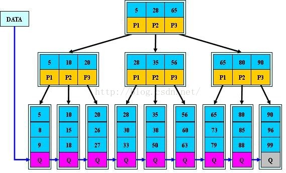
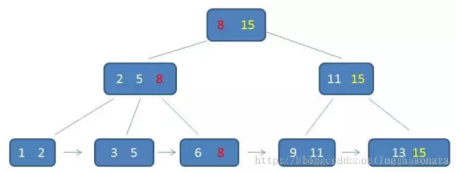

## 数据库常见面试问题

### 1. B+树、B*树、位图索引和hash索引

**B+树**

  B+树是B-树的变体，也是一种多路搜索树：

​       1.其定义基本与B-树同，除了：

​       2.非叶子结点的子树指针与关键字个数相同；

​       3.非叶子结点的子树指针P[i]，指向关键字值属于[K[i], K[i+1])的子树（B-树是开区间）；

​       5.为所有叶子结点增加一个链指针；

​       6.所有关键字都在叶子结点出现；

​       如：（M=3）



B+的搜索与B-树也基本相同，区别是B+树只有达到叶子结点才命中（B-树可以在非叶子结点命中），其性能也等价于在关键字全集做一次二分查找；

​       B+的特性：

​       1.所有关键字都出现在叶子结点的链表中（稠密索引），且链表中的关键字恰好是有序的；

​       2.不可能在非叶子结点命中；

​       3.非叶子结点相当于是叶子结点的索引（稀疏索引），叶子结点相当于是存储（关键字）数据的数据层；

​       4.更适合文件索引系统；

**B*树**

是B+树的变体，在B+树的非根和非叶子结点再增加指向兄弟的指针；


B*树定义了非叶子结点关键字个数至少为(2/3)*M，即块的最低使用率为2/3（代替B+树的1/2）；

​       B+树的分裂：当一个结点满时，分配一个新的结点，并将原结点中1/2的数据复制到新结点，最后在父结点中增加新结点的指针；B+树的分裂只影响原结点和父结点，而不会影响兄弟结点，所以它不需要指向兄弟的指针；

​       B*树的分裂：当一个结点满时，如果它的下一个兄弟结点未满，那么将一部分数据移到兄弟结点中，再在原结点插入关键字，最后修改父结点中兄弟结点的关键字（因为兄弟结点的关键字范围改变了）；如果兄弟也满了，则在原结点与兄弟结点之间增加新结点，并各复制1/3的数据到新结点，最后在父结点增加新结点的指针；

​       所以，B*树分配新结点的概率比B+树要低，空间使用率更高；

**位图索引**

如果用户查询的列的基数非常的小， 即只有的几个固定值，如性别、婚姻状况、行政区等等。要为这些基数值比较小的列建索引，就需要建立位图索引。

两个表，男性向量10100，未婚向量01100，男性未婚则为两个求与：00100

### 2. MySQL 索引以及底层实现B+ tree的好处

 索引是一个单独存储在磁盘上的数据库结构，它们包含着对数据表里所有记录的引用指针，使用索引可以提高数据库特定数据的查询速度.索引时在存储引擎中实现的，因此每种存储引擎的索引不一定完全相同,并且每种存储引擎也不一定支持所有索引类型．

索引的优点：

 1.通过创建唯一索引，可以确保数据库数据的唯一性

 2.可以加快数据库查询的速度

 3.通过使用索引，可以在查询中使用优化隐藏器，提高系统的性能

 4.加速表和表之间的连接；

索引的缺点：

1.索引是存储在磁盘上的数据结构，它们包含着对数据表里所有记录的引用指针。所以创建索引需要耗费空间内存。

2.创建索引和维护索引需要耗费时间。并且随着数据量的增长耗费越来越大。

3.对表中数据删改的时候，索引也需要动态的进行维护，这样降低了数据的维护速度。

因为磁盘IO问题。之前说过，索引是存储在磁盘上的，对数据库表中一列或多列进行排序的数据结构。数据库中的数据可能很大，在大量的数据存储在磁盘上时。计算机无法一次性将数据全部加载进内存。而是通过逐一加载每一磁盘页。而加载磁盘页对应着索引树的节点。那么一次查找所经历的索引树的深度对应着磁盘IO交互的次数。如果采取二叉树结构，那么显而易见，可能导致遍历的深度太大导致磁盘IO交互的次数太多。而相较于内存查询，磁盘IO才是影响查询以及更新表中数据的关键。那么由二叉树这样的瘦长结构自然容易联想到如何将它变的矮胖。这样做虽然没有降低比较次数，由于深度的降低，可以极大的减少磁盘IO次数。从而可以提升查询以及更新数据的性能。

那么B tree，是怎样的一种数据结构呢？

首先B tree是一种m叉的多路平衡树。B树具有这样的特点：

   1.每个节点最多含有m个孩子

   2.根节点含有[2,m]个孩子

   3.非叶子节点含有[[m/2],m]个孩子节点（向上取整的意思）

   4.一个节点如果含有K个关键字，那么它就有k+1个孩子

   5.所有叶子节点都在同一层  

   6.每个节点的K个关键数把节点拆成了K+1段

  图示举个栗子，顺便说下查找元素我的操作：


MySQL InnoDB索引的底层实现是什么？是B+ tree。并不是B-tree。那么为什么不选择B-Tree,而选择B+tree呢。

我们还是先来看看B+ tree吧。

B+ tree 是n路查找平衡树。它的特点是：

 1.有n个关键字的非叶子节点具有n个孩子（B树是n+1），这些关键字不保存数据只是用来索引。最终的数据都在叶子节点上（B树是每个关键字都保存数据）。

 2.所有的叶子结点中包含了全部关键字的信息，及指向含这些关键字记录的指针，且叶子结点本身依关键字的大小自小而大顺序链接。

3.所有的非叶子节点可以看作是索引部分，节点关键字仅含其子树中最大最小的部分。

4.同一数字可能在不同节点重复出现，非叶子节点是索引，叶子节点保存数据。

上个图吧，直观一点。



b+树相比于b树的查询优势：

- b+树的中间节点不保存数据，所以磁盘页能容纳更多节点元素，更“矮胖”；
- b+树查询必须查找到叶子节点，b树只要匹配到即可不用管元素位置，因此b+树查找更稳定（并不慢）；
	对于范围查找来说，b+树只需遍历叶子节点链表即可，b树却需要重复地中序遍历。

为什么说B+-tree比B 树更适合实际应用中操作系统的文件索引和数据库索引？

- B+tree的磁盘读写代价更低：B+tree的内部结点并没有指向关键字具体信息的指针(红色部分)，因此其内部结点相对B 树更小。如果把所有同一内部结点的关键字存放在同一盘块中，那么盘块所能容纳的关键字数量也越多。一次性读入内存中的需要查找的关键字也就越多，相对来说IO读写次数也就降低了；

- B+tree的查询效率更加稳定：由于内部结点并不是最终指向文件内容的结点，而只是叶子结点中关键字的索引，所以，任何关键字的查找必须走一条从根结点到叶子结点的路。所有关键字查询的路径长度相同，导致每一个数据的查询效率相当；

数据库索引采用B+树而不是B树的**主要原因**：B+树只要遍历叶子节点就可以实现整棵树的遍历，而且在数据库中基于范围的查询是非常频繁的，而B树只能中序遍历所有节点，效率太低。

文件索引和数据库索引为什么使用B+树?

　　文件与数据库都是需要较大的存储，也就是说，它们都不可能全部存储在内存中，故需要存储到磁盘上。而所谓索引，则为了数据的快速定位与查找，那么索引的结构组织要尽量减少查找过程中磁盘I/O的存取次数，因此B+树相比B树更为合适。数据库系统巧妙利用了局部性原理与磁盘预读原理，将一个节点的大小设为等于一个页，这样每个节点只需要一次I/O就可以完全载入，而红黑树这种结构，高度明显要深的多，并且由于逻辑上很近的节点(父子)物理上可能很远，无法利用局部性。最重要的是，B+树还有一个最大的好处：方便扫库。B树必须用中序遍历的方法按序扫库，而B+树直接从叶子结点挨个扫一遍就完了，B+树支持range-query非常方便，而B树不支持，这是数据库选用B+树的最主要原因

### 3. 主键和唯一索引的区别以及索引的优缺点

主键和唯一索引都要求值唯一，但是它们还是有区别的：

- 主键是一种约束，唯一索引是一种索引；
- 一张表只能有一个主键，但可以创建多个唯一索引；
- 主键创建后一定包含一个唯一索引，唯一索引并一定是主键；
- 主键不能为null，唯一索引可以为null；
- 主键可以做为外键，唯一索引不行；

主键约束比唯一索引约束严格，当没有设定主键时，非空唯一索引自动称为主键。对于主键和唯一索引的一些区别主要如下：

- 主键不允许空值，唯一索引允许空值
- 主键只允许一个，唯一索引允许多个
- 主键产生唯一的聚集索引，唯一索引产生唯一的非聚集索引

注：聚集索引确定表中数据的物理顺序，所以是主键是唯一的（聚集就是整理数据的意思）

### 4. 聚集索引和非聚集索引

**聚集索引**

> 数据行的物理顺序与列值（一般是主键的那一列）的逻辑顺序相同，一个表中只能拥有一个聚集索引。

聚集索引也就是常说的主键索引，建议再建表时创建，如果不创建索引，系统会自动创建一个隐含列作为表的聚集索引。

**非聚集索引**

> 该索引中索引的逻辑顺序与磁盘上行的物理存储顺序不同，一个表中可以拥有多个非聚集索引。

分成普通索引，唯一索引，全文索引。非聚簇索引可能会出现二次回表查询造成效率低下，建议对常用的查询字段建立覆盖索引，其执行过程中使用最佳左前缀原则去匹配where条件，如果出现跨列的情况则会失效

**总结**

- 使用聚集索引的查询效率要比非聚集索引的效率要高，但是如果需要频繁去改变聚集索引的值，写入性能并不高，因为需要移动对应数据的物理位置。

- 非聚集索引在查询的时候可以的话就避免二次查询，这样性能会大幅提升。

- 不是所有的表都适合建立索引，只有数据量大表才适合建立索引，且建立在选择性高的列上面性能会更好。

### 5.数据库隔离级别

满足传统事务特性：ACID（Atomicity-原子性、Consistency-一致性、Isolation-隔离性、Durability-持久性）


```mysql
set session transaction isolation level 隔离级别;
```

### 6.数据库事务

**定义: 数据库事务是构成单一逻辑工作单元的操作集合**
一个典型的数据库事务如下所示

```SQL
BEGIN TRANSACTION  //事务开始
SQL1
SQL2
COMMIT/ROLLBACK   //事务提交或回滚
```

关于事务的定义有几点需要解释下：

- 1.数据库事务可以包含一个或多个数据库操作,但这些操作构成一个逻辑上的整体
- 2.构成逻辑整体的这些数据库操作,要么全部执行成功,要么全部不执行
- 3.构成事务的所有操作,要么全都对数据库产生影响,要么全都不产生影响,即不管事务是否执行成功,数据库总能保持一致性状态
- 4.以上即使在数据库出现故障以及并发事务存在的情况下依然成立

### 7.常见的并发控制技术

并发控制技术是实现事务隔离性以及不同隔离级别的关键,实现方式有很多,按照其对可能冲突的操作采取的不同策略可以分为乐观并发控制和悲观并发控制两大类。

- 乐观并发控制:对于并发执行可能冲突的操作,假定其不会真的冲突,允许并发执行,直到真正发生冲突时才去解决冲突,比如让事务回滚。
- 悲观并发控制:对于并发执行可能冲突的操作,假定其必定发生冲突,通过让事务等待(锁)或者中止(时间戳排序)的方式使并行的操作串行执行。

**基于封锁的并发控制**

核心思想:对于并发可能冲突的操作,比如读-写,写-读,写-写,通过锁使它们互斥执行。
锁通常分为共享锁和排他锁两种类型

- 1.共享锁(S):事务T对数据A加共享锁,其他事务只能对A加共享锁但不能加排他锁。
- 2.排他锁(X):事务T对数据A加排他锁,其他事务对A既不能加共享锁也不能加排他锁

基于锁的并发控制流程:

1. 事务根据自己对数据项进行的操作类型申请相应的锁(读申请共享锁,写申请排他锁)
2. 申请锁的请求被发送给锁管理器。锁管理器根据当前数据项是否已经有锁以及申请的和持有的锁是否冲突决定是否为该请求授予锁。
3. 若锁被授予,则申请锁的事务可以继续执行;若被拒绝,则申请锁的事务将进行等待,直到锁被其他事务释放。

可能出现的问题:

- 死锁:多个事务持有锁并互相循环等待其他事务的锁导致所有事务都无法继续执行。
- 饥饿:数据项A一直被加共享锁,导致事务一直无法获取A的排他锁。

对于可能发生冲突的并发操作,锁使它们由并行变为串行执行,是一种悲观的并发控制。

> 《[数据库事务的概念及其实现原理](https://www.cnblogs.com/takumicx/p/9998844.html)》

### 8.数据库的锁机制

