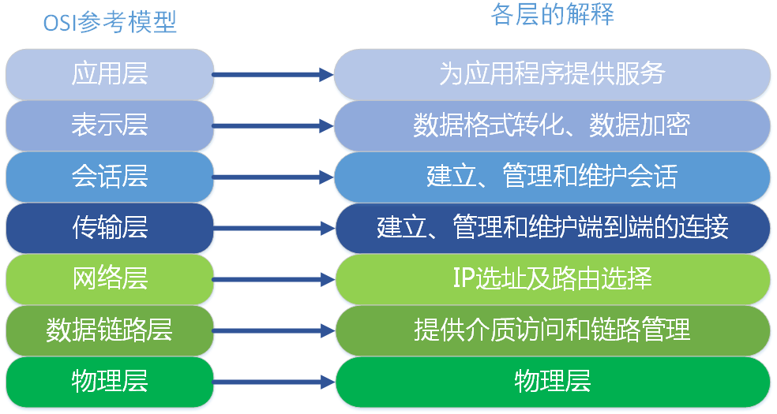
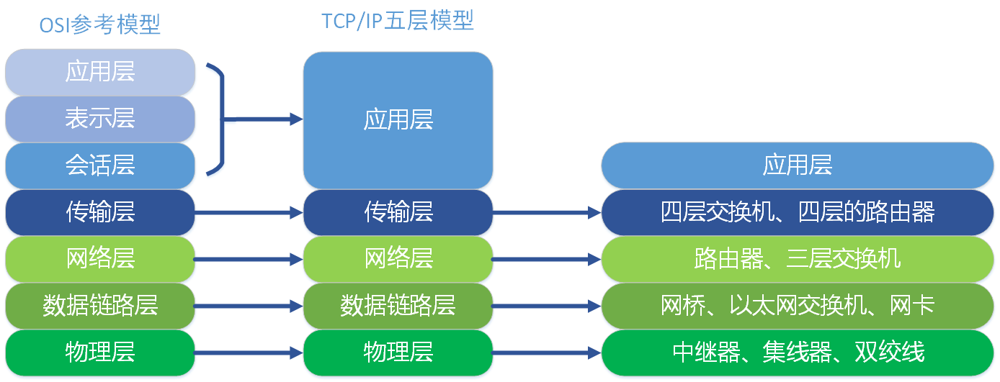
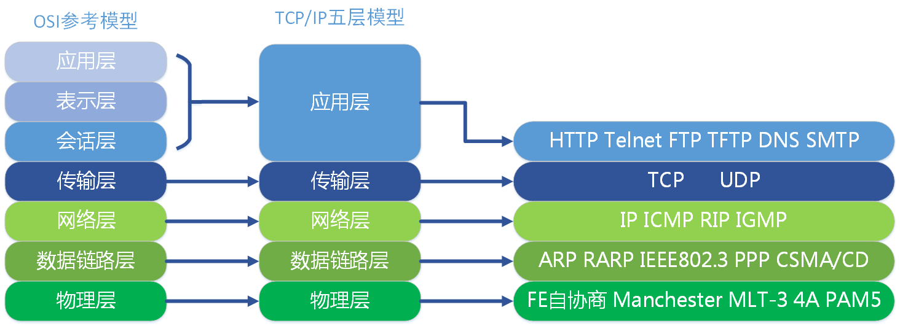
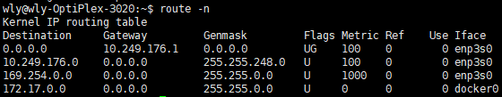
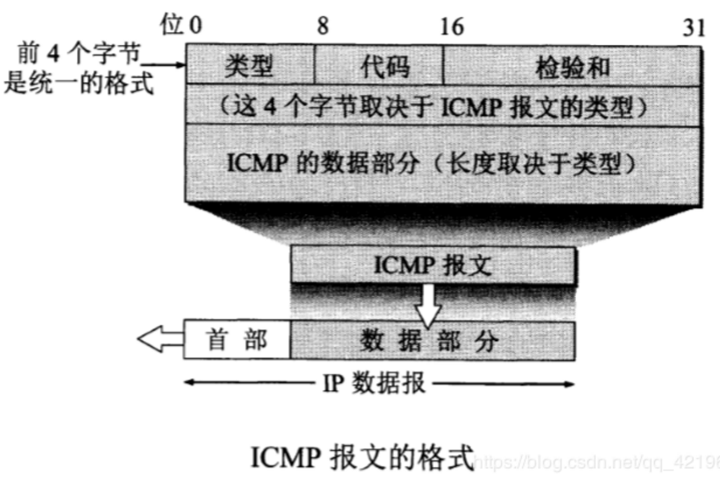
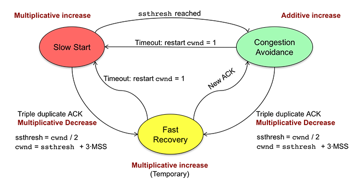

## 计算机网络常见面试问题

### 1. 网络的几种分层体系结构

**应用层协议**

| 协议   | 名称                       | 默认端口       | 底层协议                                                     |
| ------ | -------------------------- | -------------- | ------------------------------------------------------------ |
| HTTP   | 超文本传输协议             | 80             | TCP                                                          |
| HTTPS  | 超文本传输安全协议         | 443            | TCP                                                          |
| Telnet | 远程登录服务的标准协议     | 23             | TCP                                                          |
| FTP    | 文件传输协议               | 20传输和21连接 | TCP                                                          |
| TFTP   | 简单文件传输协议           | 21             | UDP                                                          |
| SMTP   | 简单邮件传输协议（发送用） | 25             | TCP                                                          |
| POP    | 邮局协议（接收用）         | 110            | TCP                                                          |
| DNS    | 域名解析服务               | 53             | 服务器间进行域传输的时候用TCP 客户端查询DNS服务器时用 UDP |

**网络层协议**

| 协议 | 名称               | 作用                                                         |
| ---- | ------------------ | ------------------------------------------------------------ |
| IP   | 网际协议           | IP协议不但定义了数据传输时的基本单元和格式，还定义了数据报的递交方法和路由选择 |
| ICMP | 超文本传输安全协议 | ICMP就是一个“错误侦测与回报机制”，其目的就是让我们能够检测网路的连线状况﹐也能确保连线的准确性，是ping和traceroute的工作协议 |
| RIP  | 路由信息协议       | 使用“跳数”(即metric)来衡量到达目标地址的路由距离             |
| IGMP | Internet组管理协议 | 用于实现组播、广播等通信                                     |

**数据链路层协议**

| 协议 | 名称             | 作用                                                         |
| ---- | ---------------- | ------------------------------------------------------------ |
| ARP  | 地址解析协议     | 根据IP地址获取物理地址                                       |
| RARP | 反向地址转换协议 | 根据物理地址获取IP地址                                       |
| PPP  | 点对点协议       | 主要是用来通过拨号或专线方式建立点对点连接发送数据，使其成为各种主机、网桥和路由器之间简单连接的一种共通的解决方案 |

> 《OSI七层模型与TCP/IP五层模型》：https://www.cnblogs.com/qishui/p/5428938.html

### 2. 为何快速重传是选择3次ACK？

主要的考虑还是要区分包的丢失是由于链路故障还是乱序等其他因素引发。两次duplicated ACK时很可能是乱序造成的！三次duplicated ACK时很可能是丢包造成的！四次duplicated ACK更更更可能是丢包造成的！但是这样的响应策略太慢。丢包肯定会造成三次duplicated ACK!综上是选择收到三个重复确认时窗口减半效果最好，这是实践经验。

在没有fast retransmit / recovery 算法之前，重传依靠发送方的retransmit timeout，就是在timeout内如果没有接收到对方的ACK，默认包丢了，发送方就重传，包的丢失原因1）包checksum 出错 2）网络拥塞 3）网络断，包括路由重收敛，但是发送方无法判断是哪一种情况，于是采用最笨的办法，就是将自己的发送速率减半，即CWND 减为1/2，这样的方法对2是有效的，可以缓解网络拥塞，3则无所谓，反正网络断了，无论发快发慢都会被丢；但对于1来说，丢包是因为偶尔的出错引起，一丢包就对半减速不合理。于是有了fast retransmit 算法，基于在反向还可以接收到ACK，可以认为网络并没有断，否则也接收不到ACK，如果在timeout 时间内没有接收到> 2 的duplicated ACK，则概率大事件为乱序，乱序无需重传，接收方会进行排序工作；而如果接收到三个或三个以上的duplicated ACK，则大概率是丢包，可以逻辑推理，发送方可以接收ACK，则网络是通的，可能是1、2造成的，先不降速，重传一次，如果接收到正确的ACK，则一切OK，流速依然（包出错被丢）。而如果依然接收到duplicated ACK，则认为是网络拥塞造成的，此时降速则比较合理。

> 《TCP快速重传为什么是三次冗余ack，这个三次是怎么定下来的？》：https://blog.csdn.net/u010202588/article/details/54563648

### 3. 建立TCP服务器的各个系统调用

### 4. socket网络编程有哪些系统调用？其中close是一次就能直接关闭的吗，半关闭状态是怎么产生的？

调用socket函数时：在内核生成一个socket和tcp_sock类型的对象用于保存TCP连接信息，并安装TCP相关的操作函数集以限定后续的系统调用的行为；将socket对象与一个file类型的对象绑定到一起，并将一个文件描述符与file对象绑定到一起，最后将这个文件描述符返回给调用者。

用close会将该socket的计数-1，如果引用还是大于0，那么socket端口状态保持不变，如果为0，会将sender缓冲中的数据发出去，然后向服务端发送连接终止请求

使用shutdown(sockfd, args)函数可以关闭进程的读端（参数为SHUT_RD）但是任然可以写。此时套接字接收到的数据将被丢弃。关闭进程的写端SHUT_WD，但是仍然可以读，称为半关闭状态。由于shutdown不考虑描述符的引用计数，直接关闭描述符，到**LAST_ACK状态**。

如果有**多个进程**共享一个套接字，close每被调用一次，计数减1，直到计数为0时，也就是所用进程都调用了close，套接字将被释放。

在多进程中如果一个进程调用了shutdown(sfd, SHUT_RDWR)后，其它的进程将无法进行通信。但如果一个进程调用close(sfd)将不会影响到其它进程。

### 5. MTU和MSS

MTU：maximum transmission unit，最大传输单元，由硬件规定，如以太网的MTU为1500字节。

MSS：maximum segment size，最大分节大小，为TCP数据包每次传输的最大数据分段大小，一般由发送端向对端TCP通知对端在每个分节中能发送的最大TCP数据。MSS值为MTU值减去IPv4 Header（20 Byte）和TCP header（20 Byte）得到。

### 6. 对路由协议的了解与介绍

常见的路由协议有[RIP](http://zh.wikipedia.org/wiki/RIP)、[IGRP](http://zh.wikipedia.org/wiki/IGRP)（Cisco私有协议）、[EIGRP](http://zh.wikipedia.org/wiki/EIGRP)（Cisco私有协议）、[OSPF](http://zh.wikipedia.org/wiki/OSPF)、[IS-IS](http://zh.wikipedia.org/wiki/IS-IS)、[BGP](http://zh.wikipedia.org/wiki/BGP)等。

RIP、IGRP、EIGRP、OSPF、IS-IS是内部网关协议([IGP](http://zh.wikipedia.org/wiki/内部网关协议))，适用于单个[ISP](http://zh.wikipedia.org/wiki/ISP)的统一路由协议的运行，一般由一个ISP运营的网络位于一个AS（[自治系统](http://zh.wikipedia.org/wiki/自治系统)）内，有统一的AS number（自治系统号）。BGP是[自治系统](http://zh.wikipedia.org/wiki/自治系统)间的路由协议，是一种[外部网关协议](http://zh.wikipedia.org/wiki/外部网关协议)，多用于不同ISP之间交换路由信息，以及大型企业、政府等具有较大规模的私有网络。

**RIP**

RIP“路由信息协议(Route Information Protocol)”的简写，主要传递路由信息，通过每隔30秒广播一次路由表，维护相邻路由器的位置关系，同时根据收到的路由表信息计算自己的路由表信息。RIP是一个[距离矢量路由协议](http://zh.wikipedia.org/w/index.php?title=距离矢量路由协议&action=edit&redlink=1)，最大跳数为16跳，16跳以及超过16跳的网络则认为目标网络不可达。此协议通常用在网络架构较为简单的小型网络环境，现在分为RIPv1和RIPv2两个版本，后者支持[VLSM](http://zh.wikipedia.org/w/index.php?title=VLSM&action=edit&redlink=1)技术以及一系列技术上的改进。RIP的收敛速度较慢。

PS：路由收敛指网络的拓扑结构发生变化后，路由表重新建立到发送再到学习直至稳定，并通告网络中所有相关路由器都得知该变化的过程。也就是网络拓扑变化引起的通过重新计算路由而发现替代路由的行为。

**OSPF**

OSPF协议是“开放式最短路径优先(Open Shortest Path First)”的缩写，属于链路状态路由协议。OSPF提出了“区域（area）”的概念，每个区域中所有路由器维护着一个相同的链路状态数据库 （LSDB）。区域又分为骨干区域（骨干区域的编号必须为0）和非骨干区域（非0编号区域），如果一个运行OSPF的网络只存在单一区域，则该区域可以是骨干区域或者非骨干区域。如果该网络存在多个区域，那么必须存在骨干区域，并且所有非骨干区域必须和骨干区域直接相连。OSPF利用所维护的链路状态数据库，通过最短生成树算法（[SPF](http://zh.wikipedia.org/wiki/SPF)算法）计算得到路由表。OSPF的收敛速度较快。由于其特有的开放性以及良好的扩展性，目前OSPF协议在各种网络中广泛部署。

**IS-IS**

IS-IS协议是Intermediate system to intermediate system（中间系统到中间系统）的缩写，属于链路状态路由协议。标准IS-IS协议是由[国际标准化组织](http://zh.wikipedia.org/wiki/国际标准化组织)制定的ISO/IEC 10589:2002 所定义的，标准IS-IS不适合用于IP网络，因此[IETF](http://zh.wikipedia.org/wiki/IETF)制 定了适用于IP网络的集成化IS-IS协议（Integrated IS-IS）。和OSPF相同，IS-IS也使用了“区域”的概念，同样也维护着一份链路状态数据库，通过最短生成树算法（SPF）计算出最佳路径。 IS-IS的收敛速度较快。集成化IS-IS协议是ISP骨干网上最常用的IGP协议。

**IGRP**

IGRP协议是“内部网关路由协议（Interior Gateway Routing Protool）”的缩写，由[Cisco](http://zh.wikipedia.org/wiki/Cisco)于 二十世纪八十年代独立开发，属于Cisco私有协议。IGRP和RIP一样，同属距离矢量路由协议，因此在诸多方面有着相似点，如IGRP也是周期性的广 播路由表，也存在最大跳数（默认为100跳，达到或超过100跳则认为目标网络不可达）。IGRP最大的特点是使用了混合度量值，同时考虑了链路的带宽、 延迟、负载、[MTU](http://zh.wikipedia.org/wiki/MTU)、可靠性5个方面来计算路由的度量值，而不像其他IGP协议单纯的考虑某一个方面来计算度量值。目前IGRP已经被Cisco独立开发的EIGRP协议所取代，版本号为12.3及其以上的[Cisco IOS](http://zh.wikipedia.org/w/index.php?title=Cisco_IOS&action=edit&redlink=1)（Internetwork Operating System）已经不支持该协议，现在已经罕有运行IGRP协议的网络。EIGRP由于IGRP协议的种种缺陷以及不足，Cisco开发了EIGRP协议（增强型内部网关路由协议）来取代IGRP协议。EIGRP属于高级距离矢量路由协议（又称混合型路由协议），继承了IGRP的混合度量值，最大特点在于引入了非等价负载均衡技术，并拥有极快的收敛速度。EIGRP协议在 Cisco设备网络环境中广泛部署。

**BGP**

为了维护各个ISP的独立利益，标准化组织制定了ISP间的路由协议BGP。 BGP是“边界网关协议(Border Gateway Protocol)”的缩写，处理各ISP之间的路由传递。但是BGP运行在相对核心的地位，需要用户对网络的结构有相当的了解，否则可能会造成较大损失。

> 《常见路由协议以及路由算法》：https://blog.csdn.net/qq_22080999/article/details/81104125
### 7. 路由协议所使用的算法

路由算法主要分以下两类：

- 总体式路由算法：每个路由器都拥有网络中其他路由器的全部信息，以及网络的流量状态。也叫LS （链路状态）算法。
- 分散式路由算法：每个路由器只有与它直接相连的路由器的信息，没有网络中每个路由器的信息。也叫DV （距离向量）算法。

**LS算法**

链路状态算法（也称最短路径算法）发送路由信息到互联网上所有的结点，对于每个路由器，仅发送它的路由表中描述了其自身链路状态的那一部分。

采用LS算法时，每个路由器必须遵循以下步骤：

1、确认在物理上与之相连的路由器并获得它们的IP地址。当一个路由器开始工作后，它首先向整个网络发送一个“HELLO”分组数据包。每个接收到数据包的路由器都将返回一条消息，其中包含它自身的IP地址。

2、测量相邻路由器的延时（或者其他重要的网络参数，比如平均流量）。为做到这一点，路由器向整个网络发送响应分组数据包。每个接收到数据包的路由器返回一个应答分组数据包。将路程往返时间除以2，路由器便可以计算出延时。（路程往返时间是网络当前延迟的量度，通过一个分组数据包从远程主机返回的时间来测量。）该时间包括了传输和处理两部分的时间——也就是将分组数据包发送到目的地的时间以及接收方处理分组数据包和应答的时间。

3、向网络中的其他路由器广播自己的信息，同时也接收其他路由器的信息。 
在这一步中，所有的路由器共享它们的知识并且将自身的信息广播给其他每一个路由器。这样，每一个路由器都能够知道网络的结构以及状态。

4、使用一个合适的算法，确定网络中两个节点之间的最佳路由。

在这一步中，路由器选择通往每一个节点的最佳路由。它们使用一个算法来实现这一点，如Dijkstra最短路径算法。在这个算法中，一个路由器通过收集到的其他路由器的信息，建立一个网络图。这个图描述网络中的路由器的位置以及它们之间的链接关系。每个链接都有一个数字标注，称为权值或成本。这个数字是延时和平均流量的函数，有时它仅仅表示节点间的跃点数。例如，如果一个节点与目的地之间有两条链路，路由器将选择权值最低的链路。

**DV算法**

距离向量算法（也称为Bellman-Ford算法）则要求每个路由器发送其路由表全部或部分信息，但仅发送到邻近结点上。从本质上来说，链路状态算法将少量更新信息发送至网络各处，而距离向量算法发送大量更新信息至邻接路由器。由于链路状态算法收敛更快，因此它在一定程度上比距离向量算法更不易产生路由循环。但另一方面，链路状态算法要求比距离向量算法有更强的CPU能力和更多的内存空间，因此链路状态算法将会在实现时显得更昂贵一些。

Dijkstra算法执行下列步骤：

1、路由器建立一张网络图，并且确定源节点和目的节点，我们设为V1和V2。然后路由器建立一个矩阵，称为“邻接矩阵”。在这个矩阵中，各矩阵元素表示权值。例如，[i, j]是节点Vi与Vj之间的链路权值。如果节点Vi与Vj之间没有链路直接相连，它们的权值设为“无穷大”。

2、路由器为网路中的每一个节点建立一组状态记录。此记录包括三个字段： 
前序字段——表示当前节点之前的节点。 
长度字段——表示从源节点到当前节点的权值之和。 
标号字段——表示节点的状态。每个节点都处于一个状态模式：“永久”或“暂时”。

3、路由器初始化（所有节点的）状态记录集参数，将它们的长度设为“无穷大”，标号设为“暂时”。

4、路由器设置一个T节点。例如，如果设V1是源T节点，路由器将V1的标号更改为“永久”。当一个标号更改为“永久”后，它将不再改变。一个T节点仅仅是一个代理而已。

5、路由器更新与源T节点直接相连的所有暂时性节点的状态记录集。

6、路由器在所有的暂时性节点中选择距离V1的权值最低的节点。这个节点将是新的T节点。

7、如果这个节点不是V2（目的节点），路由器则返回到步骤5。

8、如果节点是V2，路由器则向前回溯，将它的前序节点从状态记录集中提取出来，如此循环，直到提取到V1为止。这个节点列表便是从V1到V2的最佳路由。

> 《常见路由协议以及路由算法》：https://blog.csdn.net/qq_22080999/article/details/81104125

### 8. 路由表的项目包括哪些

| 表项        | 含义                                                         |
| ----------- | ------------------------------------------------------------ |
| Destination | 目标网络或目标主机。Destination 为 default（`0.0.0.0`）时，表示这个是默认网关，所有数据都发到这个网关（这里是 `10.249.176.1`） |
| Gateway     | 网关地址，`0.0.0.0` 表示当前记录对应的 Destination 跟本机在同一个网段，通信时不需要经过网关 |
| Genmask     | Destination 字段的网络掩码，Destination 是主机时需要设置为 `255.255.255.255`，是默认路由时会设置为 `0.0.0.0` |
| Flags       | U 路由是活动； H 目标是个主机；G 需要经过网关；R 恢复动态路由产生的表项；D 由路由的后台程序动态地安装；M 由路由的后台程序修改；! 拒绝路由 |
| Metric      | 路由距离，到达指定网络所需的中转数，是大型局域网和广域网设置所必需的 （不在Linux内核中使用。） |
| Ref         | 路由项引用次数 （不在Linux内核中使用。）                     |
| Use         | 此路由项被路由软件查找的次数                                 |
| Iface       | 网卡名字，例如 `enp3s0`                                      |

### 9. 地址解析协议ARP的过程 

1. 每个主机都会在自己的 ARP 缓冲区中建立一个 ARP 列表，以表示 IP 地址和 MAC 地址之间的对应关系。

2. 主机（网络接口）新加入网络时（也可能只是mac地址发生变化，接口重启等）， 会发送免费ARP报文把自己IP地址与Mac地址的映射关系广播给其他主机。

3. 网络上的主机接收到免费ARP报文时，会更新自己的ARP缓冲区。将新的映射关系更新到自己的ARP表中。

4. 某个主机需要发送报文时，首先检查 ARP 列表中是否有对应 IP 地址的目的主机的 MAC 地址，如果有，则直接发送数据，如果没有，就向本网段的所有主机发送 ARP 数据包，该数据包包括的内容有：源主机 IP 地址，源主机 MAC 地址，目的主机的 IP 地址等。

5. 当本网络的所有主机收到该 ARP 数据包时：

	(A）**首先检查数**据包中的 IP 地址是否是自己的 IP 地址**，如果**不是，则忽略该数据包。

​       （B）**如果是，**则首先从数据包中取出源主机的 IP 和 MAC 地址写入到 ARP 列表中，如果已经存在，则覆盖。

​       （C）然后将自己的 MAC 地址写入 ARP 响应包中，告诉源主机自己是它想要找的 MAC 地址。

6. 源主机收到 ARP 响应包后。将目的主机的 IP 和 MAC 地址写入 ARP 列表，并利用此信息发送数据。如果源主机一直没有收到 ARP 响应数据包，表示 ARP 查询失败。

> 《ARP地址解析协议原理》：https://www.cnblogs.com/csguo/p/7542944.html

### 10. 网际控制报文协议ICMP的过程

ICMP就是一个“错误侦测与回报机制“，其目的就是让我们能够检测网路的连线状况﹐也能确保连线的准确性，主要功能有：主机探测、路由维护、路由选择和流量控制

* 动态主机配置协议DHCP的过程
* WAN  LAN  WLAN   VLAN  VPN的区别
* 介绍一下VPN（虚拟专用网）

### TCP的检验和

检验和计算过程（以TCP校验为例）

​        TCP首部校验和计算三部分：TCP首部+TCP数据+TCP伪首部。

发送端：

​        首先，把伪首部、TCP报头、TCP数据分为16位的字，如果总长度为奇数个字节，则在最后增添一个位都为0的字节。

​        把TCP报头中的校验和字段置为0。

​        其次，用反码相加法（对每16bit进行二进制反码求和）累加所有的16位字（进位也要累加，进位则将高位叠加到低位）。

​        最后，将上述结果作为TCP的校验和，存在检验和字段中。

接收端：

​        同样利用反码求和，高位叠加到低位， 如计算结果的16位中每一位都为1，则正确，否则说明发生错误。  

验证示例：

​        校验和  反码求和过程

​        以4bit 为例

​        发送端计算：

​        数据：   1000  0100   校验和  0000

​        则反码：0111  1011               1111

​        叠加：   0111+1011+1111 = 0010 0001   高于4bit的， 叠加到低4位      0001 + 0010 = 0011 即为校验和

​        接收端计算：

​        数据：  1000   0100   检验和  0011

​        反码：  0111   1011                1100

​        叠加：  0111 + 1011 +1100 = 0001 1110  叠加为4bit为1111.   全为1，则正确

UDP检验和

​        基本过程和TCP检验和相同，不同的是UDP的伪首部中8位传输层协议号是17而TCP是6。

> 《TCP检验和》：https://www.cnblogs.com/zxiner/p/7203192.html

### TCP和UDP的区别

[UDP](https://www.baidu.com/s?wd=UDP&tn=SE_PcZhidaonwhc_ngpagmjz&rsv_dl=gh_pc_zhidao)是面向报文的，发送方的[UDP](https://www.baidu.com/s?wd=UDP&tn=SE_PcZhidaonwhc_ngpagmjz&rsv_dl=gh_pc_zhidao)对[应用层](https://www.baidu.com/s?wd=应用层&tn=SE_PcZhidaonwhc_ngpagmjz&rsv_dl=gh_pc_zhidao)交下来的报文，不合并，不拆分，只是在其上面加上首部后就交给了下面的[网络层](https://www.baidu.com/s?wd=网络层&tn=SE_PcZhidaonwhc_ngpagmjz&rsv_dl=gh_pc_zhidao)，也就是说无论[应用层](https://www.baidu.com/s?wd=应用层&tn=SE_PcZhidaonwhc_ngpagmjz&rsv_dl=gh_pc_zhidao)交给[UDP](https://www.baidu.com/s?wd=UDP&tn=SE_PcZhidaonwhc_ngpagmjz&rsv_dl=gh_pc_zhidao)多长的报文，它统统发送，一次发送一个。而对接收方，接到后直接去除首部，交给上面的[应用层](https://www.baidu.com/s?wd=应用层&tn=SE_PcZhidaonwhc_ngpagmjz&rsv_dl=gh_pc_zhidao)就完成任务了。因此，它需要应用层控制报文的大小

[TCP](https://www.baidu.com/s?wd=TCP&tn=SE_PcZhidaonwhc_ngpagmjz&rsv_dl=gh_pc_zhidao)是面向[字节流](https://www.baidu.com/s?wd=字节流&tn=SE_PcZhidaonwhc_ngpagmjz&rsv_dl=gh_pc_zhidao)的，它把上面应用层交下来的数据看成无结构的[字节流](https://www.baidu.com/s?wd=字节流&tn=SE_PcZhidaonwhc_ngpagmjz&rsv_dl=gh_pc_zhidao)来发送，可以想象成流水形式的，发送方[TCP](https://www.baidu.com/s?wd=TCP&tn=SE_PcZhidaonwhc_ngpagmjz&rsv_dl=gh_pc_zhidao)会将数据放入“蓄水池”（缓存区），等到可以发送的时候就发送，不能发送就等着，[TCP](https://www.baidu.com/s?wd=TCP&tn=SE_PcZhidaonwhc_ngpagmjz&rsv_dl=gh_pc_zhidao)会根据当前网络的拥塞状态来确定每个报文段的大小。

**TCP**

（1）序号：Seq序号，占32位，用来标识从TCP源端向目的端发送的字节流，发起方发送数据时对此进行标记。
（2）确认序号：Ack序号，占32位，只有ACK标志位为1时，确认序号字段才有效，Ack=Seq+1。
（3）标志位：共6个，即URG、ACK、PSH、RST、SYN、FIN等，具体含义如下：
          （A）URG：紧急指针（urgent pointer）有效。
          （B）ACK：确认序号有效。
          （C）PSH：接收方应该尽快将这个报文交给应用层。
          （D）RST：重置连接。
          （E）SYN：发起一个新连接。
          （F）FIN：释放一个连接。

**UDP**

**TCP和UDP的区别**

1、TCP面向连接（如打电话要先拨号建立连接）;UDP是无连接的，即发送数据之前不需要建立连接

2、TCP提供可靠的服务。也就是说，通过TCP连接传送的数据，无差错，不丢失，不重复，且按序到达;UDP尽最大努力交付，即不保证可靠交付

3、TCP面向字节流，实际上是TCP把数据看成一连串无结构的字节流;UDP是面向报文的

UDP没有拥塞控制，因此网络出现拥塞不会使源主机的发送速率降低（对实时应用很有用，如IP电话，实时视频会议等）

4、每一条TCP连接只能是点到点的;UDP支持一对一，一对多，多对一和多对多的交互通信

5、TCP首部开销20字节;UDP的首部开销小，只有8个字节

6、TCP的逻辑通信信道是全双工的可靠信道，UDP则是不可靠信道

> 《TCP数据段格式+UDP数据段格式详解》：https://www.cnblogs.com/love-jelly-pig/p/8471181.html

### TCP如何保证数据的正确性

**首部校验** 
这个校验机制能够确保数据传输不会出错吗？ 答案是不能。

**原因**

TCP协议中规定，TCP的首部字段中有一个字段是校验和，发送方将伪首部、TCP首部、TCP数据使用累加和校验的方式计算出一个数字，然后存放在首部的校验和字段里，接收者收到TCP包后重复这个过程，然后将计算出的校验和和接收到的首部中的校验和比较，如果不一致则说明数据在传输过程中出错。这就是TCP的数据校验机制。 
但是这个机制能够保证检查出一切错误吗？显然不能。因为这种校验方式是累加和，也就是将一系列的数字（TCP协议规定的是数据中的每16个比特位数据作为一个数字）求和后取末位。 
但是小学生都知道A+B=B+A，假如在传输的过程中有前后两个16比特位的数据前后颠倒了（至于为什么这么巧合？我不知道，也许路由器有bug？也许是宇宙中的高能粒子击中了电缆？反正这个事情的概率不为零，就有可能会发生），那么校验和的计算结果和颠倒之前是一样的，那么接收端肯定无法检查出这是错误的数据。 

**解决方案**

传输之前先使用MD5加密数据获得摘要，跟数据一起发送到服务端，服务端接收之后对数据也进行MD5加密，如果加密结果和摘要一致，则认为没有问题

> 《TCP新手误区--数据校验的意义》：https://blog.csdn.net/bjrxyz/article/details/75194716

### 在进行UDP编程的时候，一次发送多少bytes好?

当然,这个没有唯一答案，相对于不同的系统,不同的要求,其得到的答案是不一样的,我这里仅对像ICQ一类的发送聊天消息的情况作分析，对于其他情况，你或许也能得到一点帮助:首先,我们知道,TCP/IP通常被认为是一个四层协议系统,包括链路层,网络层,运输层,应用层.UDP属于运输层,下面我们由下至上一步一步来看:以太网(Ethernet)数据帧的长度必须在46-1500字节之间,这是由以太网的物理特性决定的.这个1500字节被称为链路层的MTU(最大传输单元).但这并不是指链路层的长度被限制在1500字节,其实这这个MTU指的是链路层的数据区.并不包括链路层的首部和尾部的18个字节.所以,事实上,这个1500字节就是网络层IP数据报的长度限制.因为IP数据报的首部为20字节,所以IP数据报的数据区长度最大为1480字节.而这个1480字节就是用来放TCP传来的TCP报文段或UDP传来的UDP数据报的.又因为UDP数据报的首部8字节,所以UDP数据报的数据区最大长度为1472字节.这个1472字节就是我们可以使用的字节数。

当我们发送的UDP数据大于1472的时候会怎样呢？
这也就是说IP数据报大于1500字节,大于MTU.这个时候发送方IP层就需要分片(fragmentation).
把数据报分成若干片,使每一片都小于MTU.而接收方IP层则需要进行数据报的重组.
这样就会多做许多事情,而更严重的是,由于UDP的特性,当某一片数据传送中丢失时,接收方便
无法重组数据报.将导致丢弃整个UDP数据报。

因此,在普通的局域网环境下，我建议将UDP的数据控制在1472字节以下为好.

进行Internet编程时则不同,因为Internet上的路由器可能会将MTU设为不同的值.
如果我们假定MTU为1500来发送数据的,而途经的某个网络的MTU值小于1500字节,那么系统将会使用一系列的机
制来调整MTU值,使数据报能够顺利到达目的地,这样就会做许多不必要的操作.

鉴于Internet上的标准MTU值为576字节,所以我建议在进行Internet的UDP编程时.
最好将UDP的数据长度控件在548字节(576-8-20)以内

* 
* TCP和UDP相关的协议与端口号

UDP和TCP报头使用两个字节存放端口号，所以端口号的有效范围是从0到65535。动态端口的范围是从1024到65535

* TCP（UDP，IP）等首部的认识（http请求报文构成）
* 网络层分片的原因与具体实现
* TCP的三次握手与四次挥手的详细介绍（TCP连接建立与断开是热门问题）
* TCP握手以及每一次握手客户端和服务器端处于哪个状态（11种状态）
* 为什么使用三次握手，两次握手可不可以？
* TIME_WAIT的意义（为什么要等于2MSL）
* 超时重传机制（不太高频）
* TCP怎么保证可靠性（面向字节流，超时重传，应答机制，滑动窗口，拥塞控制，校验等）？

* 流量控制的介绍，采用滑动窗口会有什么问题（死锁可能，糊涂窗口综合征）？
* TCP滑动窗口协议

> 《TCP协议中的窗口机制------滑动窗口详解》：https://blog.csdn.net/m0_37962600/article/details/79951780
>

* 拥塞控制和流量控制的区别

### TCP拥塞控制，算法名字？（极其重要）

**四大算法**

拥塞控制主要是四个算法：1）慢启动，2）拥塞避免，3）拥塞发生，4）快速恢复。这四个算法不是一天都搞出来的，这个四算法的发展经历了很多时间，到今天都还在优化中。

#### 慢热启动算法 – Slow Start

 所谓慢启动，也就是TCP连接刚建立，一点一点地提速，试探一下网络的承受能力，以免直接扰乱了网络通道的秩序。

 慢启动算法：

1) 连接建好的开始先初始化拥塞窗口cwnd大小为1，表明可以传一个MSS大小的数据。
2) 每当收到一个ACK，cwnd大小加一，呈线性上升。
3) 每当过了一个往返延迟时间RTT(Round-Trip Time)，cwnd大小直接翻倍，乘以2，呈指数让升。
4) 还有一个ssthresh（slow start threshold），是一个上限，当cwnd >= ssthresh时，就会进入“拥塞避免算法”（后面会说这个算法）

#### 拥塞避免算法 – Congestion Avoidance

 如同前边说的，当拥塞窗口大小cwnd大于等于慢启动阈值ssthresh后，就进入拥塞避免算法。算法如下：

1) 收到一个ACK，则cwnd = cwnd + 1 / cwnd
2) 每当过了一个往返延迟时间RTT，cwnd大小加一。

 过了慢启动阈值后，拥塞避免算法可以避免窗口增长过快导致窗口拥塞，而是缓慢的增加调整到网络的最佳值。

#### 拥塞状态时的算法

 一般来说，TCP拥塞控制默认认为网络丢包是由于网络拥塞导致的，所以一般的TCP拥塞控制算法以丢包为网络进入拥塞状态的信号。对于丢包有两种判定方式，一种是超时重传RTO[Retransmission Timeout]超时，另一个是收到三个重复确认ACK。

 超时重传是TCP协议保证数据可靠性的一个重要机制，其原理是在发送一个数据以后就开启一个计时器，在一定时间内如果没有得到发送数据报的ACK报文，那么就重新发送数据，直到发送成功为止。

 但是如果发送端接收到3个以上的重复ACK，TCP就意识到数据发生丢失，需要重传。这个机制不需要等到重传定时器超时，所以叫
做快速重传，而快速重传后没有使用慢启动算法，而是拥塞避免算法，所以这又叫做快速恢复算法。

 超时重传RTO[Retransmission Timeout]超时，TCP会重传数据包。TCP认为这种情况比较糟糕，反应也比较强烈：

- 由于发生丢包，将慢启动阈值ssthresh设置为当前cwnd的一半，即ssthresh = cwnd / 2.
- cwnd重置为1
- 进入慢启动过程

 最为早期的TCP Tahoe算法就只使用上述处理办法，但是由于一丢包就一切重来，导致cwnd又重置为1，十分不利于网络数据的稳定传递。

 所以，TCP Reno算法进行了优化。当收到三个重复确认ACK时，TCP开启快速重传Fast Retransmit算法，而不用等到RTO超时再进行重传：

- cwnd大小缩小为当前的一半
- ssthresh设置为缩小后的cwnd大小
- 然后进入快速恢复算法Fast Recovery。

#### 快速恢复算法 – Fast Recovery

 TCP Tahoe是早期的算法，所以没有快速恢复算法，而Reno算法有。在进入快速恢复之前，cwnd和ssthresh已经被更改为原有cwnd的一半。快速恢复算法的逻辑如下：

- cwnd = cwnd + 3 *MSS，加3* MSS的原因是因为收到3个重复的ACK。
- 重传DACKs指定的数据包。
- 如果再收到DACKs，那么cwnd大小增加一。
- 如果收到新的ACK，表明重传的包成功了，那么退出快速恢复算法。将cwnd设置为ssthresh，然后进入拥塞避免算法。

 如图所示，第五个包发生了丢失，所以导致接收方接收到三次重复ACK，也就是ACK5。所以将ssthresh设置当当时cwnd的一半，也就是6/2 = 3，cwnd设置为3 + 3 = 6。然后重传第五个包。当收到新的ACK时，也就是ACK11，则退出快速恢复阶段，将cwnd重新设置为当前的ssthresh，也就是3，然后进入拥塞避免算法阶段。

> 《TCP 拥塞控制算法简介》：https://yq.aliyun.com/articles/691978

* 网页解析的过程与实现方法
* 应用层协议常用的端口号
* http协议与TCP联系
* http/1.0和http/1.1的区别
* http的请求方法有哪些？get和post的区别。
* http的状态码
* http和https的区别，由http升级为https需要做哪些操作
* https的具体实现，怎么确保安全性
* 在浏览器输入一个URL的流程，这个过程中浏览器做了什么（如www.baidu.com）
* URL包括哪三个部分？
*  [长连接与短连接的区别以及使用场景](https://blog.csdn.net/zou2ouzou/article/details/76570171)
* 一个机器能够使用的端口号上限是多少，为什么？可以改变吗？那如果想要用的端口超过这个限制怎么办？
* 介绍一下ping的过程，分别用到了哪些协议
* 对称密码和非对称密码体系
* 数字证书的了解（高频）
* 客户端为什么信任第三方证书
* RSA加密算法（非对称加密，用公匙和私匙实现）;
* MD5原理（MD5是密码散列函数）=> SHA安全散列算法替代
* 单条记录高并发访问的优化
* [数据流和粘包问题](https://blog.csdn.net/bjrxyz/article/details/73351248)
*  一台机器最多可以建立多少tcp连接？
*  五种IO模型的过程和比较

> 阻塞IO、非阻塞IO、IO多路复用、信号驱动IO、异步IO

* IO多路复用（select，poll，epoll的区别）
* 有没有抓过TCP包，描述一下
* 一个ip配置多个域名，靠什么识别？
* 服务器攻击（DDos攻击）
* 重放攻击，IP欺骗