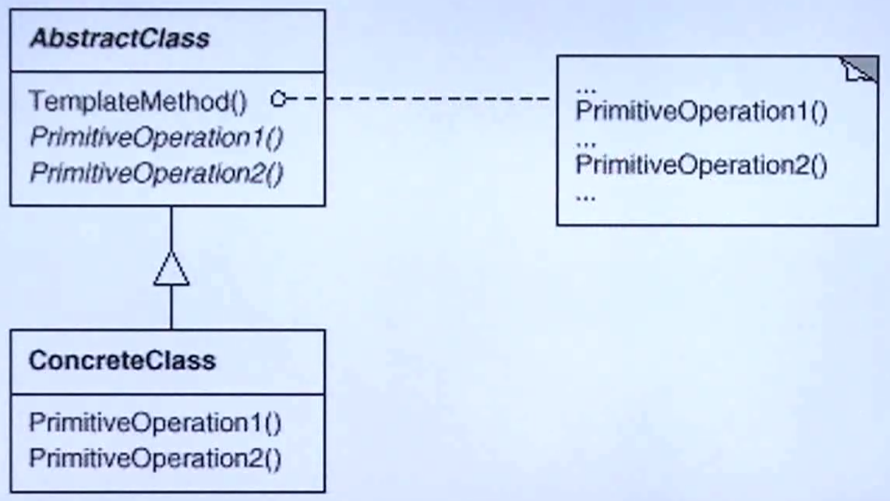

# 设计模式

## 1. 设计原则

### 1.1 依赖倒置原则（DIP）

高层模块（稳定）不应该依赖于低层模块（变化），二者都应该依赖于抽象（稳定）

抽象不应该依赖于实现细节（变化），实现细节应该依赖于抽象（稳定）


上图中左半部分，MainForm（高层模块）中要实现画线条和画矩阵两个功能，一般的做法是分别写两个类（低层模块），由MainForm进行引用，这样的做法往往导致新增一个功能时，需要大幅改动MainForm。常用做法如上图右半部分所示，定义一个抽象的形状类Shape，让MainForm统一使用Shape类实现相关功能，这样的话新增功能时只要小幅改动Shape及增加对应功能类即可，也就是常见的“工厂设计模式”。

### 1.2 开放封闭原则（OCP）

对扩展开放，对更改封闭

类模块应该是可拓展的，但是不可修改

### 1.3 单一职责原则（SRP）

一个类应该仅有一个引起它变化的原因

变化的方向隐含着类的责任

### 1.4 Liskov替换原则（LSP）

子类必须能够替换它们的基类（IS-A）

继承表达类型抽象

### 1.5 接口隔离原则（ISP）

不应该强迫客户程序依赖他们不使用的方法

接口应该小而完备

### 1.6 优先使用对象组合，而不是类继承

类继承通常为“白箱复用”，对象组合通常为“黑箱复用” 

继承在某种程度上破坏了封装性，子父类耦合度高

对象组合原则只要求被组合的对象具有良好定义的接口，耦合度低

### 1.7 封装变化点

使用封装来创建对象之间的分解层，让设计者可以在分解层的一侧进行修改，而不会对另一侧产生不良的影响，从而实现不同层次间的松耦合

### 1.8 针对接口编程，而不针对实现编程

不将变量类型声明为某个特定的具体类，而是声明为某个接口

客户程序无需获知对象的具体类型，只需要知道对象所具有的接口

减少系统中各部分的依赖关系，从而实现“高内聚、松耦合”的类型设计方案

## 2. GOF-23

现代软件设计的特征是“需求的频繁变化”。设计模式要寻到变化点，知道哪些地方是稳定的，哪些是变化的，在变化点使用设计模式。

## 3 "组件协作"模式

通过晚期绑定，来实现框架与应用程序之间的松耦合，是二者之间协作时常用的模式。典型模式有：

- Template Method

- Strategy

- Observer / Event

### 3.1 Template Method模式

**动机：**在软件构建过程中，对于某一项任务，它常常有稳定的整体操作结构，但各个子步骤却有很多改变的需求，或者由于固有的原因（比如框架与应用之间的关系）而无法和任务的整体结构同时实现。

**问：**如何在确定稳定操作结构的前提下，来灵活应对各个子步骤的变化或者晚期实现需求？

示例**代码3-1**【结构化软件设计】：

```C++
/*
	为了查看方便，这里将工具类和实际应用类写在一起
*/
//工具类
class Library{
public:
    void step1(){};
    void step3(){};
    void step5(){};
};

//实际应用类
class Application{
    bool step2(){};
    void step4(){};
};

int main (){
    Library lib();
    Application app();
    lib.step1();
    if(app.step2()){
        lib.step3();
    }
    for(int i = 0; i < 4; i++){
        app.step4();
    }
    lib.step5();
	return 0;
}
```

示例**代码3-2**【面向对象软件设计】：

```C++
class Library{
public:
    void run(){
        step1();
        if(step2()){  //虚函数支持动态变化
            step3();
        }
        for(int i = 0; i < 4; i++){
            step4(); //虚函数支持动态变化
        }
        step5();
	}
    virtual ~Library(){}
protected:
    void step1(){};
    void step3(){};
    void step5(){};
    virtual bool step2() = 0;
    virtual void step4() = 0;
};
//实际应用类共有集成Library
class Application : public Library{
    bool step2(){
        //可以对虚函数根据实际需求进行修改
    };
    void step4(){
        //可以对虚函数根据实际需求进行修改
    };
};

int main (){
    Library *lib = new Application();
    lib->run();
    delete lib;
    lib = NULL;
    return 0;
}
```

上述两段代码分别对应下面图片中的两种设计流程，在引入了多态之后，Library开发人员可以在早期就对整个主程序进行编写，提供变化的函数接口，留给Application开发人员进行开发。即保证了工作流程，也减小了Application开发人员的工作量，前提是程序主流程是稳定的。


这里涉及到早/晚绑定的概念，如下图所示。


Library开发早，Application开发晚，一般程序设计过程都是晚的调用早的，这个叫早绑定，反之称为晚绑定。

> **模式定义**
>
> 定义一个操作中的算法的骨架(稳定)，而将一些步骤延迟(变化)到子类中。Template Method使得子类可以不改变(复用)一个算法的结构即可重定义(override)该算法的某些特定步骤。
>
> <div style="float:right;">——《设计模式》 GoF</div>

上述内容很好的体现了模式定义中所描述的内容，读者可以对照着代码理解一下。

**结构**

**AbstractClass**类对整体的步骤进行定义，将变化的方法延迟到晚期去实现。子类继承**AbstractClass**对其中的虚函数进行实现，充分利用虚函数动态绑定的特点实现解耦，类结构图如下：



**总结**

- Template Method模式是一种非常基础性的设计模式，在面向对象系统中应用广泛。它用最简洁的机制(虚函数的多态性)为很多应用程序框架提供灵活的扩展点(集成+多态)，是代码复用的基本实现结构
- 除了可以灵活应对子步骤的变化外，“不要调用我，我来调用你"的反向控制结构是Template Method的典型应用
- 在具体实现方面，被Template Method调用的虚方法可以具体实现，也可以没有实现方法(抽象方法、纯虚方法)，但一般将他们设置为protected

### 3.2 Strategy模式

**动机：**在软件构建过程中，某些对象使用的算法可能多钟多样，经常改变，如果将这些算法都编码到对象中，将会使对象变得异常复杂，而且有时候支持不使用的算法也是一个性能负担

**问：**如何在运行时根据需要透明地改变对象的算法？将算法与对象本身解耦，从而避免上述问题？

示例**代码3-3：**

```C++
//货币税率枚举类型
enum TaxBase{
    CN_Tax,
    US_Tax,
    DE_tax
};
class SalesOrder{
    TaxBase tax;
public:
    double CalculateTax(){
        if(tax == CN_Tax){
            //计算CN国家的算法
        }
        else if(tax == US_Tax){
            //计算US国家的算法
        }
        else if(tax == DE_Tax){
            //计算DE国家的算法
        }
    }
};
```

上述代码中，如果要为***SalesOrder***类新增一个国家的税率计算方法，需要增加枚举类型，再在**CalculateTax()**方法中新增相关的方法，仔细思考这种方式其实违反了设计原则中的**开放封闭原则**，也就是说，需要扩展新内容时，需要回去修改相关的类。可以通过引入**策略模式**进行代码设计，有效解上述问题。

示例**代码3-4**：

```C++
/*
	抽象的策略基类，可以单独放在一个类文件中
*/
class TaxStrategy{
public :
    virtual double Calculate() = 0;
    virtual ~TaxStrategy(){}
};

/*
	针对每个国家的具体类，可以单独放在一个类文件中
*/
class CNTax : public TaxStrategy{
public :
    virtual double Calculate(){
        //CN国家税率计算算法
    }
};

class USTax : public TaxStrategy{
public :
    virtual double Calculate(){
        //US国家税率计算算法
    }
};

class DETax : public TaxStrategy{
public :
    virtual double Calculate(){
        //DE国家税率计算算法
    }
};

class Context{
protected:
    TaxStrategy* strategy;
public:
    Context(TaxStrategy* sty)
    {
        this->strategy = sty;
    }
    double ContextInterface()
    {
        return this->strategy->Calculate();
    }
};

/*
	应用程序类，单独放在一个类文件中
*/
class SalesOrder{
private:
    Context ctx; //可以使用指针和引用，使用对象类具有多态特性
public:
    SalesOrder(StrategyFactory* strategyFactory){
        //创建策略对象
        ctx = new Context(strategyFactory->NewStrategy()); //与工厂模式配合使用
    }
    ~SalesOrder(){
        delete this->ctx;
        this->ctx = NULL;
    }
    public double CalculateTax(){
        double val = ctx.ContextInterface();
    }
};
```

**代码3-4**体现了策略模式的设计思想，这样在需要扩展的时候，只需要将国家税率的计算方法单独写成一个类添加即可，无需改动原有的代码，***SalesOrder***对象在使用时根据上下文对象进行调用，不用对国家逐个进行判断，很好的支持了扩展，也体现了软件复用思想。

> **模式定义**
>
> 定义一系列算法，把它们一个个封装起来，并且使它们可互相替换(变化)。该模式使得算法可以独立于使用它的客户程序(稳定)而变化(扩展，子类化)。
>
> <div style="float:right;">——《设计模式》 GoF</div>

**结构**

策略模式的结构可见下图，***Strategy***类常被定义为一个抽象接口类，具体的策略继承该接口并实现其中的方法，***Context***类常在客户程序中使用，根据其选择相关的策略。绿框部分表示为该模式稳定的部分，红框表示为不稳定部分(可扩展部分)。


**总结**

- Strategy及其子类为组件提供了一系列可重用的算法，从而可以使得类型在运行时方便地根据需要在各个算法之间进行切换
- Strategy模式提供了用条件判断语句以外的另一种选择，消除条件判断语句，就是在解耦合。含有许多条件判断语句的代码通常需要Strategy模式
- 如果Strategy对象没有实例变量，那么上下文可以共享同一个Strategy对象(单例类)

### 3.3 Observer 观察者模式

**动机：**在软件构建过程中，我们需要对某些对象建立一种“通知依赖关系”——一个对象(目标对象)的状态发生改变，所有的依赖对象(观察者对象)都将得到通知。如这样的关系过于紧密，将使软件不能很好地应对变化

**问：**使用面向对象技术，可以将这种一类关系弱化，并形成一种稳定的依赖关系。从而实现软件体现结构的松耦合

以文件分割为例，讲述观察者模式的设计流程。

示例**代码3-5：**

```C++
//文件分割类
class FileSplitter{
    string m_filePath;
    int m_fileNumber;
    //显示进度条控件
    ProgressBar* m_progressBar：//语句1
public:
    FileSplitter(const string& filePath, int fileNumber, ProgressBar* progressBar):
    m_filePath(filePath),
    m_fileNumber(fileNumber),
    m_progressBar(progressBar){ //语句2
        //构造函数
    }
    void split(){ //切割文件具体函数
        //1. 读取文件
        //2. 分批向小文件写入数据
        for(int i = 0; i < m_fileNumber; i++){
           //具体写文件操作
            progressBar->saveValue((i + 1)/ m_fileNumber); //语句3
        }
    }
    ~FileSplitter(){}
};

//窗体类为单独一个文件，这里演示方便放在一起了
class MainForm : Form{
    TextBox* txtFilePath;
    TextBox* txtFileNumber;
    //进度条控件
    ProgressBar* progressBar：//语句4
public:
    void Button1_Click(){
        string filePath = txtFilePath->getText();
        int number = atoi(txtFileNumber->gettext().c_str());
        
        FileSplitter splitter(filePath, number, progressBar); //语句5
        splitter.split();
    }
};
```

上述代码中，如果要为***FileSplitter***类新增一个显示进度条的功能，一般的做法是在类中定义一个进度条控件(语句1)，修改构造函数传递的参数(语句2)，在分割文件的方法**split()**中更新进度条(语句3)，同时在窗体类中定义进度条控件并传入(语句4和5)。

这种做法对于特定的场景是没有问题的，但是如果需要该类可以控制台显示“...”的进度，是不是还要去修改***FileSplitter***类中的代码？如果不需要进度条，只需要以文本形式显示进度呢？

显然上述代码不能很好的应对需求的变化，这里引入观察者模式改善这个问题。

示例**代码3-6**：

```C++
/*
	引入进度接口
*/
class Iprogress{
public :
    virtual void DoProgress(float value) = 0;
    virtual ~Iprogress(){}
};

/*
	文件分割类，可以单独放在一个类文件中
*/
class FileSplitter{
    string m_filePath;
    int m_fileNumber;
    //显示进度条控件
    //ProgressBar* m_progressBar：
    //抽象通知机制,使用list可以存储多个观察者
    list<IProgress*> m_iprogress;           //语句1
    
public:
    FileSplitter(const string& filePath, int fileNumber):
    m_filePath(filePath),
    m_fileNumber(fileNumber){//构造函数}
    void split(){ //切割文件具体函数
        //1. 读取文件
        //2. 分批向小文件写入数据
        for(int i = 0; i < m_fileNumber; i++){
           //具体写文件操作
            float progressValue = (i + 1)/ m_fileNumber;
            DoProgress(progressValue);      //语句2
        }
    }
    //增加观察者
    void addIProgress(IProgress* iprogress){//语句3
        m_iprogress.add(iprogress);
    }
    //移除观察者
    void removeIProgress(IProgress* iprogress){
        m_iprogress.remove(iprogress);     //语句4
    }
    virtual ~FileSplitter(){}
protected:
    //通知函数
    void onProgress(float value){          //语句5
        List<IProgress*>:: Iterator iter = m_iprogress.begin();
        while(iter != m_iprogress.end()){
            (*iter)->DoProgress(value);  //更新进度
            ++iter;
        }
    }
};

class MainForm : public:Form, public:Iprogress{
    TextBox* txtFilePath;
    TextBox* txtFileNumber;
    //进度条控件
    ProgressBar* progressBar：
public:
    void Button1_Click(){
        string filePath = txtFilePath->getText();
        int number = atoi(txtFileNumber->gettext().c_str());
        
        FileSplitter splitter(filePath, number); 
        ConsoleObserver cb;
        //添加两个观察者，并订阅
        splitter.addIProgress(this);		//语句6
        splitter.addIProgress(&cb);			//语句7
        splitter.split();
        splitter.removeIProgress(&cb);	
    }
    //实现IProgress接口
    virtual void DoProgress(float value)(){
        progressBar->setValue(value);
    }
};
//控制台观察者
class ConsoleObserver : public:Iprogress{
    //实现IProgress接口
    virtual void DoProgress(float value)(){//语句8
        //...
    }
};
```

**代码3-6**体现了观察者模式的设计思想，将原本需要根据控件进行更新的方式调整为只返回数据，让客户程序根据需求进行变化，观察者订阅的方式动态的获取值，采用容器存储观察者(语句1)，增加/删除函数保证了应用程序可以独立的选择订阅和取消订阅(语句3和4)，增加了程序的灵活性。通过遍历容器内的观察者，向其通知最新的消息(语句5)，从而在观察者能根据其通知结果实现相关的功能(语句6、7和8)。

> **模式定义**
>
> 定义对象间的一种一对多(变化)的依赖关系，以便当一个对象(Subject)的状态发生改变时，所有依赖于它的对象都得到通知并自动更新。
>
> <div style="float:right;">——《设计模式》 GoF</div>

**结构**

观察者模式的结构可见下图，***Observer***类常被定义为一个抽象接口类，用于更新观察到的值，在代码2-6中体现为***IProgress***类，而***Subject***类主要负责观察者的增加、移除和通知，在代码3-6中体现为addIProgress()、removeIProgress()和onProgress()三个函数，一种做法是将这三个函数独立的编写成一个类。具体观察者继承***Observer***对象，并实现update()函数，从中获取从***Subject***类订阅到的值。绿框部分表示为该模式稳定的部分，红框表示为不稳定部分(可扩展部分)。


**总结**

- 使用面向对象的抽象，Observer模式使得我们可以独立的改变目标与观察者，从而使二者之间的依赖关系松耦合
- 目标发送通知时，无需指定观察者，通知(可以携带通知信息作为参数)会自动传播
- 观察者自己决定是否需要订阅通知，目标对象对此一无所知
- Observer模式是基于时间的UI框架中十分常用的设计模式，也是MVC模式的一个重要组成部分

## 4 ”单一职责“模式

在软件组件的设计中，如果责任划分的不清晰，使得继承得到的结果往往是随着需求的变化，子类急剧膨胀，同时充斥着重复代码，这时候的关键是划清责任。典型模式有：

- Decorator
- Bridge

### 4.1 Decorator装饰器模式

**动机：**在某些情况下我们可能会“过度地使用继承来扩展对象的功能”，由于继承为类型引入的静态特质，使得这种扩展方式缺乏灵活性；并且随着子类的增多(扩展功能的增多)，各种子类的组合(扩展功能的组合)会导致更多子类的膨胀

**问：**如何使“对象功能的扩展”能够根据需要来动态地实现？同时避免“拓展功能的增多”带来的子类膨胀问题？从而使得任何“功能拓展变化”所导致的影响降为最低？

以流的读取和加密操作为例，讲述Decorator模式的设计流程。

示例**代码4-1：**

```C++
//业务操作，流操作接口
class Stream{
public:
   virtual char Read(int number) = 0; //读取流
   virtual void Seek(int position) = 0;//定位流
   virtual void Write(char data) = 0;//写入流
   virtual ~Stream(){}
};

//文件流操作类
class FileStream : public Stream{
public:
    virtual char Read(int number){}
    virtual void Seek(int number){}
    virtual void Write(int number){}
};
//网络流操作类
class NetworkStream : public Stream{
public:
    virtual char Read(int number){}
    virtual void Seek(int number){}
    virtual void Write(int number){}
};
//内存流操作类
class MemoryStream : public Stream{
public:
    virtual char Read(int number){}
    virtual void Seek(int number){}
    virtual void Write(int number){}
};
//扩展操作
//文件流加密类
class CryptoFileStream : public FileStream{
public:
    virtual char Read(int number){
        FileStream::Read(number); //读文件流
        //额外的加密操作
    }
    virtual void Seek(int number){
        FileStream::Seek(number);
        //额外的加密操作
    }
    virtual void Write(int number){
        //额外的加密操作
        FileStream::Write(number);
    }
};
//网络流加密类
class CryptoNetworkStream : public NetworkStream{
public:
    virtual char Read(int number){
        NetworkStream::Read(number);//读网络流
        //额外的加密操作
    }
    virtual void Seek(int number){
        NetworkStream::Seek(number);
        //额外的加密操作
    }
    virtual void Write(int number){
        //额外的加密操作
        NetworkStream::Write(number);
    }
};
//网络流加密类
class CryptoMemoryStream : public MemoryStream{
public:
    virtual char Read(int number){
        MemoryStream::Read(number);//读内存流
        //额外的加密操作
    }
    virtual void Seek(int number){
        MemoryStream::Seek(number);
        //额外的加密操作
    }
    virtual void Write(int number){
        //额外的加密操作
        MemoryStream::Write(number);
    }
};
//文件流缓冲
class BufferedFileStream : public FileStream{
    //...
};
//网络流缓冲
class BufferedNetworkStream : public NetworkStream{
    //...
};
//内存流缓冲
class BufferedMemoryStream : public MemoryStream{
    //...
};
//加密缓冲文件流
class CryptoBufferedFileStream :public FileStream{
public:
    virtual char Read(int number){
        //额外的加密操作
        //额外的缓冲操作
        FileStream::Read(number);//读内存流
    }
    virtual void Seek(int number){
        //额外的加密操作
        //额外的缓冲操作
        FileStream::Seek(number);
        //额外的加密操作
    }
    virtual void Write(int number){
        //额外的加密操作
        //额外的缓冲操作
        FileStream::Write(number);
    }
};
//加密缓冲网络流，同上
//加密缓冲内存流，同上
```

上述代码中，***Stream***基类类所有流操作类的接口，基于不同的类别额外的操作都需要继承对应的基类，为了直观的理解，画出了如下图所示的类继承示意图。


一个明显的特征是子类的数量众多，而且子类的实现过程中存在着大量的重复代码，代码的维护量很大，每一个子类中都只调用了父类的特定函数(静态特质)，可以看出除了父类的不同，相同功能的子类函数其他操作完全相同。如果还要扩展新的子类，其数量将更加庞大。

如何解决上述问题？这里引入装饰模式改善这个问题。

示例**代码4-2**：

```C++
//业务操作，流操作接口
class Stream{
public:
   virtual char Read(int number) = 0; //读取流
   virtual void Seek(int position) = 0;//定位流
   virtual void Write(char data) = 0;//写入流
   virtual ~Stream(){}
};

//文件流操作类
class FileStream : public Stream{
public:
    virtual char Read(int number){}
    virtual void Seek(int number){}
    virtual void Write(int number){}
};
//网络流操作类...
//内存流操作类...

//扩展操作
//文件流加密类
class CryptoFileStream { //这里不再直接继承FileStream类
    FileStream* stream; //引入FileStream类指针
public:
    virtual char Read(int number){
        stream->Read(number); //读文件流
        //额外的加密操作
    }
    virtual void Seek(int number){
        stream->Seek(number);
        //额外的加密操作
    }
    virtual void Write(int number){
        //额外的加密操作
        stream->Write(number);
    }
};
//网络流加密类
class CryptoNetworkStream {
    NetworkStream* stream;
public:
    virtual char Read(int number){
        stream->Read(number);//读网络流
        //额外的加密操作
    }
    virtual void Seek(int number){
         stream->Seek(number);
        //额外的加密操作
    }
    virtual void Write(int number){
        //额外的加密操作
         stream->Write(number);
    }
};
//网络流加密类
class CryptoMemoryStream {
    MemoryStream* stream;
public:
    virtual char Read(int number){
        stream->Read(number);//读内存流
        //额外的加密操作
    }
    virtual void Seek(int number){
        stream->Seek(number);
        //额外的加密操作
    }
    virtual void Write(int number){
        //额外的加密操作
        stream->Write(number);
    }
};
//后续操作,同上
```

在**代码4-2**中，针对扩展操作，我们首先使用组合替代继承，可以看出扩展操作的中的几个类，除了成员对象***stream***的类型不同外，其他代码完全相同，利用多态的特性，可以在未来让***stream***动态的成为我们想要的类型，见代码**4-3**：

```C++
//业务操作，流操作接口
class Stream{
public:
  virtual char Read(int number) = 0; //读取流
   virtual void Seek(int position) = 0;//定位流
   virtual void Write(char data) = 0;//写入流
   virtual ~Stream(){}
};

//文件流操作类
class FileStream : public Stream{
public:
    virtual char Read(int number){}
    virtual void Seek(int number){}
    virtual void Write(int number){}
};
//网络流操作类...
//内存流操作类...

//扩展操作
//流加密类
class CryptoStream : public Stream{ //这里直接继承Stream类
    Stream* stream; //在运行时，利用多态特性动态的选择类型  语句1
public:
    CryptoStream(Stream* stm):stream(stm){
        //构造函数
    }
    virtual char Read(int number){
        stream->Read(number); //读文件流
        //额外的加密操作
    }
    virtual void Seek(int number){
        stream->Seek(number);
        //额外的加密操作
    }
    virtual void Write(int number){
        //额外的加密操作
        stream->Write(number);
    }
};
//流缓冲类
class BufferedStream : public FileStream{
     Stream* stream; //在运行时，利用多态特性动态的选择类型  语句1
public:
    BufferedStream(Stream* stm):stream(stm){
        //构造函数
    }
    virtual char Read(int number){
        stream->Read(number); //读文件流
        //额外的缓冲操作
    }
    virtual void Seek(int number){
        stream->Seek(number);
        //额外的缓冲操作
    }
    virtual void Write(int number){
        //额外的缓冲操作
        stream->Write(number);
    }
};
void Process(){
    //编译时装配
    CryptoFileStream *fs1 = new CryptoFileStream();
    BufferFileStream *fs2 = new CryptoFileStream();
    CryptoBufferFileStream *fs3 = new CryptoFileStream();
    
    //运行时装配
    FileStream *s1 = new FileStream();  //文件流
    CryptoStream *s2 = new CryptoStream(s1);//加密流
    BufferStream *s3 = new BufferStream(s1);//缓冲流
    
    BufferStream *s4 = new BufferStream(s2);//既加密又缓存文件流
}
```

如此一来，原本加密和加密缓冲的三个类统一成了一个类，代码的功能完全一样，但是更加简洁。在构造函数的初始化列表中，我们将Stream成员赋值为传递进来的***Stream***类对象，从而实现动态性。再将**4-3**代码中的Stream对象单独提取出来，独立实现一个装饰器类，**代码4-4**。

```C++
//以上代码省略...
//流装饰器类
class DecoratorStream : public Stream{
protected:
    Stream* stream;
    DecoratorStream(Stream* stm):stream(stm){
        //构造函数
    }
    //...
}
class CryptoStream : public DecoratorStream{
    Stream* stream; //在运行时，利用多态特性动态的选择类型  语句1
public:
    CryptoStream(Stream* stm):DecoratorStream(stm){ //执行父类的构造函数
        //构造函数
    }
    virtual char Read(int number){
        stream->Read(number); //读文件流，动态特质
        //额外的加密操作
    }
    virtual void Seek(int number){
        stream->Seek(number);
        //额外的加密操作
    }
    virtual void Write(int number){
        //额外的加密操作
        stream->Write(number);
    }
};
//以下代码省略...
```

经过调整之后，我们可以再看一下调整之后的类继承图。


扩展操作的子类不再直接从对应的父类直接继承，而是通过继承装饰类的形式动态的实现相关功能，代码的复用性进一步提高，子类的数量也没有出现大规模膨胀，而是通过动态组合的方式实现功能的组合，无需再为新功能设计新的子类。这种设计模式中类的数量为：$$1+n+1+m$$，其中第一个$$1$$为接口类，第二个$$1$$为装饰器类，$$n$$为功能类，$$m$$为扩展类。

> **模式定义**
>
> 动态(组合)地给一个对象增加一些额外的职责。就增加功能而言，Decorator模式比生成子类(继承)更为灵活(消除重复代码&减少子类个数)。
>
> <div style="float:right;">——《设计模式》 GoF</div>

**结构**

装饰模式的结构可见下图，***Component***类常被定义为一个抽象接口类，用于定义相关的操作函数接口，在代码中体现为***Stream***类，而***Decorator***类主要继承***Component***并遵循规范实现其中的成员函数，同时支持动态调用相关的对象。绿框部分表示为该模式稳定的部分，红框表示为不稳定部分(可扩展部分)。


**总结**

- 通过采用组合而非继承的手法，Decorator模式实现了在运行时动态扩展对象功能的能力，而且可以根据需要扩展多个功能，避免了使用继承带来的“灵活性差”和“多子类衍生问题”
- Decorator类在接口上表现为is-a Component的集成关系，即Decorator类继承了Component类所具有的接口。但在实现上又表现为has-a Component的组合关系，即Decorator类又使用了另外一个Component类
- Decorator模式的目的并非解决"多子类衍生的多继承"问题，Decorator模式应用的要点在于解决“主体类在多个方向的扩展功能"——是为”装饰“的含义

### 4.2 Bridge桥模式

**动机：**由于某些类型的固有的实现逻辑，使得它们具有两个变化的维度，乃至多个变化维度。

**问：**如何应对这种”多维度的变化“？如何利用面向对象技术来使得类型可以轻松的沿着两个乃至多个方向的变化，而不引入额外的复杂度？

以消息通信功能为例，讲述桥模式的设计原则和方法。

示例**代码4-5：**

```C++
//消息接口类
class Messager{
	virtual void Login(string username, string password) = 0;
	virtual void SendMessage(string username) = 0;
	virtual void SendPicture(Image image) = 0;
    
	virtual void PlaySound() = 0;
	virtual void DrawShape() = 0;
	virtual void WriteText() = 0;
	virtual void Connect() = 0;
	~Messager(){}
};

//平台实现
//PC端
class PCMessagerBase : public Messager{
public:
    virtual void PlaySound(){
       //**************
    }
    virtual void DrawShape(){
       //**************
    }
    virtual void WriteText(){
       //**************
    }
    virtual void Connect(){
       //**************
    }
};
//手机端
class MobileMessagerBase : public Messager{
public:
    virtual void PlaySound(){
       //==============
    }
    virtual void DrawShape(){
       //==============
    }
    virtual void WriteText(){
       //==============
    }
    virtual void Connect(){
       //==============
    }
};

//业务抽象
//PC端简洁版
class PCMessagerLite : public PCMessagerBase{
public:
    virtual void Login(string username, string password){
        PCMessagerBase::Connect();
        //..............
    }
    virtual void SendMessage(string username){
        PCMessagerBase::WriteText();
        //..............
    }
    virtual void SendPicture(Image image){
        PCMessagerBase::DrawShape();
      	//..............
    }
};
//PC端完整版
class PCMessagerPerfect : public PCMessagerBase{
public:
    virtual void Login(string username, string password){
        PCMessagerBase::PlaySound();
        //**************
        PCMessagerBase::Connect();
        //..............
    }
    virtual void SendMessage(string username){
        PCMessagerBase::PlaySound();
        //**************
        PCMessagerBase::WriteText();
        //..............
    }
    virtual void SendPicture(Image image){
        PCMessagerBase::PlaySound();
        //**************
        PCMessagerBase::DrawShape(image);
        //..............
    }
};

//手机端简洁版
class MobileMessagerLite : public MobileMessagerBase{
public:
    virtual void Login(string username, string password){
        MobileMessagerBase::Connect();
        //..............
    }
    virtual void SendMessage(string username){
        MobileMessagerBase::WriteText();
        //..............
    }
    virtual void SendPicture(Image image){
        MobileMessagerBase::DrawShape();
      	//..............
    }
};
//手机端完整版
class MobileMessagerPerfect : public MobileMessagerBase{
public:
    virtual void Login(string username, string password){
        MobileMessagerBase::PlaySound();
        //**************
        MobileMessagerBase::Connect();
        //..............
    }
    virtual void SendMessage(string username){
        MobileMessagerBase::PlaySound();
        //**************
        MobileMessagerBase::WriteText();
        //..............
    }
    virtual void SendPicture(Image image){
        MobileMessagerBase::PlaySound();
        //**************
        MobileMessagerBase::DrawShape(image);
        //..............
    }
};

void Process(){
    //编译时装配
    Messager *m = new MobileMessagerPerfect();
}
```

上述代码中，我们知道消息类存在着两个平台和两个业务方向的拓展，代码与之前所学的装饰器模式演示代码极其类似，处理的过程也很相似，这里不再赘述过程，直接写出使用桥模式之后的设计代码，并指出与装饰器模式的主要区别。

示例**代码4-6：**

```C++
//消息接口类
class Messager{
    Messager(MessageImp* mImp):messageImp(mImp){}
protected:
    MessageImp* messageImp
public:
	virtual void Login(string username, string password) = 0;
	virtual void SendMessage(string username) = 0;
	virtual void SendPicture(Image image) = 0;
	~Messager(){}
};

//业务实现
class MessageImp{
public:
	virtual void PlaySound() = 0;
	virtual void DrawShape() = 0;
	virtual void WriteText() = 0;
	virtual void Connect() = 0;
	~MessageImp(){}
};

//平台实现
//PC端
class PCMessagerImp : public MessageImp{
public:
    virtual void PlaySound(){
       //**************
    }
    virtual void DrawShape(){
       //**************
    }
    virtual void WriteText(){
       //**************
    }
    virtual void Connect(){
       //**************
    }
};
//手机端
class MobileMessagerImp : public MessageImp{
public:
    virtual void PlaySound(){
       //**************
    }
    virtual void DrawShape(){
       //**************
    }
    virtual void WriteText(){
       //**************
    }
    virtual void Connect(){
       //**************
    }
};

//业务抽象
//简洁版
class MessagerLite : public Messager{
    MessagerLite(MessageImp* mImp):Messager(mImp){};
public:
    virtual void Login(string username, string password){
        messageImp->Connect();
        //..............
    }
    virtual void SendMessage(string username){
        messageImp->WriteText();
        //..............
    }
    virtual void SendPicture(Image image){
        messageImp->DrawShape();
      	//..............
    }
};
//完整版
class MessagerPerfect : public Messager{
    MessagerPerfect(MessageImp* mImp):Messager(mImp){};
public:
    virtual void Login(string username, string password){
        messageImp->PlaySound();
        //**************
        messageImp->Connect();
        //..............
    }
    virtual void SendMessage(string username){
        messageImp->PlaySound();
        //**************
        messageImp->WriteText();
        //..............
    }
    virtual void SendPicture(Image image){
        messageImp->PlaySound();
        //**************
        messageImp->DrawShape(image);
        //..............
    }
};
void Process(){
    //运行时装配
    MessagerImp *mImp = new MobileMessagerImp();
    Messager* m = new MessagerPerfect(mImp);
}
```

从**代码4-6**可以看出，使用桥模式让代码更加简洁。我们将***Messager***类进行了维度的划分，划分为业务实现和业务抽象两个维度，业务抽象中设置业务实现的指针，达到组合的目的，这也是区别于装饰器模式的主要地方。如果新增了第三个业务需要实现，我们也只需要在新增这个业务实现的指针，进行组合即可。

> **模式定义**
>
> 将抽象部分(业务功能)与实现部分(平台实现)分离，使它们都可以独立地变化。
>
> <div style="float:right;">——《设计模式》 GoF</div>

**结构**

桥模式的结构可见下图，***Abstraction***定义为一个抽象接口类，***Implementor***定义为实现类，抽象类中定义指向实现类的指针，使之可以动态的调用其中的方法，同时抽象类和实现类都能根据实际的需要进行独立变化。绿框部分表示为该模式稳定的部分，红框表示为不稳定部分(可扩展部分)。


**总结**

- Bridge模式使用“对象间的组合关系”解耦了抽象和实现之间固有的绑定关系，是的抽象和实现可以沿着各自的维度来变化。即“子类化”它们
- Bridge模式有时候类似于多继承方案，但是多继承方案往往违背单一原则（即一个类只有一个变化），复用性比较差。Bridge模式是比多继承方案更好的解决方法
- Bridge模式的应用一般在“两个非常强的变化维度”，有时一个类也有多于两个变化的维度，这时候可以使用Bridge的拓展模式

## 5 ”对象创建“模式

通过“对象创建”模式绕开new，来避免对象创建(new)过程中所导致的紧耦合(依赖具体类)，从而支持对象创建的稳定。它是接口抽象之后的第一步工作。典型模式有：

- Factory Method
- Abstract Factory
- Prototype
- Builder

### 5.1 Factory Method工厂方法

**动机：**在软件系统中，经常面临着创建对象的工作，由于需求的变化，需要创建的对象的具体类型经常变化。

**问：**如何应对这种变化？如何绕开常规的对象创建方法(new)，提供一种“封装机制”来避免客户长须和这种“具体对象创建工作”的紧耦合？

以文件分割为例，讲述工厂方法的设计流程，首先是传统设计模式。

示例**代码5-1：**

```C++
//文件分割类
class FileSplitter{
public:
    void split(){ //切割文件具体函数
    }
    ~FileSplitter(){}
};

//窗体类为单独一个文件，这里演示方便放在一起了
class MainForm : Form{
    TextBox* txtFilePath;
    TextBox* txtFileNumber;
    //进度条控件
    ProgressBar* progressBar：
public:
    void Button1_Click(){
        string filePath = txtFilePath->getText();
        int number = atoi(txtFileNumber->gettext().c_str());
        
        FileSplitter splitter(filePath, number, progressBar); //语句1
        splitter.split();
    }
};
```

上述代码中，如果要新增图片分割、视频分割功能，常见的做法是将分割类抽象出来，具体实现类继承抽象类。代码示例如下：

示例**代码5-2**：

```C++
// 引入接口
class ISplitter{
public :
    virtual void split(float value) = 0;
    virtual ~ISplitter(){}
};

// 文件分割类，可以单独放在一个类文件中
class FileSplitter : public ISplitter{
};

// 图片分割类，可以单独放在一个类文件中
class ImgSplitter : public ISplitter{
};

// 视频分割类，可以单独放在一个类文件中
class VideoSplitter : public ISplitter{
};

class MainForm : public:Form, public:Iprogress{
    TextBox* txtFilePath;
    TextBox* txtFileNumber;
    //进度条控件
    ProgressBar* progressBar：
public:
    void Button1_Click(){
        string filePath = txtFilePath->getText();
        int number = atoi(txtFileNumber->gettext().c_str());
        
        ISplitter splitter =     //语句1
            new FileSplitter();  //语句2  依赖具体类
    }
};
```

**代码5-2**完成了面向对象的抽象过程，**语句1**依赖于抽象类，实现了代码的稳定性，但是**语句2**还是依赖于某一个具体的类实现，违背了依赖倒置原则，还需要对具体的实现进行抽象。

示例**代码5-3**：

```C++
// 引入接口
class ISplitter{
public :
    virtual void split(float value) = 0;
    virtual ~ISplitter(){}
};
//引入工厂类
class SplitterFactory{
public:
    virtual ISplitter* CreateSplitter() = 0;  //语句1
    virtual ~SplitterFactory()
}

//以上两个类可以写到一个Factory文件中

//以下的类可以写到一个具体的Splitter文件中
//具体的实现类
// 文本分割类
class TextSplitter : public ISplitter{
};

// 图片分割类
class ImgSplitter : public ISplitter{
};

// 视频分割类
class VideoSplitter : public ISplitter{
};

//具体工厂
// 文本分割工厂
class TextSplitterFactory : public SplitterFactory{
    virtual ISplitter* CreateSplitter(){
        return new TextSplitter();
    }
};
// 图片分割工厂
class ImgSplitterFactory : public SplitterFactory{
    virtual ISplitter* CreateSplitter(){
        return new ImgSplitter();
    }
};
// 视频分割工厂
class VideoSplitterFactory : public SplitterFactory{
    virtual ISplitter* CreateSplitter(){
        return new FileSplitter();
    }
};

//主窗口
class MainForm : public:Form{
    SplitterFactory* factory; //工厂类指针
public:
    MainForm(SplitterFactory* factory){
        this-> factory = factory;  //外部传入具体的工厂
    }
    void Button1_Click(){
        
        ISplitter* splitter =     //语句2
            this-> factory-> CreateSplitter();  //语句3  根据外部传入的工厂动态创建
    }
};
```

在引入工厂方法后，主窗口中只需根据传入的具体工厂即可动态的创建相关类，解除了内部与具体类的依赖关系，读者在这里的一个问题：主窗口之外还是存在具体的工厂，也就是说归根结底还是需要创建具体的工厂。这个问题是显然的，这里的主窗口已经和具体的工厂实现了分离，具体的工厂会在外部集中创建，这就好比原本每个房间都有一只猫，使用工厂方法之后，就将每个房间的猫关到一个笼子里，实现了集中的管理。

> **模式定义**
>
> 定义一用于创建对象的接口，让子类决定实例化哪一个类。Factory Method 使得一个类的实例化延迟(目的：解耦，手段：虚函数)到子类。
>
> <div style="float:right;">——《设计模式》 GoF</div>

**结构**

工厂方法的结构可见下图，***Product***类常被定义为一个抽象接口类，定义具体实现类需要实现的方法，在**代码5-3**中体现为***ISplitter***类，***ConcreteProduct***类表示抽象接口的具体实现，体现为***TextSplitter***、***ImgSplitter***和***VideoSplitter***类。***Creator***类为工厂类，提供创建具体工厂的函数，***ConcreteCreator***类继承***Creator***类返回具体的工厂对象。绿框部分表示为该模式稳定的部分，红框表示为不稳定部分(可扩展部分)。


**总结**

- Factory Method模式用于隔离类对象的使用者和具体类型之间的耦合关系。面对一个经常变化的具体类型，紧耦合关系(new)会导致软件的脆弱
- Factory Method模式通过面向对象的收发，将所要创建的具体对象工作延迟到子类，从而实现一种扩展(非更改)的策略，较好地解决了这种紧耦合关系
- Factory Method模式解决“单个对象”的需求变化。缺点在于要求创建方法/参数相同

### 5.2 Abstract Factory抽象工厂

**动机：**在软件系统中，经常面临着"一系列相互依赖的对象"的创建工作，由于需求的变化，往往存在更多系列对象的创建工作。

**问：**如何应对这种变化？如何绕开常规的对象创建方法(new)，提供一种“封装机制”来避免客户程序和这种“多系列具体对象创建工作”的紧耦合？

以数据库连接对象创建为例，讲述抽象工厂的设计流程，首先是传统设计模式。

示例**代码5-4：**

```C++
//数据库连接对象创建
class EmployeeDAO{
public:
    vector<EmployeeDAO> GetEmployees(){ //获取雇员
        SqlConnection* connection = new SqlConnection();  //获取数据库连接
        connection->ConnectionString("sqlConnectString");
        
        SqlCommand* command = new SqlCommand(); // 获取数据库指令
        command->CommandText("excuteSqlString");
        
        SqlDataReader* reader = command->ExecuteReader(); //执行
        while(reader->Read()){
            
        }
    }
};
```

上述代码中，假设目前写的是针对SQL Server数据库的连接方式，如果现在换成Oracle数据库，则需要修改代码，换成Oracle数据库的连接方式，每次更换数据库都需要修改源代码，显然是不太合适的。读者会想到引发问题的原因在于代码中的new，因为换数据库连接方式，new的对象也不一样，因此会想到用工厂方法，其代码如下。

示例**代码5-5**：

```C++
// 引入接口
class IDBConnection{
	//需要实现的接口函数
};
class IDBCommand{
	//需要实现的接口函数
};
class IDBDataReader{
	//需要实现的接口函数
};

// 引入工厂
class IDBConnectionFactory{
public :
    virtual IDBConnection* CreateConnection(string sqlConnectString) = 0;
    virtual ~IDBConnectionFactory(){}
};

class IDBCommandFactory{
public :
    virtual IDBCommand* CreateCommand(string sqlConnectString) = 0;
    virtual ~IDBCommandFactory(){}
};

class IDBDataReaderFactory{
public :
    virtual IDBDataReader* CreateDataReader(string sqlConnectString) = 0;
    virtual ~IDBDataReaderFactory(){}
};

// SQL Server具体实现
class SqlConnection : public IDBConnection{
};

class SqlCommand : public IDBCommand{
};

class SqlDataReader : public IDBDataReader{
};

// SQL Server具体工厂
class SqlConnectionFactory : public IDBCommandFactory{
    virtual IDBConnection* CreateConnection(){
        return new SqlConnection();
    }
};
class SqlCommandFactory : public IDBConnectionFactory{
    virtual IDBCommand* CreateCommand(){
        return new SqlCommand();
    }
};
class SqlDataReaderFactory : public IDBDataReaderFactory{
    virtual IDBDataReader* CreateDataReader(){
        return new SqlDataReader();
    }
};
// Oracle具体实现 ...
// Oracle具体工厂 ...

class EmployeeDAO{
    IDBConnectionFactory* dbconnectionFactory;
    IDBCommandFactory* dbcommandFactory;
    IDBDataReaderFactory* dbdataReaderFactory;
public:
    vector<EmployeeDAO> GetEmployees(){ //获取雇员
        IDBConnection* connection = 
            dbconnectionFactory->CreateConnection();  //获取数据库连接
        dbconnectionFactory->ConnectionString("sqlConnectString");
        
        IDBCommand* command = 
            dbcommandFactory->CreateCommand(); // 获取数据库指令
        command->CommandText("excuteSqlString");
        command->SetConnection();
        
        IDBDataReader* reader = 
            command->ExecuteReader(); //执行
        while(reader->Read()){
            
        }
    }
};
```

**代码5-5**采用工厂方法达到了不修改连接而支持扩展数据库连接的目的，但是存在一个问题是在***EmployeeDAO***类中的三个工厂如果不是一个系列的工厂，有可能Connection是SQL Server而Command是Oracle的，这样不是一个系列的参数无疑会造成错误。如何解决呢？当然需要一次性创建完备的工厂，的这里引入抽象工厂模式。

示例**代码5-3**：

```C++
// 引入接口
class IDBConnection{
	//需要实现的接口函数
};
class IDBCommand{
	//需要实现的接口函数
};
class IDBDataReader{
	//需要实现的接口函数
};

// 引入抽象工厂，体现的是高内聚的思想，即把高度相关的操作聚集在一起
class IDBFactory{
public :
    virtual IDBConnection CreateConnection(string sqlConnectString) = 0;
    virtual IDBCommand CreateCommand(string sqlConnectString) = 0;
    virtual IDBDataReader CreateDataReader(string sqlConnectString) = 0;
    virtual ~IDBFactory(){}
};

// SQL Server具体实现
class SqlConnection : public IDBConnection{
};

class SqlCommand : public IDBCommand{
};

class SqlDataReader : public IDBDataReader{
};

// SQL Server具体工厂
class SqlFactory : public IDBFactory{
    virtual IDBConnection* CreateConnection(){
        return new SqlConnection();
    }
    virtual IDBCommand* CreateCommand(){
        return new SqlCommand();
    }
    virtual IDBDataReader* CreateDataReader(){
        return new SqlDataReader();
    }
};
// Oracle具体实现 ...
// Oracle具体工厂 ...

class EmployeeDAO{
    IDBFactory* dbFactory;
public:
    vector<EmployeeDAO> GetEmployees(){ //获取雇员
        IDBConnection* connection = 
            dbFactory->CreateConnection();  //获取数据库连接
        dbconnectionFactory->ConnectionString("sqlConnectString");
        
        IDBCommand* command = 
            dbFactory->CreateCommand(); // 获取数据库指令
        command->CommandText("excuteSqlString");
        command->SetConnection();
        
        IDBDataReader* reader = 
            command->ExecuteReader(); //执行
        while(reader->Read()){
            
        }
    }
};
```

在抽象工厂方法后，我们将具有高度关联性的三个方法聚集在一个抽象工厂中，也就是说在创建这个工厂的时必须同时实现这三个具有一定关联性的方法，那么在***EmployeeDAO***类中只需存在一个工厂，即在创建工厂的过程中，保证了相关操作的关联性，由此避免“牛头不对马嘴”的错误。

> **模式定义**
>
> 提供一个接口，让该接口负责创建一系列“相关或者相互依赖的对象”，无需指定它们具体的类。
>
> <div style="float:right;">——《设计模式》 GoF</div>

**结构**

抽象工厂模式的结构可见下图，***AbstractFactory***类常被定义具有一系列关联性操作的抽象接口类，在**代码5-6**中体现为***IDBFactory***类，***ConcreteFactory***类继承它需要一次性实现这些抽象方法，并返回相对应的对象，在**代码5-6**中体现为***SqlFactory***类，***AbstractProductA***表示***AbstractFactory***类中的一个抽象接口返回的基类，体现为***IDBConnection***类。***ProductA***类为具体工厂类里面的一个创建对象函数的返回的对象，不同具体工厂返回与之匹配的对象（读者可以参考代码理解一下）。绿框部分表示为该模式稳定的部分，红框表示为不稳定部分(可扩展部分)。


**总结**

- 如果没有应对“多系列对象构建”的需求变化，则没有必要使用Abstract Factory模式，这时候简单的工厂完全可以
- “系列对象”指的是在某一特定系列下的对象之间具有相互依赖、或作用的关系。不同系列的对象之间不能相互依赖
- Abstract  Factory模式主要在于应对“新系列”(Mysql 系列等)的需求变动。其缺点在于难以应对“新对象”(需要增加方法，导致基类不稳定)的需求变动

### 5.3 Prototype原型模式

**动机：**在软件系统中，经常面临着创建对象的工作，由于需求的变化，需要创建的对象的具体类型经常变化。

**问：**如何应对这种变化？如何绕开常规的对象创建方法(new)，提供一种“封装机制”来避免客户长须和这种“具体对象创建工作”的紧耦合？

以文件分割为例，讲述原型模式的设计流程，首先我们引用代码5-3。

**引用代码5-3**：

```C++
// 引入接口
class ISplitter{
public :
    virtual void split(float value) = 0;
    virtual ~ISplitter(){}
};
//引入工厂类
class SplitterFactory{
public:
    virtual ISplitter* CreateSplitter() = 0;  //语句1
    virtual ~SplitterFactory()
}

//以上两个类可以写到一个Factory文件中

//以下的类可以写到一个具体的Splitter文件中
//具体的实现类
// 文本分割类
class TextSplitter : public ISplitter{
};

// 图片分割类
class ImgSplitter : public ISplitter{
};

// 视频分割类
class VideoSplitter : public ISplitter{
};

//具体工厂
// 文本分割工厂
class TextSplitterFactory : public SplitterFactory{
    virtual ISplitter* CreateSplitter(){
        return new TextSplitter();
    }
};
// 图片分割工厂
class ImgSplitterFactory : public SplitterFactory{
    virtual ISplitter* CreateSplitter(){
        return new ImgSplitter();
    }
};
// 视频分割工厂
class VideoSplitterFactory : public SplitterFactory{
    virtual ISplitter* CreateSplitter(){
        return new FileSplitter();
    }
};

//主窗口
class MainForm : public:Form{
    SplitterFactory* factory; //工厂类指针
public:
    MainForm(SplitterFactory* factory){
        this-> factory = factory;  //外部传入具体的工厂
    }
    void Button1_Click(){
        
        ISplitter* splitter =     //语句2
            this-> factory-> CreateSplitter();  //语句3  根据外部传入的工厂动态创建
    }
};
```

对引用代码加以改造，使用了**拷贝构造函数**。

示例**代码5-7：**

```C++
// 引入接口
class ISplitter{
public :
    virtual void split(float value) = 0;
    virtual ISplitter* clone() = 0;  //语句1
    virtual ~ISplitter(){}
};

//具体的实现类
// 文本分割类
class TextSplitter : public ISplitter{
    TextSplitter(const TextSplitter &tst){ //拷贝构造函数
        //进行深拷贝
    }
    virtual ISplitter* clone(){
        return new TextSplitter(*this); //this本身是一个指针，这里需要解引用
    }
};

// 图片分割类
class ImgSplitter : public ISplitter{
    ImgSplitter(const ImgSplitter &ist){ //拷贝构造函数
        //进行深拷贝
    }
    virtual ISplitter* clone(){
        return new ImgSplitter(*this); //this本身是一个指针，这里需要解引用
    }
};

// 视频分割类
class VideoSplitter : public ISplitter{
   	VideoSplitter(const VideoSplitter &vst){ //拷贝构造函数
        //进行深拷贝
    }
    virtual ISplitter* clone(){
        return new VideoSplitter(*this); //this本身是一个指针，这里需要解引用
    }
};

//主窗口
class MainForm : public:Form{
    ISplitter* prototype; //原型对象
public:
    MainForm(ISplitter* prototype){
        this-> prototype = prototype;  //外部传入原型对象
    }
    void Button1_Click(){
        
        ISplitter* splitter =     //语句2
            this-> prototype-> clone();  //语句3  克隆原型对象
        
        splitter->split(); //语句4
        delete splitter;
        splitter = NULL;
        
    }
};
```

我们首先合并了工厂类和功能接口类，创建工厂方法改成克隆方法。接着在每个具体功能类中添加了本类的拷贝构造函数和实现克隆方法。在原型模式后，主窗口中只需根据传入的原型对象即可动态的创建相关类，注意语句4不能直接使用prototype原型对象去调用具体的操作方法，原型对象是用于拷贝的，直接调用可能改变原型对象内部的状态。

那在什么时候使用工厂模式什么时候使用原型模式呢？简单来说，当对象只需要简单的几步就能创建完成时，推荐使用前者。如果新建的对象具有比较复杂的中间状态，需要频繁的使用到，而你又希望保留这个状态，则使用后者。

> **模式定义**
>
> 使用原型实例指定创建对象的种类，然后通过拷贝这些原型来创建新的对象。
>
> <div style="float:right;">——《设计模式》 GoF</div>

**结构**

原型模式的结构可见下图，***Prototype***类常被定义为一个抽象接口类，定义具体实现类需要实现的方法，需要指出的是*clone()*方法，具体的原型类需要实现拷贝构造函数，并实现*clone()*方法返回自身。客户端每次调用时都会重新调用*clone()*方法生成***Prototype***类对象。图中绿框部分表示为该模式稳定的部分，红框表示为不稳定部分(可扩展部分)。


**总结**

- Prototype模式同样用于隔离类对象的使用者和具体类型（易变类）之间的耦合关系。它同样要求这些“易变类”拥有“稳定的接口”
- Prototype模式对于“如何创建易变类的实体对象”采用“原型克隆”的方法来做，使得我们可以非常灵活的动态创建“拥有某些稳定接口”的新对象——所需工作仅仅是注册一个新类的对象（即原型），然后在任何需要的地方Clone
- Prototype模式中的Clone方法可以利用某些框架中的序列化来实现深拷贝

### 5.4 Builder构建器

**动机：**在软件系统中，有时候面临着创建“一个复杂对象”的工作，通常各个部分的子对象用一定的算法构成；由于需求的变化，这个复杂对象的各个部分经常面临着剧烈的而变化，但是将它们组合在一起的算法却相对稳定。

**问：**如何应对这种变化？如何提供一种“封装机制”来隔离“复杂对象的各个部分”的变化，从而保持系统中的“稳定构建算法”不随着需求的改变而改变？

以房屋建设为例，讲述构建器的设计流程。

**示例代码5-8**：

```C++
// 房屋基类
class House{
public :
    void Init() {
        //建造步骤
        this->BuildPart1();
        for(int i = 0; i < 4; i++){
            this->BuildPart2();
        }
        bool flag = this->BuildPart3();
        if(flag){
            this->BuildPart4();
        }
        this->BuildPart5();
	}
    virtual ~House(){}
protected:
    virtual void BuildPart1() = 0;
    virtual void BuildPart2() = 0;
    virtual bool BuildPart3() = 0;
    virtual void BuildPart4() = 0;
    virtual void BuildPart5() = 0;
};
//石头房子类
class StoreHouse : public House{
public:
    //实现石头房子具体步骤内容
    virtual void BuildPart1() {}
    virtual void BuildPart2() {}
    virtual bool BuildPart3() {}
    virtual void BuildPart4() {}
    virtual void BuildPart5() {}
}

int main(){
    House* house = new StoreHouse();
    house->Init();
    return 0;
}
```

上述代码中，建造房子的步骤是稳定的，但是建造房子的类型不稳定，而且房子内部的内容也不尽相同，如何应对这种变化？

示例**代码5-7：**

```C++
//房子
class House{
public :
    virtual ~House(){}
protected:
    virtual void Windows() = 0;
    virtual void Floor() = 0;
};

//构建者
class HouseBuilder{
public:
    House* GetResult(){
        return pHouse;
    }
    virtual ~HouseBuilder(){}
protected:
    House* pHouse;
    virtual void BuildPart1() = 0;
    virtual void BuildPart2() = 0;
    virtual bool BuildPart3() = 0;
    virtual void BuildPart4() = 0;
    virtual void BuildPart5() = 0;
};

//指挥构建者，稳定
class HouseDirector{
public:
    HouseBuilder* pHouseBuiler;
    HouseDirector(HouseBuilder* pHouseBuiler){
        this->pHouseBuiler = pHouseBuiler;
    }
    House* Construct(){
        pHouseBuiler->BuildPart1();
        for(int i = 0; i < 4; i++){
            pHouseBuiler->BuildPart2();
        }
        bool flag = pHouseBuiler->BuildPart3();
        if(flag){
            pHouseBuiler->BuildPart4();
        }
        pHouseBuiler->BuildPart5();
        return pHouseBuiler->GetResult();
    }
};

//石头房子类
class StoreHouse : public House{
	virtual void Windows() {}
    virtual void Floor() {}
}
//石头构建类
class StoreHouseBuiler : public HouseBuiler{
public:
    StoreHouse* GetResult(){
        return pStoreHouse;
    }
    virtual void BuildPart1() {
        pStoreHouse->Windows();
    }
    virtual void BuildPart2() {}
    virtual bool BuildPart3() {}
    virtual void BuildPart4() {}
    virtual void BuildPart5() {}
protected:
    StoreHouse* pStoreHouse
};

int main(){
    HouseBuiler* hb = new StoreHouseBuiler();
    HouseDirector hd(hb);
    House * house = hd->Construct();
    return 0;
}

```

我们首先将整体和细节分离出来，***HouseBuilder***负责确定建房子拥有哪些具体步骤，***House***负责建房子过程中的细节，而***HouseDirector***负责确定整个房子的创建步骤。当我们要新建一类房子时，在总的流程不变的情况下，我们关注的是其中的细节(可变)。

> **模式定义**
>
> 将一个复杂对象的构建与其表示相分离，使得同样的构建过程(稳定)可以创建不同的表示(变化)。
>
> <div style="float:right;">——《设计模式》 GoF</div>

**结构**

Builder模式的结构可见下图，***Director***类作为一名“指挥者”的角色，定义了创建的步骤，***Builder***类完成具体步骤的实现工作，因此在创建一个具体的类对象时，我们只需关心具体步骤和细节的实现，而不用去修改整体的步骤，从而完成复杂创建工作。图中绿框部分表示为该模式稳定的部分，红框表示为不稳定部分(可扩展部分)。


**总结**

- Builder模式主要用于“分步骤构建一个复杂的对象”。在这其中“分步骤”是一个稳定的算法，而复杂对象的各个部分则经常发生变化
- 变化点在哪里？封装哪里——Builder模式主要在于应对“复杂对象各个部分”的频繁需求变动。其缺点在于难以应对“分步骤构建算法”（修改Director）的需求变动。
- 在Builder模式中，要注意不同语言中构造器内调用虚函数的差别

## 6 ”对象性能“模式

面向对象很好的解决了“抽象”的问题，但是必不可免地要付出一定的代价。对于通常情况来讲，面向对象的成本大都可以忽略不计。但是某些情况，面向对象所带来的成本必须谨慎处理。典型模式：

- Singleton
- FlyWeight

### 6.1 Singleton单件模式

**动机：**在软件系统中，经常有这样一些特殊的类，必须保证它们在系统中只存在一个实例，才能确保它们的逻辑正确性、以及良好的效率

**问：**如何绕过常规的构造器，提供一种机制来保证一个类只有一个实例？

实例**代码6-1**：

```C++
class Singleton{
private:
    Singleton();
    Singleton(const Singleton& other);
public:
    static Singleton* getInstance();
    static Singleton* m_instance;
    std::mutex my_mutex;
};
Singleton* Singleton::m_instance = nullptr;
//线程非安全版本  方式一
Singleton* Singleton::getInstance(){
    if(Singleton::m_instance == nullptr){
        Singleton::m_instance = new Singleton();
    }
    return Singleton::m_instance;
}
//线程安全版本,有一定代价  方式二
Singleton* Singleton::getInstance(){
    std::lock_guard<std::mutex> lg(my_mutex);
    if(Singleton::m_instance == nullptr){
        Singleton::m_instance = new Singleton();
    }
    return Singleton::m_instance;
}
//线程安全版本,改进版   方式三
Singleton* getInstance(){
    if(Singleton::m_instance == nullptr){//双重锁定
        std::lock_guard<std::mutex> lg(my_mutex);
        if(Singleton::m_instance == nullptr){
            Singleton::m_instance = new Singleton(); //语句1
        }
    }
    return Singleton::m_instance;
}

//线程安全版本,改进版   方式四
std::atomic<Singleton*> Singleton::m_instance;
std::mutex Singleton::m_mutex;

Singleton* Singleton::getInstance(){
    Singleton* tmp = m_instance.load(std::memory_order_relaxed);
    std::atomic_thread_fence(std::memory_order_acquire);
    if(tmp == nullptr){//双重锁定
        std::lock_guard<std::mutex> lock(m_mutex);
        tmp = m_instance.load(std::memory_order_relaxed);
        if(tmp == nullptr){
            tmp = new Singleton(); //语句2
            std::atomic_thread_fence(std::memory_order_release);
            m_instance.store(tmp,std::memory_order_relaxed);
        }
        
    }
    return tmp;
}
```

方式三由于内存读写**reorder**会导致不安全，什么是**reorder**呢？

对于**语句1**，我们一般认为，其执行顺序是：①先分配对象的内存。②初始化对象中的成员。③返回对象地址。但是由于**reorder**，整个过程可能会变成①->③->②，如果有两个线程，第一个线程在执行**语句1**，此时已经执行①和③两步，又有对象地址已经返回，线程二会直接拿到对象地址去做其他操作，但是对象中的一些成员并未初始化，造成调用错误。

方式四针对方式三种出现的问题进行了改进，可以保证对象的创建按照正常的步骤进行，防止**reorder**造成的问题。关于内存模型，读者可以参考：https://en.cppreference.com/w/cpp/atomic/memory_order

> **模式定义**
>
> 保证一个类仅有一个实例，并提供一个该实例的全局访问点。
>
> <div style="float:right;">——《设计模式》 GoF</div>

**结构**

Singleton模式的结构可见下图，***Singleton***类必定有一个静态类型的本类类型指针变量，还有一个静态类型的方法用于返回上述静态变量。


**总结**

- Singleton模式中的实例构造器可以设置为protected以允许子类派生
- Singleton模式一般不要支持拷贝构造函数和Clone接口，因为这有可能导致多个对象实例，违背该模式的初衷
- 在多线程环境下实现Singleton，需要注意双检查锁的正确实现

### 6.2 Flyweight享元模式

**动机：**在软件系统中，采用纯粹对象方案的问题在于大量细粒度的对象会很快充斥在系统中，从而带来很高的运行时代价——主要指内存需求方面的代价

**问：**如何在避免大量细粒度对象问题的同时，让外部客户程序仍然能够透明地使用面向对象的方式来进行操作？

以字体对象为例，讲述享元模式的设计过程。背景：程序中有大量需要使用的字体，如果反复创建相同的字体对象无疑对内存是一种浪费。

实例**代码6-2**：

```C++
class Font{
private:
    //unique object key
    string key;
    //object state
    //...
public:
    Font(const string& key){
        //...
    }
};
//字体工厂
class FontFactory{
private:
    map<string, Font*> fontpool; //字体池
public:
    Font* GetFont(const string& key){
        map<string, Font*>::iterator item = fontpool.find(key);
        if(item != fontpool.end()){  //如果字体已经存在，则直接返回
            return fontpool[key];
        }else{ //字体不存在则创建并返回
            Font* font = new Font(key);
            fontpool[key] = font;
            return font;
        }
    }
    void clear(){
        //...
    }
}
```

使用享元模式，我们将已经创建的字体对象存储到”字体池“中，实现字体对象的重复利用，避免了多次创建相同字体对象所带来的开销。需要注意的是，在设计”对象池“之前，需要计算每个对象的大小，以及可以接收的对象个数，确保”对象池“稳定运行。享元模式的一个缺点是，对于已经创建的对象，一般认为是只读对象，不对对象中的状态进行修改。

> **模式定义**
>
> 运用共享技术有效地支持大量细粒度的对象。
>
> <div style="float:right;">——《设计模式》 GoF</div>

**结构**

Flyweight模式的结构可见下图，***Flyweight*** 类负责根据外部传入的状态创建对象，***FlyweightFactory***类负责***Flyweight*** 类对象的管理，存在则返回，不存在则创建并返回。


**总结**

- Flyweight模式主要解决面向对象中的代价问题，一般不触及面向对象的抽象性问题
- Flyweight模式采用对象共享的做法来降低系统中对象的个数，从而降低细粒度对象给系统带来的内存压力。在具体实现方面，要注意对象状态的处理
- 对象的数量太大从而导致对象内存开销加大——什么样的数量才算大？需要根据具体应用情况进行评估，不能凭空臆断

## 7 ”接口隔离“模式

在组件构建过程中，某些接口之间直接的依赖往往会带来很多问题，甚至根本无法实现。采用添加一层间接(稳定)接口，来隔离本来互相紧密关联的接口是一种常见的解决方案，典型模型有：

- Façade
- Proxy
- Adapter
- Mediator

### 7.1 Façade门面模式

在讲述门面模式之前，可以先看一张图，如下。


对于方案A，客户程序与系统程序之间之间交互，可以看到关系复杂，如果系统程序发生变化，则客户程序也需要相应的进行改变，这种方案显然不适合产品的快速迭代。

对于方案B，在客户程序和系统程序之间增加一层“门面”，通过门面来连接两者，这样对于客户程序来说，只提供了一套稳定的接口，系统程序内部的任何变动都不会影响客户程序。

**动机：**上述A方案的问题在于组件的客户和组建中各种复杂的子系统有了过多的耦合，随着外部客户程序和个子系统的演化，这种过多的耦合会面临很多变化的挑战

**问：**如何简化外部客户程序和系统间的交互接口？如何将外部客户程序的演化和内部子系统的变化之间的依赖互相解耦？方案B。

> **模式定义**
>
> 为子系统中的一组接口提供一个一致(稳定)的界面，Façade模式定义了一个高层接口，这个接口使得这一子系统更加容易使用(复用)。
>
> <div style="float:right;">——《设计模式》 GoF</div>

**结构**

Façade模式的结构可见下图，***Façade***将内部与外部分开，内部用于实现一系列相互关联的逻辑，体现为高内聚，通过***Façade***对外部提供统一接口，达到内部快速迭代而不影响外部。


**总结**

- 从客户程序的角度来看，Façade模式简化了整个组件系统的接口，对于组件内部与外部客户程序来说，达到了一种"解耦"的效果——内部子系统的任何变化不会影响到Façade接口的变化
- Façade设计模式更注重从架构的层次去看整个系统，而不是单个类的层次。Façade很多时候更是一种架构设计模式
- Façade设计模式并非一个集装箱，可以任意的放进任何多个对象。Façade模式中组件的内部应该是“相互耦合关系比较大的一系列组件”，而不是一个简单的功能集合

### 7.2 Proxy代理模式

**动机：**在面向对象系统中，有些对象由于某种原因(比如对象创建的开销很大，或者这某些操作需要安全控制，或者需要进程外的访问等)，直接访问会给使用者、或者系统结构带来很多麻烦

**问：**如何在不失去透明操作对象的同时来管理/控制这些对象特有的复杂性？增加一层间接层是软件开发中常见的解决方式。

示例**代码7-1**：

```C++
class ISubject{
public:
    virtual void process();
};

class RealSubject : public ISubject{
public:
    virtual void process(){
        //...
    }
};
class ClientApp{
    ISubject* subject;
public:
    ClientApp(){
        subject = new RealSubject(); //语句1
    }
    void DoTask(){
        //...
        subject->process();
        //....
    }
};
```

上述代码是一种直接的方法，在一些特殊的场景下，比如分布式、创建的对象开销很大，或者进行安全控制等额外的操作，**语句1**往往无法直接得到相应的类对象，如何解决这类问题？

示例**代码7-2**：

```C++
class ISubject{
public:
    virtual void process();
};

class RealSubject : public ISubject{
public:
    virtual void process(){
        //...
    }
};

//针对RealSubject的代理，一般使用工具实现
class SubjectProxy : public ISubject{
    RealSubject* realsubject;
public:
    virtual void process(){
         //针对RealSubject的一种间接访问，可能十分复杂
        if(realsubject == NULL){
            realsubject = new RealSubject();
        }
        realsubject->process();
        //...
    }
};
class ClientApp{
    ISubject* subject;
public:
    ClientApp(){
        subject = new SubjectProxy(); //语句2
    }
    void DoTask(){
        //...
        subject->process();
        //....
    }
};
```

我们可以增加一层代理层，去对需要代理的对象做相关的额外操作，再让客户程序通过代理来拿到需要使用的对象，从用户的层面来看，并不影响对象的使用。

> **模式定义**
>
> 为其他对象提供一种代理以控制(隔离，使用接口)对这个对象的访问。
>
> <div style="float:right;">——《设计模式》 GoF</div>

**结构**

Proxy模式的结构可见下图，***Proxy***和***RealSubject***都继承并实现***Subject***接口，这样调用***Proxy***代理就和调用***RealSubject***没什么区别了。


**总结**

- "增加一层间接层"是软件系统中对许多复杂问题的一种常见解决方法。在面向对象系统中，直接使用某些对象会带来很多问题，作为间接层的Proxy对象变色解决这一问题
- 具体Proxy设计模式的实现方法、实现粒度都相差很大，有些可能对单个对象做细粒度的控制，如copy-on-write技术，有些可能对组件模块提供代理层，在架构层次对对象做Proxy
- Proxy并不一定要求保持接口完整的一致性，只要能够实现间接控制，有时候很损失一些透明性是可以接受的

### 7.3 Adapter适配器

**动机：**在软件系统中，由于应用环境的变化，常常需要将“一些现存的对象”放在新的环境中应用，但是心环境要求的接口是这些现存对象所不满足的

**问：**如何应对这种“迁移的变化”？如何既能利用现有对象的良好实现，同时又能满足新的应用环境所要求的接口？

示例**代码7-3**：

```C++
//目标接口(新接口)
class ITarget{
public:
    virtual void process() = 0;
};

//遗留接口(老接口)
class IAdaptee{
public:
    virtual void foo(int data) = 0;
    virtual int bar() = 0;
};

//遗留类型
class OldClass : public IAdaptee{
public:
    virtual void foo(int data) {
        //....
    };
    virtual int bar() {
        //....
    };
}

//对象适配器
class Adapter : public ITarget{
protected:
    IAdaptee* pAdaptee; //组合
public:
    Adapter(IAdaptee* pAdaptee){
       this->pAdaptee = pAdaptee;
    }
    void process(){
        int  data = pAdaptee->bar();
        pAdaptee->foo(data);
    }
};

//类适配器
class Adapter : public ITarget, protected OldClass{ //多继承
protected:
    IAdaptee* pAdaptee;
public:
    Adapter(IAdaptee* pAdaptee){
       this->pAdaptee = pAdaptee;
    }
    void process(){
        int  data = pAdaptee->bar();
        pAdaptee->foo(data);
    }
};

int main(){
    IAdaptee* pAdaptee = new oldClass();
    ITarget* adapter = new Adapter(oldclass);
    adatper->process();
}
```

上述代码中，我们针对旧的接口将其通过适配器的方式转化成适合新环境的新接口，在适配器的实现过程中，分为对象适配器和类适配器两种，从代码可以看出类适配器去继承一个旧的类，并不能灵活的实现动态性，因此这种适配器是有缺点的，对象适配器成为主流

> **模式定义**
>
> 将一个类的接口转换成客户希望的另一个接口。Adapter模式使得原本由于接口不兼容而不能在一起工作的那些类可以一起工作
>
> <div style="float:right;">——《设计模式》 GoF</div>

**结构**

Adapter模式的结构可见下图，***Adaptee***是旧的接口，***Adapter***是新的接口，目标程序通过调用新的接口间接实现对旧接口的使用。需要指出的是，每种模式的代码实现有很多种，并不一定要遵循类图。


**总结**

- Adapter模式主要应用于“希望复用一些现存的类，但是接口由于复用环境要求不一致的情况”，在遗留代码复用，类库迁移等方面非常有用。
- GoF 23 定义了两种适配器的实现结构：对象适配器和类适配器。但类适配器采用“多继承”的实现方式，一般不推荐使用。对象适配器采用“对象组合”的方式，更符合松耦合精神
- Adapter模式可以实现的非常灵活，不必拘泥于GoF 23中定义的两种结构。例如，完全可以将Adapter模式中的“现存对象”作为新的接口方法参数，来达到适配的目的

### 7.4 Mediator中间者

**动机：**在软件构建中，经常会出现多个对象互相关联交互的情况，对象之间常常会维持一种复杂的引用关系，如果遇到一些需求的更改，这种直接的引用关系将面临不断的变化

**问：**如何应对这种“复杂的关系”？我们可以使用一个"中介对象"来管理对象间的关联关系，避免相互交互的对象之间的紧耦合引用关系，从而更好的抵御变化

示例**代码7-3**：

```C++
//中介者抽象接口
class ITMediator{
public:
    virtual void Send(string msg, Colleague clg) = 0;
};

//同事抽象接口
class Colleague{
protected:
    ITMediator* mediator;
public:
    Colleague(ITMediator* mediator){
        this->mediator = mediator;
    }

};

//具体中介者
class ConcreteMediator : public ITMediator{
protected: 
    ConcreteColleague1* colleague1;
    ConcreteColleague2* colleague2;
public:
    virtual void Send(string msg, Colleague clg){
        if(clg == colleague1){
            colleague2.Notify(msg);
        }else{
            colleague1.Notify(msg);
        }
    }
}
//具体同事1
class ConcreteColleague1 : public Colleague{
public:
    void send(string msg){
        mediator->send(msg, this);
    }
    void Notify(string msg){
        //...
    }
}
//具体同事2
class ConcreteColleague2 : public Colleague{
public:
   void send(string msg){
        mediator->send(msg, this);
    }
    void Notify(string msg){
        //...
    }
}

int main(){
    ITMediator* mediator = new ConcreteMediator();
    Colleague* colleague1 = new ConcreteColleague1(mediator);
    Colleague* colleague2 = new ConcreteColleague2(mediator);
    
    mediator->colleague1 = colleague1;
    mediator->colleague2 = colleague2;
    
    colleague1->send("hello");
    colleague2->send("hi");
    
    return 0;
}
```

上述代码中，两个同事之间的通信实际上是通过中介者来完成的，避免了两个同事之间的直接耦合。

> **模式定义**
>
> 用一个中介对象来封装（封装变化）一系列的对象交互。中介者使各对象不需要显示的相互引用(编译时依赖→运行时依赖)，从而使其耦合松散(管理变化)，而且可以独立地改变它们之间的交互
>
> <div style="float:right;">——《设计模式》 GoF</div>

**结构**

Mediator模式的结构可见下图，***Mediator***定义了接口，这个接口负责转发消息，***Colleague***通过指向***Mediator***而去调用其中的转发方法，从而当通知目标想从一个具体同事到另一个具体同事时，实际上不用两者之间通信，消息通过Mediator进行中转。


**总结**

- 将多个对象间复杂的关联关系解耦，Mediator模式将多个对象间的控制逻辑进行集中管理，变“多个对象互相关联”为“多个对象和一个中介者关联”，简化了系统的维护，抵御了可能的变化
- 随着控制逻辑的复制，Mediator具体对象的实现可能相当复杂。这时候可以对Mediator对象进行分解处理
- Mediator模式是解耦系统间（单向）的对象关联关系；Mediator模式是解耦系统内各个对象之间（双向）的关联关系

## 8 ”状态变化“模式

在组件构建过程中，某些对象的状态经常面临变化，如何对这些变化进行有效的管理？同时又维持高层模块的稳定？“状态变化”模式为这一问题提供了一种解决方案，典型模式：

- State
- Memento

### 8.1 State状态模式

**动机：**在软件构建中，某些对象的状态如果改变，其行为也会随之发生变化，比如文档处于只读状态，其支持的行为和读写状态支持的行为就可能完全不同

**问：**如何在运行时根据对象的状态来透明地更改对象的行为？而不会为对象操作和状态转化之间引入紧耦合

示例**代码8-1**：

```C++
//网络状态
enum NetworkState
{
	Network_Open,
	Network_Close,
	Network_Connect,
};
//网络操作类
class NetworkProcessor{
    NetworkState state;
public:
    void Operation(){
        if(state == Network_Open){
            //相关操作1
        	state = Network_Close;
        }else if(state == Network_Close){
            //相关操作2
        	state = Network_Connect;
        }else if(state == Network_Connect){
            //相关操作3
        	state = Network_Open;
        }
    }
};

int main(){
    NetworkProcessor* pNP = new NetworkProcessor();
    pNP->Operation();
    return 0;
}
```

上述代码中，网络操作类针对每种操作都有着不同的状态改变，如果要新增一种状态，则要去修改源代码，增加相应的判断，违反了“开闭原则”，如何避免这种情况？读者应该想到了Strategy策略，此处使用的状态模式与之确实有异曲同工之妙。

示例**代码8-2**：

```C++
//网络状态
class NetworkState{
public:
	virtual void Operation(Context* ctx)=0;
    
    virtual ~NetworkState(){};
};

//上下文类
//网络状态
class Context{
    NetworkState* pNext;
    //其他属性
public:
    Context(NetworkState* pNext){
        this->pNext = pNext;
    }
    void Request(){
        this->pNext->Operation(this);
    }
    virtual ~Context(){};
};

//打开状态
class OpenState : public NetworkState{
    static NetworkState*  m_instance;
public:
    static NetworkState* getInstance(){
        if(m_instance == nullptr){
            m_instance =new OpenState();
        }
    }
   virtual void Operation(Context* ctx){
       //相关操作1
       ctx->pNext = ConnectState::getInstance();
    }
};

//连接状态
class ConnectState : public NetworkState{
    static NetworkState*  m_instance;
public:
    static NetworkState* getInstance(){
        if(m_instance == nullptr){
            m_instance =new ConnectState();
        }
    }
   virtual void Operation(Context* ctx){
       //相关操作1
       ctx->pNext = OpenState::getInstance();
    }
};

int main(){
    NetworkState* pNws = new OpenState();
    Context* ctx = new Context(pNws);
    //反复调用则会在打开与连接状态之间切换
    ctx->Request();
    ctx->Request();
    return 0;
}
```

代码示例**代码8-2**中，引入了状态模式，解决那些根据客户端传入状态不同而动态应变的场景，这样做的好处是当新增状态时，客户端并不需要修改，但是程序变得更加灵活。

> **模式定义**
>
> 允许一个对象在其内部状态改变时改变它的行为。从而使对象看起来似乎修改了其行为
>
> <div style="float:right;">——《设计模式》 GoF</div>

**结构**

State模式的结构可见下图，***State***是一个抽象接口，定义与***Context***的一个特定状态相关的行为，***Context***则维护一个具体状态实例，这个实例为当前的状态。图中绿框部分表示为该模式稳定的部分，红框表示为不稳定部分(可扩展部分)。


**总结**

- State模式将所有与一个特定状态相关的行为都放入一个State的子类对象中，在对象状态切换时，切换相应的对象；但同时维持State的接口，这样实现了具体操作与状态转换之间的解耦
- 为不同的状态引入不同的对象使得状态转换变得更加明确，而且可以保证不会出现状态不一致的情况，因为转换是原子性的——即要么彻底转换过来，要么不转换
- 如果State对象没有实例变量，那么各个上下文可以共享同一个State对象，从而节省对象开销

### 8.2 Memento备忘录

**动机：**在软件构建中，某些对象的状态在转换过程中，可能由于某种需要，要求程序能够回溯到对象之前处于某个点时的状态。如果使用一些公有接口来让其他对象得到对象的状态，便会暴露对象的细节实现同

**问：**如何实现对象状态的良好保存与恢复？但同时又不会因此而破坏对象本身的封装性

示例**代码8-3**：

```C++
//发起人（Originator）
class Originator{
private:
    string state; //需要保存的属性，可能有多个
public:
    string getState(){
       return state;
    }
    void setState(string state){
       this->state = state;
    }
    Memento CreateMemento(){
        return Memento(state);
    }
    void SetMemento(Memento* memento){
        state = memento->state;
    }
};

//备忘录（Memento）
class Memento{
private:
    string state; //需要保存的属性，可能有多个
public:
    Memento(string state){
        this->state = state;
    }
    string getState(){
        return state;
    }
};

//管理者（Caretaker）得到或设置备忘录
class Caretaker{
private:
    Memento* memento; 
public:
    Memento* getMemento(){
        return memento;
    }
    void setMemento(Memento* memento){
        this->memento = memento;
    }
};

int main(){
    
    //初始化状态
    Originator* originator = new Originator();
    originator->setState("hello");
    
    //保存状态
    Caretaker* caretaker = new Caretaker();
    Memento* memento = originator->CreateMemento();
    caretaker->setMemento(memento);
    
    //修改状态
    originator->setState("Bye");
    
    //恢复状态
    originator->SetMemento(caretaker->getMemento());
   
    return 0;
}
```

上述代码中，我们使用备忘录模式将当前类中的状态以“快照”形式存储，在修改完类的状态后再进行恢复，这在需要维护或记录属性历史信息的场景中使用广泛。

> **模式定义**
>
> 在不破坏封装性的前提下，捕获一个对象的内部状态，并在该对象之外保存这个状态。这样以后就可以将该对象恢复到原先保存的状态。
>
> <div style="float:right;">——《设计模式》 GoF</div>

**结构**

Memento模式的结构可见下图，***Originator***负责创建备忘录，并可以记录当前时刻它的内部状态，并可以使用备忘录恢复状态。***Memento***负责存储***Originator***的内部状态。***Caretaker***负责保存好备忘录，不能对备忘录的内容进行操作和修改。


**总结**

- 备忘录（Memento）存储原发器（Originator）对象的内部状态，在需要时恢复原发器状态
- Memento模式的核心是信息隐藏，即Originator需要向外界隐藏信息，保持其封装性。但同时有需要将状态保持到外接
- 由于现代语言运行时都具有相当的对象序列化支持，因此往往采用效率较高、又较容易正确实现的序列化方案来实现Memento模式

## 9 “数据结构”模式

常常有一些组件在内部具有特定的数据结构，如果让客户程序依赖这些特点的数据结构，将极大地破坏组件的复用。这时候，将这些特定数据结果封装在内，在外部提供统一的接口来实现与特点数据结构无关的访问，是一种行之有效的解决方法。典型模式：

- Composite
- Iterator
- Chain of Responsibility

### 9.1 Composite组合模式

**动机：**在软件构建中，客户代码过多地依赖于对对象容器复杂的内部实现结构，对象容器内部实现结构（而非抽象接口）的变化将硬气客户代码的频繁变化，带来了代码的维护性、扩展性等弊端

**问：**如何将“客户代码与复杂的对象容器结构”解耦？让对象容器自己来实现自身的复杂结构，从而使得客户代码巨像处理简单对象一样来处理复杂的对象容器？

示例**代码9-1**：

```C++
//组合中的对象接口
class Component{
public:
    virtual void process() = 0;
    virtual ~Component(){}
};

//子部件，定义有枝节点行为
class Composite : public Component{
private:
    string name;
    list<Component*> elements;
public:
    Composite(const string& s):name(s){};
    void add(Component* e)
        elements.push_back(e);
    };
    void remove(Component* e){
        elements.remove(e);
    };
	void process(){
        //1. 处理自己
        //2. 处理叶节点
        for(auto &e : elements)
            e->process();
    }
};

class Leaf : public Component{
private:
    string name;
public:
    Composite(const string& s):name(s){};
	void process(){
        //1. 处理自己
};
    
 void Invoke(Component& c){
     c.process();
 }

int main(){
    
    //初始化状态
    Composite root("root");
    Composite treeNode1("treeNode1");
    Composite treeNode2("treeNode2");
    Composite treeNode3("treeNode3");
    Composite treeNode4("treeNode4");
    Leaf leaf1("leaf1");
    Leaf leaf2("leaf2");
    
    root.add(&treeNode1);
    treeNode1.add(&treeNode2);
    treeNode2.add(&leaf1);
    
    root.add(&treeNode3);
    treeNode3.add(&treeNode4);
    treeNode4.add(&leaf2);
    
    Invoke(root);
   
    return 0;
}
```

**代码9-1**中，我们使用组合模式将整体与部分一致对待，也就是说，相同的功能可以根据其所在的分支进行复用，而不必重新拷贝代码。例如在下图中，我们要为上海分公司也设计一套OA，需要与总部有相同的功能，就可以使用这种树形的组件架构方法。


> **模式定义**
>
> 将对象组合成树形结构以表示“部分-整体”的层次结构。Composite使得用户对单个对象和组合对象的使用具有一致性(稳定)。
>
> <div style="float:right;">——《设计模式》 GoF</div>

**结构**

Composite模式的结构可见下图，***Component***是对象的声明接口，在适当的情况下实现所有类共有接口的默认行为。***Composite***定义有枝节点行为，用来存储子部件。***Leaf***表示叶节点对象。其中图中所示的实现方式称为***透明方式***，也就是说***Leaf***节点也实现了*add()*和*remove()*方法，但是没有实际的意义。还有一种方式是***Component***中不定义*add()*和*remove()*接口，而是在***Composite***中声明，这称为***安全方式***，但***Leaf***和***Composite***将不具有相同的接口，客户端在调用时需要判断。


**总结**

- Composite模式采用树形结构来实现普遍存在的对象容器，从而将“一对多”的关系转化为“一对多”d的关系，使得客户代码可以一致的(复用)处理对象和对象容器，无需关心处理的单个的对象，还是组合的对象容器
- 将“客户代码与复杂的对象容器结构“解耦是Composite的核心思想，解耦之后，客户代码将与纯粹的抽象接口——而非对象容器的内部实现结构——发生依赖，从而更能应对变化
- Composite模式在具体实现中，可以让父对象中的子对象反向追溯；如果父对象有频繁的遍历需求，可以使用缓存技巧来改善效率。

### 9.2 Iterator迭代器

**动机：**在软件构建过程中，集合对象内部结构常常变化各异。但对于这些集合对象，我们希望在不暴露其内部结构的同时，可以让外部客户代码透明地访问其中包含的元素；同时这种“透明遍历”也为“同一种算法在多种集合对象上进行操作”提供了可能

**问：**如何使用面向对象技术将这种遍历机制抽象为“迭代器对象”为“应对变化中的集合对象”提供一种优雅的方式？

示例**代码9-2**：

```C++
templete<typename T>
//迭代器对象接口
class Iterator{
public:
    virtual void first() = 0;
    virtual void next() = 0;
    virtual bool isDone() const = 0;
    virtual T& current() = 0;
    virtual ~Iterator(){}
};
//聚集对象接口
templete<typename T>
class Aggregate{ //返回一个迭代器
    map<int,T> item; //存储聚集的集合
public:
    virtual Iterator<T> GetIterator() = 0
};

templete<typename T>
class ConcreteAggregate : public Aggregate{ //返回一个迭代器
    map<int,T> item; //存储聚集的集合
public:
    Iterator<T> GetIterator(){
        return new CollectionIterator(this);
    }
    int count(){ //返回聚集总个数
        return item.size();
    }
    T getItem(int index){
        //获取聚集
        return item[index]
    }
    void setItem(int index,T value){
        //设置聚集
        item.insert(index,value);
    }
}

templete<typename T>
class CollectionIterator : public Iterator<T>{
    Aggregate<T> ag;
public:
    CollectionIterator(const Aggregate<T>& ag):mc(ag){};
    void first() override {}
    void next() override {}
    void isDone() override{}
    T& current()override{}
};

int main(){
    ConcreteAggregate<int> ca;
    ca.setItem(0,"0号");
    ca.setItem(1,"1号");
    ca.setItem(2,"2号");
    
    Iteratot<int> iter = ca.GetIterator();
    //循环迭代
    for(iter.first();!iter.isDone(); iter.next()){
        cout<< iter.current() << endl;
    }
    return 0;
}
```

**代码9-2**根据类图实现了一个迭代器，当然这个迭代器也有很多的不足，例如只能从前往后遍历，不能从后往前，也不好对顺序进行操。在循环迭代过程中，由于虚函数调用是有成本的，需要对虚函数表进行搜索查询。C++中的引入的泛型编程迭代器使面向对象的迭代器显得有些过时，但是思想是不变的。

> **模式定义**
>
> 提供一种方法顺序访问一个聚合对象中的各个元素，而又不暴露（稳定）该对象的内部表示。
>
> <div style="float:right;">——《设计模式》 GoF</div>

**结构**

Iterator模式的结构可见下图，我们在代码中对类图进行了实现，读者可以对照代码进行理解。


**总结**

- 迭代抽象：访问一个聚合对象的内容而无需暴露它的内部表示
- 迭代多态：为遍历不同的集合结构提供一个统一的接口，从而支持同样的算法在不同的集合结构上进行操作
- 迭代器的健壮性考虑：遍历的同时更改迭代器所在的集合结构，会导致问题

### 9.3 Chain of Responsibility职责链

**动机：**在软件构建过程中，一个请求可能被多个对象处理，但是每个请求在运行时只能有一个接收者，如果显示指定，将必不可少地带来请求发送者与接收者的紧耦合

**问：**如何使请求的发送者不需要指定具体的接收者？让请求的接收者自己在运行时决定谁来处理请求，从而使两者解耦

示例**代码9-3**：

```C++
//枚举请求类型
enum class RequestType{
    REQ_HANDLER1,
    REQ_HANDLER2
}
//请求类型
class Request{
    string description;
    RequestType reqType;
public:
    Request(const string& desc, RequestType type): description(desc),reqType(type){}
    RequestType getReqType() const { return reqType; }
    const string& getDescription() const { return description; }
};

//处理接口
class ChainHandler{
	ChainHandler *nextChain;
    void sendRequestToNextHandler(const Reqest& req){
        if(nextChain != nullptr)
            nextChain->handle(req);
    }
protected:
    virtual bool canHandleRequest( const Request& req) = 0; //能否处理
    virtual void processRequest( const Request& req) = 0;//处理请求
public:
    ChainHandler(){ nextChian = nullptr;}
    void setNextChain(ChainHandler *next){ nextChain = next; }
    void handle(const Request& req){
        if(canHandleRequest(req))
            processRequest(req);
        else
            sendRequestToNextHandler(req);
    }
};

//具体处理类1
class Handler1 : public ChainHandler{ 
protected:
    bool canHandleRequest(const Request& req) override{ 
        return req.getReqType() == RequestType::REQ_HANDLER1;
    }
    void processRequest( onst Request& req) override{
        cout << "Handler1 is handle request:"<< req.getDescription() << endl;
    }
};

//具体处理类2
class Handler2 : public ChainHandler{ 
protected:
    bool canHandleRequest(const Request& req) override{ 
        return req.getReqType() == RequestType::REQ_HANDLER2;
    }
    void processRequest( onst Request& req) override{
        cout << "Handler2 is handle request:"<< req.getDescription() << endl;
    }
};

int main(){
   //两个处理类
   Handler1 h1;
   Handler1 h2;
    
   //设置职责链
   h1.setnextChain(&h2);
    
   Request req("process task...", RequestType::REQUEST_HANDLER2);
   h1.handle(req);
   return 0;
}
```

**代码9-3**根据类图实现了职责链模式，其本质是一种链表，当前结点无法处理则转发到下一个结点处理，客户程序在使用时只需设定职责链的具体执行者，将它们串成链，提交任务给相应的执行者即可，无需关心内部的结构。当然也有可能这个任务到链结束也没有被处理，这时需要给客户程序一些反馈。

> **模式定义**
>
> 使多个对象都有机会处理请求，从而避免请求的发送者和接受者之间的耦合关系。将这些对象连成一条链，并沿着这条链传递请求，直到有一个对象处理它为止。
>
> <div style="float:right;">——《设计模式》 GoF</div>

**结构**

职责链模式的结构可见下图，我们在代码中对类图进行了实现，读者可以对照代码进行理解。


**总结**

- 职责链模式的赢一场和在于“一个请求可能有多个接收者，但是最后真正的接收者只有一个”，这时候请求发送者与接收者的耦合有可能出现“变化脆弱”的症状，职责链的目的就是将二者解耦，从而更好的应对变化
- 应用职责链模式后，对象的职责分派将更具灵活性。我们可以在运行时动态添加/修改请求的处理职责
- 如果请求传递到职责链的末尾仍得不到处理，应该有一个合理的缺省机制。这也是每一个接收对象的责任，而不是发出请求的对象的责任

## 10 ”行为变化“模式

在软件构建过程中，组件行为的变化经常导致组件本身距离的变化，“行为变化”模式将组件的行为和组件本身进行解耦，从而支持组件行为的变化，实现两者的解耦。典型模式：

- Command
- Visitor

### 10.1 Command命令模式

**动机：**在软件构建过程中，“行为请求者”与“行为实现者”通常呈现一种“紧耦合”。但在某些场合——比如需要对行为进行“记录、撤销/重做、事务”等处理，这种无法抵御变化的紧耦合是不合适的

**问：**在这种情况下，如何将“行为请求者”与“行为实现者”解耦？将一组行为抽象为对象，可以实现二者之间的松耦合

示例**代码10-1**：

```C++
//声明执行操作的接口
class Command{
protected: 
    Receiver receiver;
    string arg;
public:
    Command(Receiver* r,const string& a){
        this->receiver = r;
        this->arg = a
    }
    virtual void execute() = 0;
    ~Command(){};
}

//具体操作1
class ConcreteCommand1 : public Command{
public:
    ConcreteCommand1(Receiver r,const string& a): Command(r,a){}
    void execute() override{
        receiver.action(arg);
    }
};
//具体操作2
class ConcreteCommand2 : public Command{
public:
    ConcreteCommand2(Receiver r,const string& a): Command(r,a){}
    void execute() override{
        receiver.action(arg);
    }
};

//执行与请求相关的操作
class Receiver{
public:
    void execute(const string& s){
        cout << "Action is :" << s << endl;
    }
};

//多个操作
class macroCommand : public Command{ 
    vector<Command*> commands;
public:
    void addComand(Command* c){
        commands.push_back(c);
    }
    void execute() override{
        for(auto &c in command)
            c->execute();
    }
};

int main(){
   //两个处理类
   Receiver r;
   ConcreteCommand1 c1(r,"Arg ###");
   ConcreteCommand2 c2(r,"Arg $$$");
    
   MacroCommand m1;
   m1.addCommand(&c1);
   m1.addCommand(&c2);
   
   //统一执行
   m1.execute();
   
   return 0;
}
```

**代码10-1**根据类图实现了命令模式，命令模式将“行为请求者”与“行为实现者”分开，在客户程序调用的时候，可以灵活的根据需求的变化增加新的具体行为。该模式配合日志可以容易的实现请求的撤销和重做（维护命令队列）。

> **模式定义**
>
> 将一个请求（行为）封装为一个对象，从而使你可用不同的请求对客户进行参数化；对请求排队或记录请求日志，以及支持可撤销的操作。
>
> <div style="float:right;">——《设计模式》 GoF</div>

**结构**

Command模式的结构可见下图，我们在代码中对类图进行了实现，读者可以对照代码进行理解。


**总结**

- Command模式的根本目的在于将“行为请求者”与“行为实现者”解耦，在面向对象语言中，常见的实现手段是”将行为抽象为对象“
- 实现Command接口的具体命令对象ConcreteCommand有时候根据需要可能会报错一些额外的状态信息。通过使用Composite模式，可以将多个“命令”封装为一个“复合命令”
- Command模式与C++中的函数对象有些类似。但两者定义行为接口的规范有所区别：Command以面向对象中的”接口-实现“来定义行为接口规范，更严格，但有性能损失；C++函数对象以函数签名来定义行为接口规范，更灵活，性能更高

### 10.2 Visitor访问器

**动机：**在软件构建过程中，由于需求的改，某些类层次结构中常常需要增加新的行为（方法），如果直接在基类中做这样的更改，将会给子类带来很繁重的变更负担，甚至破坏原有设计

**问：**如何在不更改类层次结构的前提下，在运行时根据需要透明地为类层次结构上的各个类动态添加新的操作，从而避免上述问题？

示例**代码10-2**：

```C++
class Element{
public:
	virtual void Func1() = 0; // 语句1
    // other function
    ~Element(){};
};

class ElementA : public Element{
public:
	virtual void Func1() override{
		//
	}
};

class ElementB : public Element{
public:
	virtual void Func1() override{
		//
	}
};

//...
```

**代码10-2**中是一种常见的类设计方式，当需要新增一个方法时，需要在基类中增加虚方法，再在子类中进行实现，如果需求频繁变跟，这种做法显得不太合适，也违反了设计模式的开闭原则，如何解决类似的问题？引入访问者模式。

示例**代码10-3**：

```C++
//访问者虚基类
class Visitor
{
public:
	virtual void VisitElementA(Element& element) = 0;
	virtual void VisitElementB(Element& element) = 0;
	virtual ~Visitor();
};
//具体访问者1
class  Visior1 : public Visitor
{
public:
	 void VisitElementA(Element* element) override{ //第二次动态辨析，哪种类型的element
	 	cout << "Visior1 is processing ElementA" <<endl;
	 }
	 void VisitElementB(Element* element) override{
	 	cout << "Visior1 is processing ElementB" <<endl;
	 }
};
//具体访问者2
class  Visior2 : public Visitor
{
public:
	 void VisitElementA(Element* element) override{
	 	cout << "Visior2 is processing ElementA" <<endl;
	 }
	 void VisitElementB(Element* element) override{
	 	cout << "Visior2 is processing ElementB" <<endl;
	 }
};
//元素接口
class Element{
public:
	virtual void accept(Visitor* visitor) = 0; 
    ~Element(){};
};

//扩展部分
//具体元素A
class ElementA : public Element{
public:
	virtual void accept(Visitor* visitor) override {// 第一次多态辨析,哪种类型的visitor
		visitor->VisitElementA(*this);				
	}; 
};
//具体元素B
class ElementB : public Element{
public:
	virtual void accept(Visitor* visitor) override {
		visitor->VisitElementB(*this);
	}; 
};

int main()
{
	Visior2 v2;
	elementB eB;
	eB.accept(v2);

    elementB eA;
    eA.accept(v2);

	return 0;
}
```

**代码10-3**：在使用访问者模式之后，可以看出面对扩展部分的频繁变动，无需对基类进行对应的修改。但是其中也存在着一个问题，就是访问者模式不能很好的应对元素数量的增加，因为在访问者基类事先已经确定了具体元素的类型，新增元素会产生相应的错误。

> **模式定义**
>
> 表示一个作用于某对象结果中的各个元素的操作。使得可以在不改变（稳定）个元素的；类的前提下定义（扩展）作用于这些元素的新操作（变化）。
>
> <div style="float:right;">——《设计模式》 GoF</div>

**结构**

Visitor模式的结构可见下图，我们在代码中对类图进行了实现，需要指出的是，该模式的使用条件较为苛刻，必须保证元素类数量的不变性，但是元素中的方法却可以经常变化。读者可以对照代码进行理解。


**总结**

- Visitor模式通过所谓双重分发（double dispatch）来实现在不更改（不添加新的操作-编译时）Element类层次结构的前提下，在运行时透明地为类层次结构上的各个类动态添加新的操作（支持变化）
- 所谓双重分发即Visitor模式中间包括了两个多态分发（注意其中的多态机制）：第一个为accept方法的多态辨析；第二个为visitElementX方法的多态辨析
- Visitor模式的最大缺点在于扩展类层次结构（添加新的Element子类），会导致Visitor类的改变。因此Visitor模式适用于“Element类层次结构稳定，而其中的操作却经常面临频繁改动”的场景

## 11 ”领域规则“模式

在特定领域中，某些变化虽然频繁，但可以抽象为某种规则。这时候，结合特定领域，降温贴抽象为语法规则，从而给出在该领域下的一般性解决方案。典型模式：

- Interpreter

### 11.1 Interpreter解析器

**动机：**在软件构建过程中，如果某一特定领域的问题比较复杂，类似的结构不断重复出现，如果使用普通的编程方式来实现将面临非常频繁的变化

**问：**在这种情况下，将特定领域的问题表达为某种语法规则下的句子，然后构建一个解释器来解释这一的句子，从而达到解决问题的目的

示例**代码11-1**：

```C++
//表达式接口
class Expression
{
public:
	virtual int interpreter(std::map<char, int> var) = 0;
	virtual ~Expression(){}
};
//变量表达式
class VarExpression: public Expression{
	char key;
public:
	VarExpression(const char& key){
		this->key  = key;
	}
	int interpreter(std::map<char, int> var) override{
		return var[key];
	}
};
//符号表达式
class SymbolExpression: public Expression{
protected:
	Expression* left;
	Expression* right;
public:
	SymbolExpression(Expression* left, Expression* right): left(left), right(right){}
};
//加法运算
class AddExpression : public SymbolExpression{
public:
	AddExpression(Expression* left, Expression* right): SymbolExpression(left,right){}
	int interpreter(std::map<char, int> var){
		return left->interpreter(var) + right->interpreter(var);
	}
};
//减法法运算
class SubExpression : public SymbolExpression{
public:
	AddExpression(Expression* left, Expression* right): SymbolExpression(left,right){}
	int interpreter(std::map<char, int> var){
		return left->interpreter(var) - right->interpreter(var);
	}
};
//表达式分析
Expression* analyse(string expStr)
{
	stack<Expression*> expStack;
	Expression* left = nullptr;
	Expression* right = nullptr;
	for (int i = 0; i < expStr.length(); ++i)
	{
		switch(expStr[i])
		{
			case '+' :
				left = expStack.top();
				right = new VarExpression(expStr[++i]);
				expStack.push(new AddExpression(left, right));
				break;
			case '-' :
				left = expStack.top();
				right = new VarExpression(expStr[++i]);
				expStack.push(new SubExpression(left, right));
				break;
			default:
				//终结表达式
				expStack.push(new VarExpression(expStr[i]));
		}
	}
	Expression* expression = expStack.top();
	return expression;
}

void release(Expression* expression){
	//释放表达式树的结点内存
}

int main()
{
	string expStr = "a+b-c+d";
	std::map<char, int> var;
	var.insert('a',5);
	var.insert('b',2);
	var.insert('c',1);
	var.insert('d',6);

	Expression* expression = analyse(expStr);
	int res = expression->interpreter(var);
	cout << res <<endl;
	return 0;
}
```

**代码11-1**中完成的是根据字符串计算加减法表达式，表达式树如下图所示。


由于整个表达式是固定的，只含有加减法，因此可以使用解析器模式完成设计，后期需要增加乘除运算时，增加相应的表达式，在增加对应的解析操作即可，无需对接口进行变动。

> **模式定义**
>
> 给定一个语言，定义它的文法的一种表示，并定义一种解释器，这个解释器使用该表示来解释语言中的句子。
>
> <div style="float:right;">——《设计模式》 GoF</div>

**结构**

Interpreter模式的结构可见下图，我们在代码中对类图进行了实现，需要指出的是，该模式适用于简单的语法结构，例如人民币大小写转换等场景。


**总结**

- Interpreter模式的应用场合是难点，只有满足“业务规则频繁变化，且类似的结构不断重复出现，并且容易抽象为语法规则的问题“才适合使用Interpreter模式
- 使用Interpreter模式来表示文法规则，从而可以使用面向对象技巧来方便地“扩展”文法
- Interpreter模式比较适合简单的文法表示，对于复杂的文法表示，Interpreter模式会产生比较大的类层次结构，需要求助于语法分析生成器这样的标准工具

## 总结

**一个目标**

- 管理变化，提高服用

**两个手段**

- 分解VS抽象

**八大原则**

- 依赖倒置原则
- 开放封闭原则
- 单一职责原则
- Liskov替换原则
- 接口隔离原则
- 优先对象组合，少用继承
- 封装变化点
- 针对接口编程，而不是针对实现

**重构技法**

- 静态->动态
- 早绑定->晚绑定
- 继承->组合
- 编译时依赖->运行时依赖
- 紧耦合->松耦合

**什么时候不用模式**

- 代码可读性很差
- 需求理解还很浅显
- 变化没有显现时
- 不是系统的关键依赖点
- 项目没有复用价值
- 项目将要发布时

**经验之谈**

- 不要为模式而模式
- 关注抽象类&接口
- 理清变化点和稳定点
- 审视依赖关系
- 要有Framework和Application的区隔思维
- 良好的设计是演化的结果（代码是迭代升级的）

**设计模式成长之路**

- 手中无剑，心中无剑：见模式而不知
- 手中有剑，心中无剑：可以识别模式，作为应用开发人员使用模式
- 手中有剑，心中有剑：作为框架开发人员为应用设计某些模式
- 手中无剑，心中有剑：忘掉模式，只有原则

## 参考资料

> 1. 《C++设计模式》https://www.bilibili.com/video/av22292899/
> 2. 《大话设计模式》程杰

